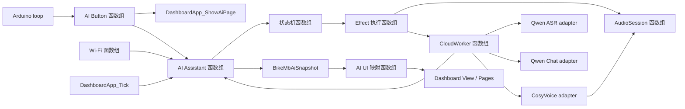

# AI 助手实现与函数组

本文描述 `src/firmware/bikemb` 中已经落地的 AI 助手初版，面向继续实现和调试固件的开发工程师。它按函数组说明入口、调用关系、执行上下文和数据所有权；总体代码地图见 `docs/software-architecture.md`。

## 实现结论

当前已形成一条可构建的按住说话链路：

```text
BOOT/GPIO0 -> 录音 -> Qwen ASR -> Qwen Chat -> CosyVoice TTS -> 喇叭播放
```

- 真实链路由 PlatformIO 环境 `esp32-s3-touch-lcd-1-85c-ai-voice-cloud-test` 开启。
- mock 链路由 `esp32-s3-touch-lcd-1-85c-ai-voice-mock-test` 开启，保留本地阶段延时和短提示音。
- 默认环境仍关闭 `BIKE_MB_ENABLE_AI_ASSISTANT`，AI 不影响基础码表启动。
- 当前真实 LLM 调用是 `qwen-plus`。`deepseek_adapter.*` 已存在并有契约测试，但尚未接入 `CloudWorker`。
- 音乐状态已预留，HTTPS MP3、`MusicService` 和点歌解析尚未实现。

## 总调用图



## 1. 启动与编译函数组

主要文件：

- `src/firmware/bikemb/src/main.cpp`
- `src/firmware/bikemb/platformio.ini`
- `src/firmware/bikemb/src/ai/ai_config.h`

| 入口 | 执行上下文 | 职责 |
| --- | --- | --- |
| `setup()` | Arduino 启动线程 | 初始化 Assistant、Wi-Fi、AI Button；启用 AudioSession 时再初始化 codec/I2S。 |
| `loop()` | Arduino 主循环 | 每轮调用 `BikeMbAiButton_Tick(now)`；继续承担 LVGL tick、Dashboard 更新和渲染。 |
| `BikeMbAiAssistant_Init()` | `setup()` | 创建 AI 命令队列、CloudWorker 和 `bikemb_ai` task。 |
| `BikeMbWifiService_Init()` | `setup()` | 创建 `bikemb_wifi` task；不阻塞等待联网。 |
| `BikeMbAiButton_Init()` | `setup()` | 配置 GPIO0 输入并清零按键 reducer。 |
| `BikeMbAudioSession_Init()` | `setup()` | 在音频开关开启时初始化 ES8311、ES7210 和 I2S0。 |

真实云环境同时定义：

```text
BIKE_MB_ENABLE_AI_ASSISTANT=1
BIKE_MB_ENABLE_AUDIO_SESSION=1
BIKE_MB_AI_TLS_INSECURE_TEST_ONLY=1
```

因此它是开发验证环境，不是可发布的安全配置。

## 2. BOOT/AI 按键函数组

主要文件：`src/firmware/bikemb/src/input/ai_button.*`、`ai_button_logic.*`

### 公开函数

| 函数 | 调用方 | 行为 |
| --- | --- | --- |
| `BikeMbAiButton_Init()` | `setup()` | 初始化 reducer，并把 GPIO0 配置为上拉输入。 |
| `BikeMbAiButton_Tick(nowMs)` | `loop()` | 读取按键，产生稳定的按下/松开事件；按下时先显示 AI 页面，再通知 Assistant。 |
| `BikeMbAiButtonLogic_Init(logic)` | Button adapter / host test | 清零纯逻辑状态。 |
| `BikeMbAiButtonLogic_Update(logic, nowMs, rawPressed)` | Button adapter / host test | 返回 `NONE/PRESSED/RELEASED`，不访问硬件。 |

### 安全时序

- 上电前 `3000 ms` 完全忽略 GPIO0。
- 保护期后必须连续释放 `50 ms` 才进入 armed。
- armed 后按下和松开都需稳定 `30 ms`。
- GPIO0 仍是 ROM 下载 strap。按住 BOOT 上电或复位可能进入下载模式，应用层延时无法改变这一点。

## 3. AI Assistant 编排函数组

主要文件：`src/firmware/bikemb/src/ai/ai_assistant.*`

### 对外命令与查询

| 函数 | 调用方 | 线程语义 |
| --- | --- | --- |
| `BikeMbAiAssistant_OnButtonPressed()` | AI Button | 非阻塞投递 `BUTTON_PRESSED`。 |
| `BikeMbAiAssistant_OnButtonReleased()` | AI Button | 非阻塞投递 `BUTTON_RELEASED`。 |
| `BikeMbAiAssistant_Cancel()` | 预留给 UI/控制入口 | 非阻塞投递 `CANCEL`；当前 AI 页面没有绑定取消控件。 |
| `BikeMbAiAssistant_SetWifiConnected(bool)` | Wi-Fi task | 非阻塞投递 Wi-Fi 状态。 |
| `BikeMbAiAssistant_GetSnapshot(out)` | Dashboard/UI | 临界区内复制快照，不返回内部指针。 |

### 内部事件与 effect

| 内部函数 | 职责 |
| --- | --- |
| `enqueueEvent(...)` / `enqueueSimple(...)` | 把小型事件写入长度为 8 的队列。队列满时当前实现静默丢弃。 |
| `assistantTask(...)` | `bikemb_ai` 唯一写状态；轮询录音并每 20 ms 产生一次 `TICK`。 |
| `processEvent(...)` | 调用纯状态机、发布 snapshot、执行 effect。 |
| `executeEffects(mask)` | 把状态机副作用转换为录音、取消和 Cloud job。 |
| `onCloudResult(...)` | 将 CloudWorker callback 转回带 `requestId` 的状态机事件。 |
| `publishSnapshot()` | 在临界区内发布完整 `BikeMbAiSnapshot`。 |

`bikemb_ai` 是 `BikeMbAiStateMachine` 和可见 snapshot 的唯一写入者。Button、Wi-Fi、CloudWorker 只投递事件，UI 只复制 snapshot。

## 4. 纯状态机函数组

主要文件：`src/firmware/bikemb/src/ai/ai_state_machine.*`、`ai_types.h`

| 函数 | 输入 | 输出 |
| --- | --- | --- |
| `BikeMbAiStateMachine_Init(...)` | enabled、当前时间 | `Disabled` 或 `Idle` 初始状态。 |
| `BikeMbAiStateMachine_Dispatch(...)` | 一个 `BikeMbAiEvent` | 新状态、snapshot 字段及 `BikeMbAiEffect` bitmask。 |

状态机不调用 FreeRTOS、HTTP、I2S 或 LVGL。关键规则：

- 录音短于 `300 ms` 不提交 STT。
- 单次录音最多 `10000 ms`。
- 松键后云端阶段共享 `60000 ms` deadline。
- 新请求、取消或断网会使旧 `requestId` 失效。
- Worker 结果的 `requestId` 不等于当前值时直接丢弃。
- Error 默认显示 `1500 ms`；录音超限且按键仍按住时，必须等松开后才能恢复。

当前枚举中 `ConnectingMusic`、`MusicPlaying` 已定义，但现有事件/effect 不会进入这两个状态。

## 5. 录音与 AudioSession 函数组

主要文件：`src/firmware/bikemb/src/audio/audio_session.*`、`audio_session_core.*`、`audio_capture_core.*`

### 会话所有权

`BikeMbAudioSessionCore_Acquire/Release/ReleaseAll` 维护单一 owner 和 `requestId`。owner 包括 Self Test、Prompt、AI Capture、AI Playback 和 Music，防止不同功能同时操作 I2S0。

### AI 录音路径

| 函数 | 职责与所有权 |
| --- | --- |
| `BikeMbAudioSession_StartCapture(requestId, maxMs)` | 获取 `AI_CAPTURE`，在 PSRAM 分配有界 mono clip。 |
| `BikeMbAudioSession_PollCapture(requestId)` | 从 I2S 读取 stereo frame，通过 `BikeMbAudioCaptureCore_DownmixStereoToMono` 写入 clip。 |
| `BikeMbAudioSession_FinishCapture(requestId, outClip)` | 停止采集并把 clip 所有权移交调用方。 |
| `BikeMbCloudWorker_SetCaptureClip(requestId, clip)` | 再把 clip 所有权移交 CloudWorker；成功后输入结构被清零。 |
| `BikeMbAudioSession_ReleaseClip(clip)` | 最终释放 PSRAM。 |

16 kHz、16-bit、mono、10 秒 clip 上限约为 `320000 bytes`。实际分配发生在开始录音时，不常驻。

### TTS 播放路径

CloudWorker 获取 `AI_PLAYBACK` owner，调用 `BikeMbAudioSession_WriteStereoPcm(...)` 写入 I2S；CosyVoice mono 样本在播放前复制为 stereo chunk。播放结束后按 owner 与 `requestId` 精确释放。

当前没有独立 `bikemb_audio` task，也没有 PCM ring buffer。录音轮询在 `bikemb_ai`，TTS 缓冲和阻塞播放在 `bikemb_cloud`。

## 6. CloudWorker 与 HTTP 函数组

主要文件：`src/firmware/bikemb/src/ai/cloud_worker.*`

### 队列与生命周期

| 函数 | 行为 |
| --- | --- |
| `BikeMbCloudWorker_Init(sink)` | 创建长度为 4 的 stage 队列和 `bikemb_cloud` task。 |
| `BikeMbCloudWorker_Submit(job)` | 非阻塞提交 STT、LLM 或 TTS job。 |
| `BikeMbCloudWorker_CancelBefore(validRequestId)` | 更新最小有效请求号并释放尚未消费的录音 clip。 |
| `BikeMbCloudWorker_SetCaptureClip(...)` | 接管当前录音 clip 的 PSRAM 所有权。 |
| `cloudTask(...)` | 串行执行 stage；仅在 request 仍有效时回调 Assistant。 |

`CancelBefore` 能阻止旧结果生效，但不能主动关闭已经阻塞在 `WiFiClientSecure` 中的请求。单次连接/读取超时为 `15000 ms`；新的 cloud job 仍需等待当前 stage 返回。

### HTTP 辅助函数

- `writeHttpJsonRequest(...)`：解析 HTTPS URL、建立 TLS、发送鉴权头和流式 JSON body。
- `readStatusAndHeaders(...)`：读取 HTTP 状态与 headers。
- `readJsonBody(...)`：把 JSON 响应限制在 `4096 bytes`。
- `readSseBody(...)`：使用 `12 KiB` PSRAM line buffer 解析 TTS SSE。
- `extractJsonString(...)`：当前轻量响应字段提取器，不是通用 JSON parser。

## 7. Provider Adapter 函数组

### Qwen ASR

文件：`qwen_asr_adapter.*`

- `BikeMbQwenAsr_WriteRequestJson(...)` 生成 `qwen3-asr-flash` 请求。
- WAV header 和 PCM 通过 sink 分块 Base64 编码，避免再复制完整录音。
- `postQwenAsr(...)` 发送请求并把转写限制到 `512 bytes`。

### Qwen Chat

文件：`qwen_chat_adapter.*`

- `BikeMbQwenChat_WriteRequestJson(...)` 生成 `qwen-plus` 请求，system prompt 要求中文、单句、30 个汉字以内。
- `BikeMbQwenChat_CopyBoundedAnswer(...)` 把回答限制到 `384 bytes`。
- `postQwenChat(...)` 是当前 CloudWorker 实际调用的 LLM 路径。

### DeepSeek

文件：`deepseek_adapter.*`

- `BikeMbDeepSeek_WriteRequestJson(...)` 和 bounded copy 已实现。
- 当前 `cloud_worker.cpp` 不 include 或调用该 adapter，因此它不是运行时链路的一部分。

### CosyVoice TTS

文件：`cosyvoice_tts_adapter.*`

- `BikeMbCosyVoice_WriteRequestJson(...)` 生成 `cosyvoice-v3-flash` SSE 请求。
- `BikeMbCosyVoice_HandleSseLineWithStream(...)` 跨 SSE 行连续解码 Base64 PCM。
- CloudWorker 最多重试 2 次，先把 PCM 存入最多 `320000` 个 `int16_t` 的 PSRAM 缓冲，再播放最多 `96000` 个 mono sample。

这意味着当前 TTS 是“完整响应缓冲后播放”，不是边收边播。

## 8. Wi-Fi 函数组

主要文件：`src/firmware/bikemb/src/network/wifi_service.*`、`wifi_service_core.*`

| 函数 | 职责 |
| --- | --- |
| `BikeMbWifiServiceCore_Init(...)` | 初始化 enabled/configured/connected 状态。 |
| `BikeMbWifiServiceCore_Update(...)` | 纯 reducer，产生连接、发布连接或发布断开 action。 |
| `BikeMbWifiService_Init()` | 创建 `bikemb_wifi` task。 |
| `wifiTask(...)` | 每秒轮询；断开时每 10 秒重试，并把状态发布给 Assistant。 |

凭据只从 Git 忽略的 `include/ai_secrets.local.h` 读取。联网成功日志包含 IP、RSSI、DNS 和 TCP 探测结果，不打印 Wi-Fi 密码或 token。

## 9. UI 快照函数组

主要文件：`src/firmware/bikemb/src/app/ai_assistant_ui_state.*`、`dashboard_app.*`、`dashboard_view*`

| 函数 | 职责 |
| --- | --- |
| `DashboardApp_ShowAiPage()` | 切换到独立 AI 页面。按键稳定按下时调用。 |
| `DashboardApp_Tick(...)` | 每约 33 ms 复制 AI snapshot，并交给 UI mapper。 |
| `BikeMbAiUiState_FromSnapshot(...)` | 把业务状态映射为 Offline/Idle/Listening/Sending/Thinking/Speaking/Music/Error。 |
| `DashboardView_Update(...)` | 只在 UI 上下文更新 LVGL。 |

后台 task 不持有 LVGL 指针。当前页面展示状态和提示，但未把触摸取消、重试或停止动作绑定到 `BikeMbAiAssistant_Cancel()`。

## 10. 端到端时序

```mermaid
sequenceDiagram
  participant Loop as Arduino loop
  participant Btn as AI Button
  participant Ai as bikemb_ai
  participant Audio as AudioSession
  participant Cloud as bikemb_cloud
  participant API as DashScope
  participant UI as Dashboard/LVGL

  Loop->>Btn: Tick(now), read GPIO0
  Btn->>UI: ShowAiPage()
  Btn->>Ai: BUTTON_PRESSED
  Ai->>Audio: StartCapture(requestId, 10 s)
  loop while held
    Ai->>Audio: PollCapture(requestId)
  end
  Btn->>Ai: BUTTON_RELEASED
  Ai->>Audio: FinishCapture(requestId)
  Ai->>Cloud: SetCaptureClip + STT job
  Cloud->>API: Qwen ASR HTTPS
  API-->>Cloud: transcript
  Cloud-->>Ai: STT_READY(requestId)
  Ai->>Cloud: LLM job
  Cloud->>API: Qwen Chat HTTPS
  API-->>Cloud: short answer
  Cloud-->>Ai: LLM_READY(requestId)
  Ai->>Cloud: TTS job
  Cloud->>API: CosyVoice SSE
  API-->>Cloud: Base64 PCM
  Cloud->>Audio: WriteStereoPcm(requestId)
  Cloud-->>Ai: playback 后依次回报 TTS_STARTED / PLAYBACK_DONE
  UI->>Ai: GetSnapshot(copy)
```

## 11. 当前限制和开发注意事项

1. 默认固件不启用 AI；真实链路仍是专用测试环境。
2. 真实环境使用 `BIKE_MB_AI_TLS_INSECURE_TEST_ONLY=1`。产品启用前必须配置 CA 校验并删除该开关。
3. CloudWorker 当前使用 Qwen Chat，不是产品文档原定的 DeepSeek；切换时应只改 worker 选择，不改 Assistant 状态机。
4. `logCloudText(...)` 会向串口打印最多 160 bytes 的转写和回答，和隐私目标不一致，产品化前必须移除或改成显式诊断开关。
5. 取消只失效旧 request；无法立即中断正在进行的 HTTPS 读写，且单 CloudWorker 会推迟新请求。
6. TTS 最多申请约 `640000 bytes` PSRAM PCM 缓冲，并在完整接收后播放；尚未实现流式低延迟播放。
7. `runRealStage(TTS)` 在 PCM 播放结束后才返回，Assistant 随后连续收到 `TTS_STARTED` 和 `PLAYBACK_DONE`；因此 Speaking UI 与实际发声时段尚未对齐。
8. UI 的取消/重试/停止是展示语义，尚无触摸命令绑定。
9. 音乐和点歌未实现；现有 Music 状态与 owner 只是接口预留。
10. ESP-IDF `app_main()` 路径尚未接入 AI、Arduino Wi-Fi 和 Arduino `ESP_I2S` 实现。

## 12. 验证入口

- `tools/run-tests.ps1`：运行全部轻量契约测试。
- `tools/tests/ai_state_machine_test.cpp`：状态、超时、取消和旧 request。
- `tools/tests/ai_button_logic_test.cpp`：3 秒保护、释放解锁和消抖。
- `tools/tests/audio_session_core_test.cpp`：音频 owner 与 request ID。
- `tools/tests/test_cloud_worker_real_contract.py`：真实 CloudWorker 结构与 provider 路径。
- `tools/tests/test_audio_capture_contract.py`：有界录音和 downmix。
- `tools/tests/test_cosyvoice_tts_contract.py`：SSE/Base64 PCM。
- `tools/tests/test_dashboard_ai_ui_contract.py`：UI snapshot 边界和 AI 页面切换。

涉及硬件的最终验收还需要串口日志、录音质量、喇叭播放、BOOT 上电/复位矩阵、Wi-Fi 断开恢复、长请求取消以及内存峰值实测。
