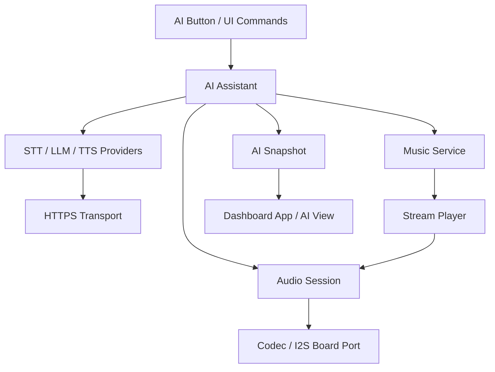

# 模块划分

本文定义 BikeMB 当前固件模块边界。模块边界以 `src/firmware/bikemb` 为主，`src/firmware/bringup` 只作为硬件验证基线引用。

## 模块概览

| 模块 | 当前职责 | 主要路径 |
| --- | --- | --- |
| App | 组织 dashboard 生命周期、demo metrics 更新、页面命令入口 | `src/app/dashboard_app.*` |
| View Core | 管理页面切换、触摸手势轮询、UI 数据更新 | `src/app/dashboard_view_core.*` |
| Pages | 创建 LVGL 页面对象、控件和局部事件 | `src/app/dashboard_pages.*` |
| UI Style | 统一 label、颜色、尺寸等 UI helper | `src/app/dashboard_ui_style.*` |
| LVGL Port | 连接 LVGL display flush、tick、touch input | `src/lvgl_port.*` |
| Board Support | 初始化 LCD、I2C、背光等板级基础链路 | `src/board_support.*` |
| Audio Prompts | 档位预录语音播报测试路径 | `src/audio/audio_prompts.*` |
| Audio Self Test | 喇叭、麦克风、串口模拟命令验证 | `src/audio/audio_self_test.*` |
| Voice Commands | ESP-SR 直接语音命令测试路径 | `src/voice/voice_commands.*` |
| Runtime | ESP-IDF 事件队列和服务骨架 | `src/runtime/*`, `src/services/*` |
| AI Button | BOOT/AI 键启动保护与消抖，产生 press/release 命令 | `src/input/ai_button.*`（计划） |
| AI Assistant | 编排 AI 状态、超时、取消和状态快照 | `src/ai/ai_assistant.*`（计划） |
| Cloud Worker | 在独立 task 执行阻塞式云调用并返回带 request ID 的结果 | `src/ai/cloud_worker.*`（计划） |
| Wi-Fi Service | AI 启用时维持连接并发布连接状态 | `src/network/wifi_service.*`（计划） |
| Cloud Providers | STT、DeepSeek、TTS 的供应商协议适配 | `src/ai/providers/*`（计划） |
| Audio Session | 唯一拥有 I2S0、ES7210、ES8311，仲裁录音与播放 | `src/audio/audio_session.*`（计划） |
| Stream Player | HTTPS 音频读取、MP3 解码、PCM 分块输出 | `src/audio/stream_player.*`（计划） |
| Music Service | 管理预设/私有 URL，并预留未来曲目解析接口 | `src/music/music_service.*`（计划） |
| AI UI | 主界面轻提示、独立 AI 页面和 snapshot 映射 | `src/app/ai_assistant_view.*`（计划） |

## 分层规则

### App 层

App 层是 dashboard 的命令入口。触摸、串口测试和语音识别都应调用 `DashboardApp_*`，不直接操作 LVGL 页面对象。

### View 层

View 层负责把 `BikeMbDashboardMetrics` 映射为页面展示，并处理当前页面状态。它可以消费触摸手势，但不拥有底层触摸驱动。

### 硬件 Port 层

硬件 Port 层负责把板级驱动连接到 LVGL 或音频/语音模块。上层模块不应直接依赖 LCD controller 细节。

### 测试型音频/语音模块

音频播报、自检和语音识别当前是测试环境能力。除非已有共享音频所有权设计，否则不要默认同时启用语音输出和语音识别。

### Runtime 骨架

ESP-IDF Runtime 当前用于验证未来服务化结构。新功能迁入前需要先明确任务所有权、事件类型和跨服务数据流。

## AI 助手模块规则

### AI Button

- 只负责 GPIO、电平语义和消抖，不判断云端状态。
- 按下产生 `PRESS`，松开产生 `RELEASE`。独立的 `CANCEL` 只来自 AI 页面；忙态再次按下由 AI Assistant 解释为“取消旧请求并开始新录音”。
- 按键 GPIO 由板级配置提供，业务模块不得写死引脚。
- V1 复用板载 `Key1/BOOT`：`GPIO0`、低电平有效、板载 `10 kΩ` 上拉，详见 ADR-0003。
- 上电后前 `3000 ms` 忽略按键；满 `3000 ms` 后还必须先观察到连续 `50 ms` 的释放电平才允许产生首个 `PRESS`。这避免按键从启动阶段一直被按住时自动开始录音。
- GPIO0 在复位采样阶段仍是下载模式 strap；按住 BOOT 上电或复位会进入 ROM 下载模式，固件延时无法消除该行为。

### AI Assistant

- 是 AI 交互状态机的唯一所有者。
- 通过命令队列接收按键、播放和取消命令，通过 snapshot 向 UI 暴露只读状态。
- 为每次请求分配 `request_id`，取消或新请求开始后忽略旧请求结果。
- 不执行阻塞式 provider 调用；云调用由独立 cloud worker 执行并以带 `request_id` 的结果事件返回。
- 不保存原始录音、转写或回答，不直接调用 LVGL。

### Cloud Providers

provider 分为三个窄接口：

- `SttProvider`：WAV/PCM clip 转 UTF-8 文本。
- `LlmProvider`：UTF-8 问题转短回答。V1 默认实现调用 DeepSeek。
- `TtsProvider`：UTF-8 回答转 PCM/WAV 音频流。

V1 默认 STT 为百炼 `qwen3-asr-flash` 短音频 REST，输入为 Base64 WAV；默认 TTS 为 `cosyvoice-v3-flash` HTTP/SSE，输出为 `16 kHz` mono PCM。供应商特有 endpoint、鉴权头、SSE 和 JSON 字段只能出现在对应 adapter 内，不能泄漏到 AI Assistant。

### Audio Session

- 统一初始化 ES7210、ES8311 和 I2S0，其他生产模块不得创建第二个 `I2SClass(I2S_NUM_0)`。
- V1 使用半双工会话：录音和播放不并发。
- 录音请求会停止音乐；TTS 回答不会与音乐混音；普通档位提示在 AI 会话期间丢弃或延后，不抢占 AI。
- 取消命令优先级最高，必须使阻塞中的读写尽快返回。

### Stream Player 与 Music Service

- Stream Player 只理解流描述、编码格式和 PCM 输出，不理解歌曲名或 AI 文本。
- V1 支持 HTTPS MP3 直链，目标码率 `<= 128 kbps`；WAV/PCM 用于 TTS。
- Music Service V1 从预设或私有配置读取 URL。后续点歌新增 `MusicCatalogProvider::Resolve(query)`，结果仍交给相同 Stream Player。
- 第三方解码库必须单独评估许可证、I2S 所有权和 Arduino 3.x 兼容性。GPL-3.0 的 `ESP32-audioI2S`、`ESP8266Audio` 和 `arduino-audio-tools` 只作为调研参考，不作为默认依赖决策。

## 现有音频模块迁移顺序

1. 先提取 codec/I2S 初始化到 `AudioSession`，保持现有测试环境互斥。
2. 让 Audio Self Test 通过 `AudioSession` 完成 speaker tone 和 mic RMS，验证输入输出未回归。
3. 让 Audio Prompts 通过 `AudioSession` 播放，验证异步提交和新请求覆盖旧请求。
4. Voice Commands 在迁移前继续保持独立测试环境；AI 环境不得启用该环境。
5. 前四步稳定后再接 AI capture/TTS，最后接 MP3 stream。

每一步都必须保证源码中生产路径只剩一个 `I2SClass(I2S_NUM_0)` owner，并保留对应 PlatformIO 测试环境作为回归入口。

### AI UI

- 主界面只显示轻量状态条，不遮挡速度、电量、里程和骑行时间。
- 独立 AI 页面显示阶段、Wi-Fi 状态、最近一次安全错误摘要，以及停止/取消入口。
- UI 使用 snapshot，不注册来自后台 task 的 LVGL callback。

## 依赖方向

禁止反向依赖：provider、音频和网络模块不得依赖 Dashboard 或 LVGL；AI UI 不得依赖具体供应商 adapter。

## 非目标

- 不在架构层引入通用插件系统。
- 不为单一调用点抽象接口。
- 不提前设计 OTA、云同步或复杂导航。
- 不把 `src/firmware/bringup` 演进成正式应用工程。
