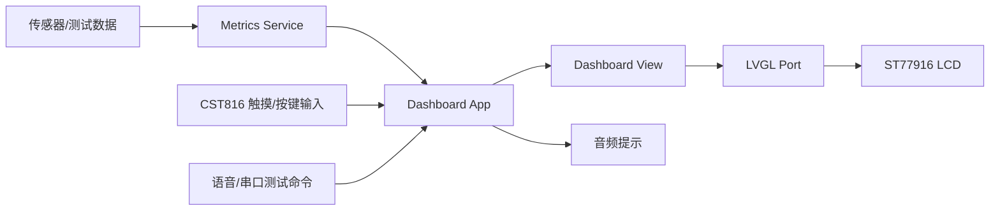
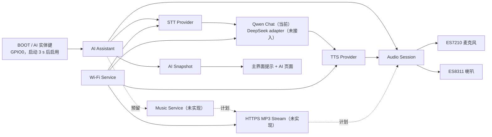
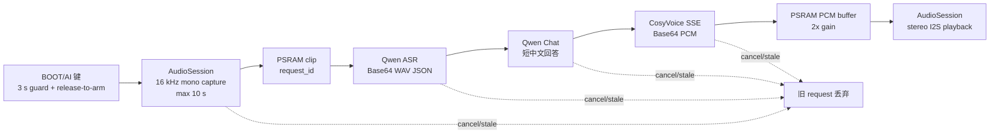
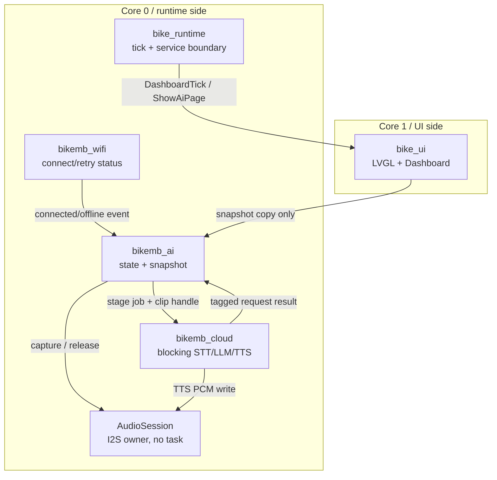

# BikeMB 架构总览

本文维护 BikeMB 固件的系统架构视图。更细的代码地图仍保留在 `docs/software-architecture.md`。

后续新增或更新架构图、任务表、资源预算表时，必须先按 `docs/architecture/architecture-documentation-requirements.md` 的要求验收；缺少实测数据时标记为“待确认”或“建议值”，不能写成现状。

规范化系统架构文档入口：`docs/architecture/system-architecture.md`。

## 架构目标

- 第一阶段先完成可上板、可扩展、可持续迭代的基础自行车码表。
- 主界面应优先保证骑行中可读性和刷新稳定性。
- 数据链路允许先使用 demo metrics，再逐步替换为真实传感器数据。
- `src/firmware/bringup` 保持为硬件验证基线，`src/firmware/bikemb` 作为正式 demo 基线。
- AI 助手作为默认关闭的 P2 能力，不成为速度、电量、里程、页面切换等核心码表功能的依赖。

## 当前系统边界

BikeMB 当前运行在 Waveshare `ESP32-S3-Touch-LCD-1.85C V2` 上，核心硬件包括：

- MCU: `ESP32-S3R8`
- Display: `360 x 360` round LCD
- LCD driver: `ST77916`
- Touch: `CST816`
- I2C: `GPIO10 / GPIO11`
- Battery ADC: `GPIO8`

第一阶段包含速度、单次里程、骑行时间、总里程、电量和实体按键切页能力。暂不包含电机控制、手机 App、云同步、复杂导航和 OTA。

P2 AI 助手初版在该边界之外独立演进，当前已经形成实体键按住说话、云端 STT、云端短回答、云端 TTS 和语音回复闭环。当前运行链路使用 Qwen ASR、Qwen Chat 和 CosyVoice TTS；DeepSeek adapter 已实现但尚未接入运行时。云音频流和点歌仍未实现。AI 不可用时，第一阶段能力必须继续运行。

## 当前运行模型

当前固件保留两条路径：

- 默认路径：`PlatformIO + Arduino`，入口为 `setup()` / `loop()`。
- 迁移路径：`PlatformIO + ESP-IDF`，已有 Runtime/Event/Service 双核模型，AudioSession、Wi-Fi 和云端语音 transport 已迁入主要代码路径，并完成基础录音/回复板级确认。

默认路径仍承载当前 LVGL dashboard、触摸、音频自检、档位播报、直接语音识别测试和 Arduino 版 AI 回归。ESP-IDF 路径用于建立产品化任务、事件和服务边界，是正式音乐能力前的目标运行模型。

AI 助手初版现在同时保留 Arduino 回归环境和 ESP-IDF 云端语音验收环境。ESP-IDF 环境中，LVGL 只由 Core 1 的 `bike_ui` 访问；Core 0 的 `bike_runtime` 负责 tick、服务启动和 AI button 轮询；`bikemb_ai`、`bikemb_cloud`、`bikemb_wifi` 固定在 Core 0。网络请求和 TTS 播放在 `bikemb_cloud` 中执行，录音由 `bikemb_ai` 轮询 `AudioSession` 完成。

下一阶段继续关闭 ADR-0004。当前已经完成：`bike_runtime` 固定在 Core 0，`bike_ui` 固定在 Core 1，AI Assistant、Cloud Worker、Wi-Fi Worker 固定在 Core 0，BOOT/AI 键页面切换通过 runtime event 交给 Core 1 UI task；AudioSession codec/I2S 使用 ESP-IDF `driver/i2s_std.h`；Wi-Fi 使用 `esp_wifi` / `esp_netif` / `nvs_flash`；Qwen ASR、Qwen Chat 和 CosyVoice SSE/TTS 使用 `esp_http_client`；2026-07-26 用户确认 ESP-IDF 云端语音固件基础录音和回复正常。ADR-0004 仍需取消、异常路径、长稳资源基线和 audio underrun 验收；关闭前只允许隔离的 decoder/stream spike、接口和 mock 工作，不能接入正式 `MusicService` 或点歌。

ROM Bootloader、Flash 二级 Bootloader、应用 `call_start_cpu0/call_start_cpu1` 和 FreeRTOS 两核调度器的完整启动顺序见 `docs/software-architecture.md` 的“Bootloader 与双核启动链路”章节。

## 顶层数据流

## AI 助手 V1 架构

### 关键边界

- `audio_session` 是共享音频环境中 I2S0、ES7210 和 ES8311 的唯一运行时所有者。Arduino 路径使用 `ESP_I2S`；ESP-IDF 路径使用 `driver/i2s_std.h`。Audio Self Test 和 Audio Prompts 已迁入；Voice Commands 迁移前继续保持编译期互斥。
- `ai_assistant` 只负责编排状态和超时，不直接访问 I2S、Wi-Fi、HTTP 或 LVGL 对象。
- provider adapter 负责生成供应商请求。当前 CloudWorker 调用百炼 Qwen ASR、Qwen Chat 和 CosyVoice；上层状态机不依赖具体供应商字段。
- `music_service`、MP3 player 和 `MusicCatalogProvider` 仍是目标边界，当前源码只有 Music 状态与音频 owner 预留。
- UI 只读取 `BikeMbAiSnapshot`。后台 task 不调用 LVGL，也不持有 LVGL 对象指针。

## AI 助手数据流

语音问答采用 V1 分阶段直连流程：

关键约束：录音和 TTS PCM 不通过队列复制整段数据，只传递句柄和小事件；每次交互使用递增 `request_id`，取消后到达的旧回调必须丢弃。

## 任务和通信模型

禁止方向：Core 0 后台 task 不访问 LVGL；`bike_ui` 不执行阻塞 HTTP；AudioSession 不发起云请求；CloudWorker 不直接修改 AI 状态。

AI 命令队列只传递小型值对象。录音通过 PSRAM clip 句柄移交 CloudWorker，不通过事件队列复制整段音频。`bikemb_ai` 不等待 provider；`bikemb_cloud` 完成一个阶段后携带 `request_id` 回报事件。取消会立即更新有效 request ID 并停止本地音频，旧网络结果无权修改新状态；但当前实现不能主动关闭已经阻塞的 HTTPS 请求，后续 cloud job 仍需等待当前 stage 返回。ESP-IDF 路径中产品 worker 固定 Core 0，UI 固定 Core 1。

## 内存与性能预算

以下是 V1 实现上限，不代表当前已经实测。基线取相同 dashboard build、AI 功能关闭、启动稳定 30 秒后的数据。每个里程碑只测已经实现的阶段；AI 默认启用前必须完成启动后、录音峰值、TLS 请求峰值、TTS 播放峰值和音乐播放峰值全量记录。

| 资源 | V1 预算 | 约束 |
| --- | --- | --- |
| 录音 clip | `<= 384 KiB PSRAM` | 10 秒 PCM 为约 320 KiB，预留 WAV 头和对齐空间 |
| TTS PCM 缓冲 | 当前上限约 `625 KiB PSRAM` | `320000` 个 `int16_t`，完整接收后播放；后续应改为流式缓冲 |
| AI 增量 PSRAM 峰值 | `<= 1.5 MiB` | 包含录音、HTTP 响应和解码工作区 |
| AI 增量 internal DRAM 峰值 | `<= 256 KiB` | 包含 task stack、TLS/HTTP 控制结构和 DMA 相关内存 |
| AI task stack | `<= 12 KiB` | 以 FreeRTOS high-water mark 验证 |
| Cloud task stack | `<= 12 KiB` | TLS/JSON 工作不得放到 AI control task stack |
| Audio task stack | `<= 8 KiB` | 以 FreeRTOS high-water mark 验证 |
| STT 文本 | `<= 512 bytes UTF-8` | 超限截断并返回明确错误 |
| LLM 回答 | `<= 192 bytes UTF-8` | 当前 Qwen prompt 要求中文短句，并使用 UTF-8 安全截断 |
| UI 主循环附加工作 | 单次 `<= 1 ms` | 只复制 snapshot，不解析 JSON |
| 松键到开始回复 | 目标 `<= 8 s` | 当前状态机云阶段 deadline 为 `60 s`，单次 HTTPS 读超时 `15 s` |
| 音乐建连 | `<= 10 s` | 超时停止并释放播放会话 |

启动阶段只创建队列和 task，不等待 Wi-Fi。AI 功能启用且配置有效时，Wi-Fi 在后台保持连接；AI 功能关闭时不因该模块启动 Wi-Fi。

## 安全与配置

- V1 配置来源为 Git 忽略的 `src/firmware/bikemb/include/ai_secrets.local.h`；仓库只允许提交不含真实值的 `ai_secrets.example.h`。
- 真实 Wi-Fi 密码、API key、音频 URL、转写文本和回答不得写入日志、Flash 持久化文件或 Git 跟踪文件。
- HTTPS 正式实现必须校验证书。当前真实云测试环境显式启用 `BIKE_MB_AI_TLS_INSECURE_TEST_ONLY=1`，不得作为发布配置。
- 当前诊断会打印截断后的转写和回答文本；产品化前必须删除或置于显式诊断开关后。
- V1 的编译期密钥可从固件中被提取，只适用于开发验证。产品化前必须另行决定设备配网、密钥轮换和服务端短期凭据方案。
- 用户配置的音频流只接受 `https://`，限制重定向次数和响应大小；日志不得打印包含 token/query secret 的完整 URL。

## 架构维护规则

- 行为或功能变更先进入 `openspec/changes/`。
- 已确认的长期能力沉淀到 `openspec/specs/`。
- `docs/architecture/` 只记录当前真实架构、接口边界、状态机和决策理由。
- AI 函数组和调用关系维护在 `docs/architecture/ai-assistant-implementation.md`。
- 高风险区域包括 bootloader、linker、flash layout、watchdog、power management、clock tree 和 interrupt priority。
