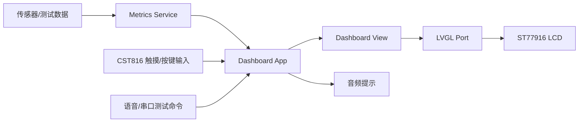
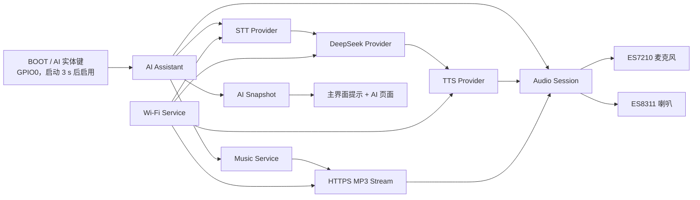

# BikeMB 架构总览

本文维护 BikeMB 固件的系统架构视图。更细的代码地图仍保留在 `docs/software-architecture.md`。

## 架构目标

- 第一阶段先完成可上板、可扩展、可持续迭代的基础自行车码表。
- 主界面应优先保证骑行中可读性和刷新稳定性。
- 数据链路允许先使用 demo metrics，再逐步替换为真实传感器数据。
- `src/firmware/bringup` 保持为硬件验证基线，`src/firmware/bikemb` 作为正式 demo 基线。
- AI 助手作为默认关闭的 P2 能力，不成为速度、电量、里程、页面切换等核心码表功能的依赖。

## 当前系统边界

BikeMB 当前运行在 Waveshare `ESP32-S3-Touch-LCD-1.85C V2` 上，核心硬件包括：

- MCU: `ESP32-S3R8`
- Display: `360 x 360` round LCD
- LCD driver: `ST77916`
- Touch: `CST816`
- I2C: `GPIO10 / GPIO11`
- Battery ADC: `GPIO8`

第一阶段包含速度、单次里程、骑行时间、总里程、电量和实体按键切页能力。暂不包含电机控制、手机 App、云同步、复杂导航和 OTA。

P2 AI 助手 V1 在该边界之外独立演进，包含实体键按住说话、云端 STT、DeepSeek 问答、云端 TTS、语音回复和云音频流播放。AI 不可用时，第一阶段能力必须继续运行。

## 当前运行模型

当前固件保留两条路径：

- 默认路径：`PlatformIO + Arduino`，入口为 `setup()` / `loop()`。
- 迁移路径：`PlatformIO + ESP-IDF`，已有 Runtime/Event/Service 骨架，但不是音频和语音的主验证路径。

默认路径已经承载当前 LVGL dashboard、触摸、音频自检、档位播报和直接语音识别测试。ESP-IDF 路径用于逐步建立更清晰的任务、事件和服务边界。

AI 助手 V1 继续使用 Arduino 默认路径和 FreeRTOS task，不以该功能为理由迁移整个固件到 ESP-IDF。LVGL 仍只在现有主循环中访问；网络请求、音频采集、音频解码和播放由后台 task 执行。

## 顶层数据流

## AI 助手 V1 架构

### 关键边界

- `audio_session` 是 I2S0、ES7210 和 ES8311 的唯一运行时所有者。现有音频提示、自检和语音测试迁入该边界前，不得与 AI 环境同时启用。
- `ai_assistant` 只负责编排状态和超时，不直接访问 I2S、Wi-Fi、HTTP 或 LVGL 对象。
- `provider` 适配器负责把统一请求转换为供应商协议。V1 默认 STT/TTS 为阿里云百炼语音服务，LLM 为 DeepSeek；上层状态机不依赖具体供应商字段。
- `music_service` 把音频来源与播放分开。V1 接受预设或私有配置中的 HTTPS MP3 直链；未来点歌通过新增 `MusicCatalogProvider` 把歌曲查询解析为流地址，不改播放器。
- UI 只读取 `BikeMbAiSnapshot`。后台 task 不调用 LVGL，也不持有 LVGL 对象指针。

## AI 助手数据流

语音问答采用 V1 分阶段直连流程：

1. 上电满 3 秒且 BOOT 键已连续释放 50 ms 后，复用的 BOOT/AI 键才解锁；随后按下时，AI 编排器停止当前音乐并请求录音会话。
2. 音频会话把 `16 kHz`、`16-bit`、mono PCM 写入 PSRAM，最长 `10` 秒。
3. 按键松开后封装为 WAV，通过 HTTPS 发送给 STT provider。
4. 转写文本发送给 DeepSeek，回答限制为适合语音播报的短文本。
5. 回答发送给 TTS provider，优先请求 `16 kHz` mono PCM/WAV。
6. TTS 音频以小块流入音频会话并播放，不把完整回答音频长期保存在内存或 Flash。
7. 每次交互使用递增 `request_id`；取消后到达的旧回调必须被丢弃。

## 任务和通信模型

| 执行上下文 | 职责 | 禁止事项 |
| --- | --- | --- |
| Arduino `loop()` | LVGL tick、Dashboard 更新、读取 AI snapshot | 阻塞式 HTTP、音频解码、等待队列 |
| `bikemb_ai` task | AI 状态机、命令、阶段超时、取消和 snapshot | 阻塞式 HTTP、直接访问 LVGL/I2S |
| `bikemb_cloud` task | 执行当前 request 的 STT、DeepSeek、TTS 网络工作 | 修改 AI 状态、访问 LVGL/I2S |
| `bikemb_audio` task | 录音、PCM 输出、MP3 解码后的样本输出、会话抢占 | 发起云请求、修改页面 |
| Arduino Wi-Fi/协议栈 task | Wi-Fi 和 TCP/TLS 底层处理 | 承担产品状态机 |

AI 命令队列只传递小型值对象。音频数据通过固定容量 ring buffer 或 PSRAM clip 句柄传递，不通过事件队列复制整段音频。`bikemb_ai` 不等待 provider；`bikemb_cloud` 完成一个阶段后携带 `request_id` 回报事件。取消由 `bikemb_ai` 立即更新有效 request ID 并停止音频，旧网络调用即使暂时不能中止也无权修改新状态。V1 不固定 task 到特定 CPU core；只有实测出现 UI 或音频抖动时才增加 core affinity。

## 内存与性能预算

以下是 V1 实现上限，不代表当前已经实测。基线取相同 dashboard build、AI 功能关闭、启动稳定 30 秒后的数据。每个里程碑只测已经实现的阶段；AI 默认启用前必须完成启动后、录音峰值、TLS 请求峰值、TTS 播放峰值和音乐播放峰值全量记录。

| 资源 | V1 预算 | 约束 |
| --- | --- | --- |
| 录音 clip | `<= 384 KiB PSRAM` | 10 秒 PCM 为约 320 KiB，预留 WAV 头和对齐空间 |
| 网络/TTS/音乐 ring buffer | `<= 192 KiB PSRAM` | 分块复用，不同时为每个 provider 分配最大缓冲 |
| AI 增量 PSRAM 峰值 | `<= 1.5 MiB` | 包含录音、HTTP 响应和解码工作区 |
| AI 增量 internal DRAM 峰值 | `<= 256 KiB` | 包含 task stack、TLS/HTTP 控制结构和 DMA 相关内存 |
| AI task stack | `<= 12 KiB` | 以 FreeRTOS high-water mark 验证 |
| Cloud task stack | `<= 12 KiB` | TLS/JSON 工作不得放到 AI control task stack |
| Audio task stack | `<= 8 KiB` | 以 FreeRTOS high-water mark 验证 |
| STT 文本 | `<= 512 bytes UTF-8` | 超限截断并返回明确错误 |
| LLM 回答 | `<= 1024 bytes UTF-8` | prompt 要求短回答，TTS 前再次校验 |
| UI 主循环附加工作 | 单次 `<= 1 ms` | 只复制 snapshot，不解析 JSON |
| 松键到开始回复 | 目标 `<= 8 s` | 整体硬超时 `15 s` |
| 音乐建连 | `<= 10 s` | 超时停止并释放播放会话 |

启动阶段只创建队列和 task，不等待 Wi-Fi。AI 功能启用且配置有效时，Wi-Fi 在后台保持连接；AI 功能关闭时不因该模块启动 Wi-Fi。

## 安全与配置

- V1 配置来源为 Git 忽略的 `src/firmware/bikemb/include/ai_secrets.local.h`；仓库只允许提交不含真实值的 `ai_secrets.example.h`。
- 真实 Wi-Fi 密码、API key、音频 URL、转写文本和回答不得写入日志、Flash 持久化文件或 Git 跟踪文件。
- HTTPS 必须校验证书，不允许使用 `setInsecure()` 作为正式实现。
- V1 的编译期密钥可从固件中被提取，只适用于开发验证。产品化前必须另行决定设备配网、密钥轮换和服务端短期凭据方案。
- 用户配置的音频流只接受 `https://`，限制重定向次数和响应大小；日志不得打印包含 token/query secret 的完整 URL。

## 架构维护规则

- 行为或功能变更先进入 `openspec/changes/`。
- 已确认的长期能力沉淀到 `openspec/specs/`。
- `docs/architecture/` 只记录当前真实架构、接口边界、状态机和决策理由。
- 高风险区域包括 bootloader、linker、flash layout、watchdog、power management、clock tree 和 interrupt priority。
