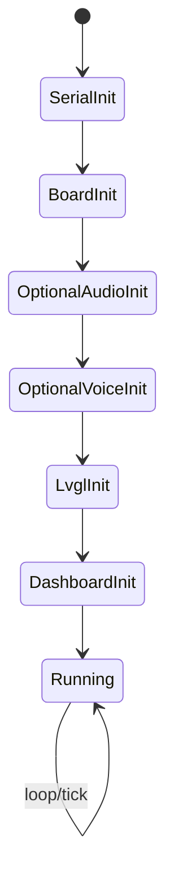
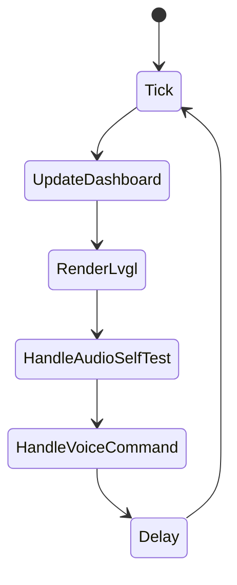
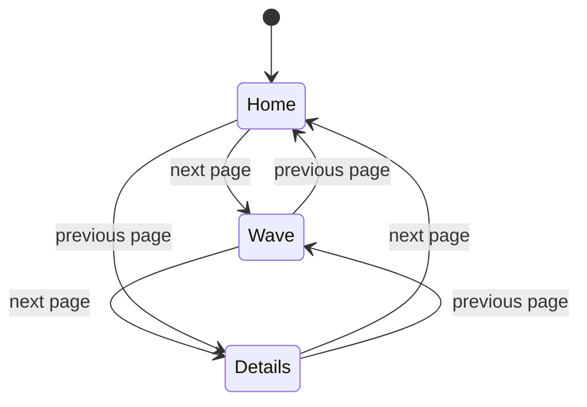
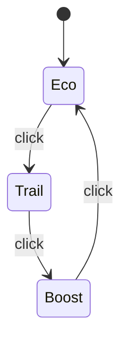
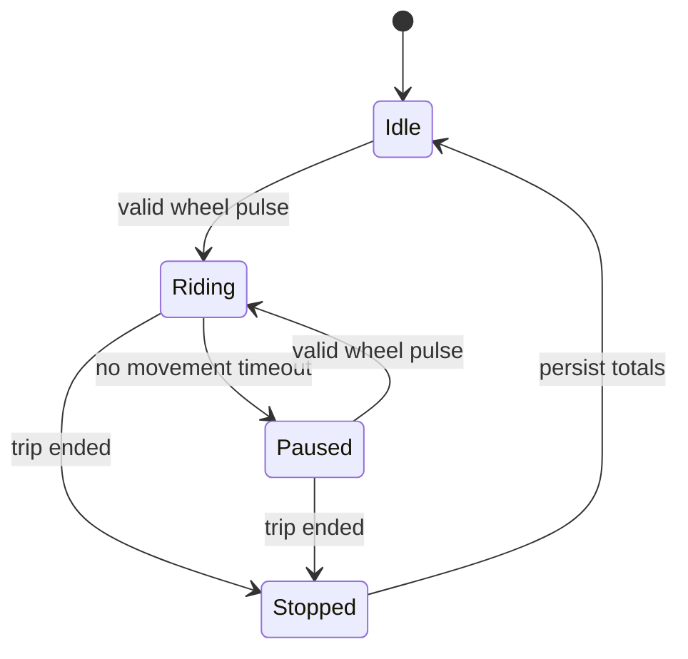
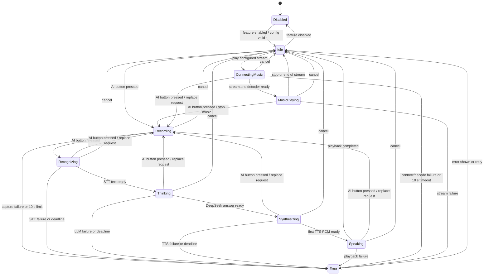
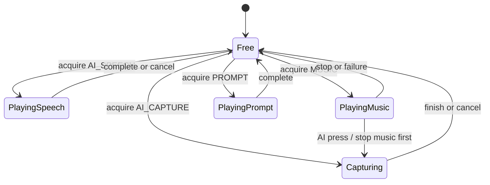
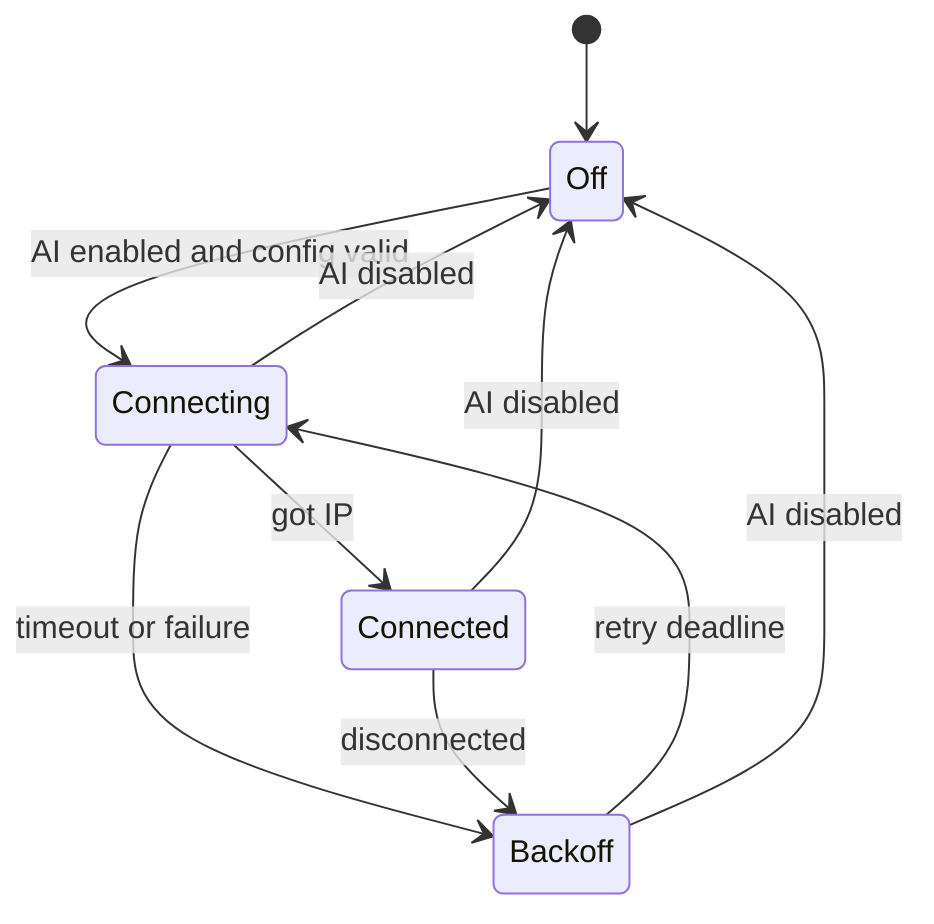

# 状态机

本文记录 BikeMB 当前和第一阶段目标相关的状态机。已经实现的状态与计划中的状态分开记录。

## 启动状态机

当前 Arduino 默认路径的启动顺序：

1. 串口初始化。
2. 板级支持初始化。
3. 可选音频播报初始化。
4. 可选音频自检初始化。
5. 可选语音命令初始化。
6. LVGL 初始化。
7. Dashboard 初始化。
8. 进入主循环。

## 主循环状态

主循环要求：

- `LvglPort_Tick()` 和 `LvglPort_Run()` 保持短耗时。
- Dashboard 数据更新不应阻塞关键输入。
- 音频自检和语音命令只消费已排队命令，不直接操作页面对象。

## 页面状态机

页面切换来源：

- CST816 左右滑动手势。
- 音频自检环境的串口 `n/p` 命令。
- 直接语音识别环境的上一页/下一页命令。

约束：页面不再按时间自动跳转。

## 档位状态机

档位变化流程：

1. 用户点击 UI 档位区域。
2. Page 层更新档位 label。
3. View/App 通过 mode changed callback 通知外部。
4. 如果启用音频播报，`main.cpp` 调用 `BikeMbAudioPrompts_PlayMode(...)`。

## 骑行状态机

第一阶段规格需要区分骑行和暂停，以控制骑行时间是否累计。当前固件仍以 demo metrics 为主，正式骑行状态机待实现。

建议目标状态：

待定义事项：

- 速度归零阈值。
- 骑行时间暂停阈值。
- 单次骑行结束条件。
- 总里程写入节流策略。

## AI 助手状态机（V1 目标）

### 状态语义

| 状态 | 主界面提示 | AI 页面详情 |
| --- | --- | --- |
| `Disabled` | 不显示 AI 状态 | 功能未启用或配置无效 |
| `Idle` | `AI 待命` | Wi-Fi 状态、可用服务 |
| `Recording` | `正在聆听` | 录音时长、取消入口 |
| `Recognizing` | `正在识别` | STT 阶段和剩余总期限 |
| `Thinking` | `正在思考` | DeepSeek 阶段和剩余总期限 |
| `Synthesizing` | `正在准备语音` | TTS 阶段和剩余总期限 |
| `Speaking` | `正在回答` | 播放状态、停止入口 |
| `ConnectingMusic` | `正在连接音乐` | 脱敏来源和连接状态 |
| `MusicPlaying` | `音乐播放中` | 播放状态、停止入口 |
| `Error` | `AI 暂时不可用` | 脱敏错误类别和重试入口 |

### 事件规则

- `AI button pressed` 仅由复用的板载 `Key1/BOOT (GPIO0)` 产生。V1 不从触摸控件开始录音。
- 上电后前 `3000 ms` 忽略 GPIO0；之后必须先检测到连续 `50 ms` 高电平释放状态，按键状态机才进入 Armed。启动阶段一直保持低电平不得在解锁时补发 `PRESS`。
- GPIO0 低电平有效并由板载 `10 kΩ` 电阻上拉。按住 BOOT 上电或复位仍会进入 ROM 下载模式，这是 ADR-0003 接受的硬件约束。
- Recording 期间松键立即停止采样。录音短于 `300 ms` 或没有有效样本时视为取消并返回 Idle，不调用 STT。
- 达到 `10` 秒上限时停止采样并进入 Error，不静默上传截断内容；保持该 Error 直到实体键松开，该次松开事件只解除按键锁存，不提交请求。
- 松键后建立统一 `15` 秒 deadline，STT、LLM 和 TTS 共用该期限；任一阶段不得通过重置计时延长总等待。
- 忙态再次按下实体 AI 键会使旧 request 失效，并在 Wi-Fi 可用时直接进入新 Recording；AI 页面 Cancel 只取消，不自动开始新录音。
- Cancel 会递增有效 `request_id`、中止可中止的 HTTP 操作、停止音频并回到 Idle。旧回调即使晚到也不得改变状态。云 worker 与 AI control task 分离，阻塞中的 provider 不得阻止状态取消。
- Error 至少显示 `1500 ms`，且只在实体键已松开时自动回到 Idle；用户在可重试条件下再次按键可开始新请求。错误不会改变 Dashboard 页面状态或骑行 metrics。
- Wi-Fi 断开是 AI 能力错误，不是系统级错误。Wi-Fi Service 在后台重连，Dashboard 继续运行。

## Audio Session 状态机（V1 目标）

音频所有权优先级：取消操作最高，其次是 AI 录音、AI 回答、音乐、普通提示音。V1 不做混音、不做录播并行、不恢复被 AI 录音打断的音乐位置。

## Wi-Fi 状态（V1 目标）

Wi-Fi 连接和重连不阻塞启动流程。AI 处于 Idle 时允许后台重连；用户在未连接时按下 AI 键，系统直接显示 AI 暂不可用，不进入 Recording。
