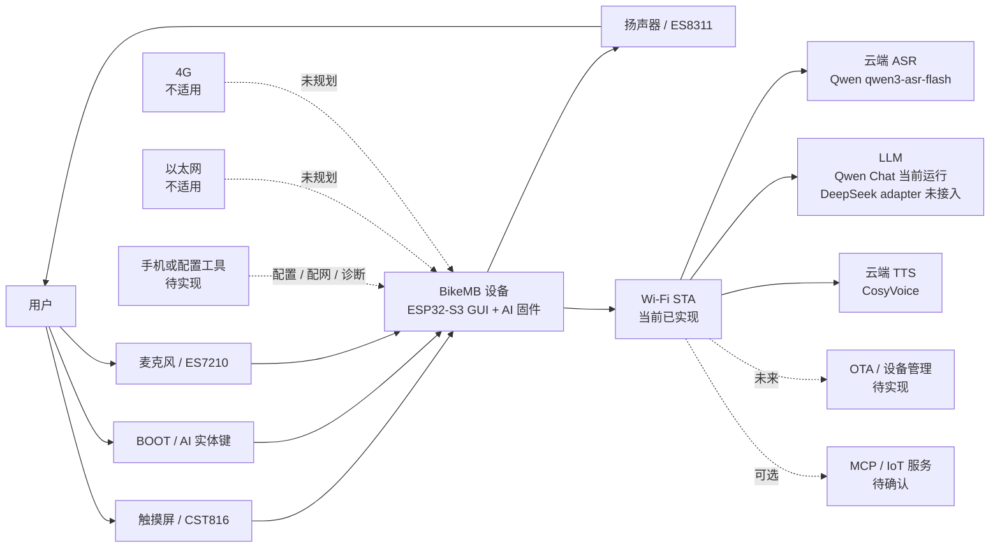
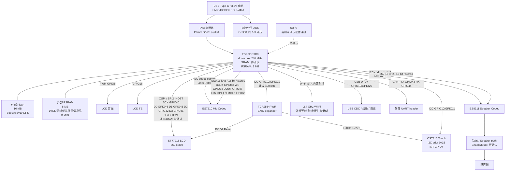
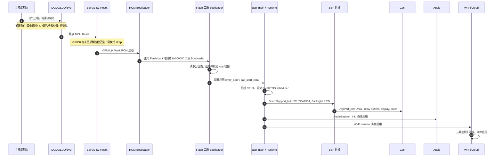
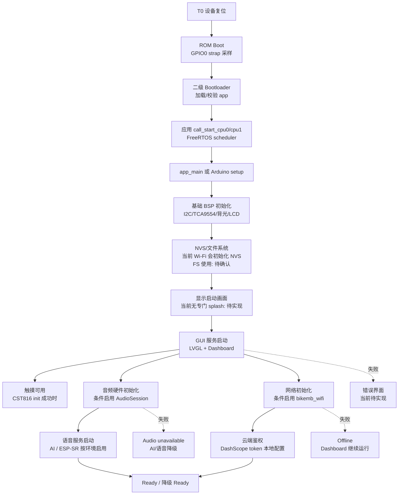
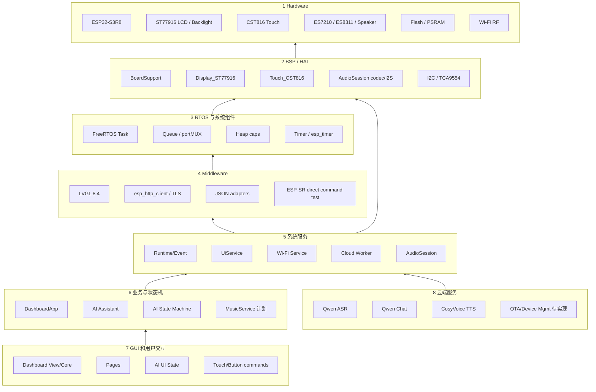
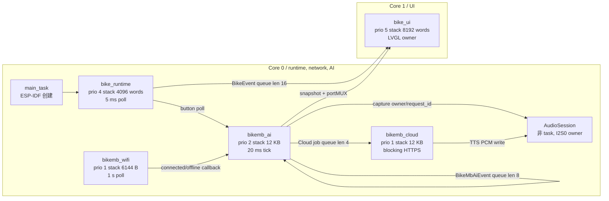
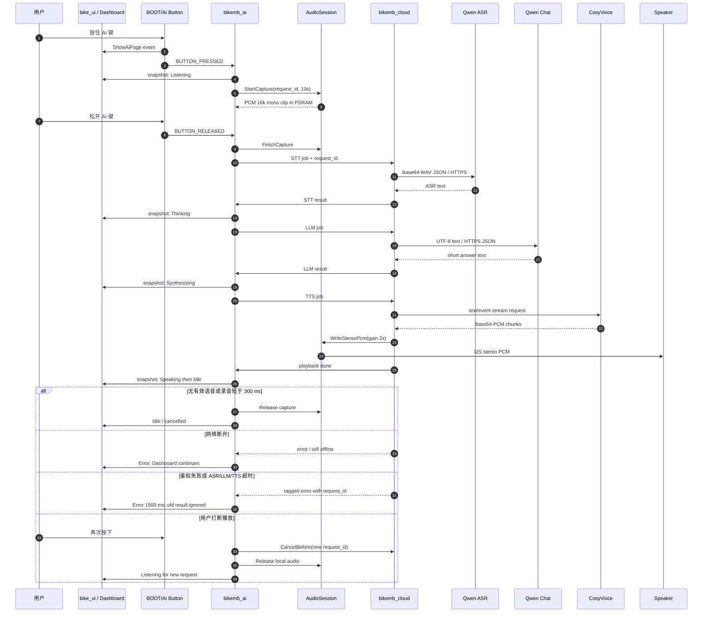
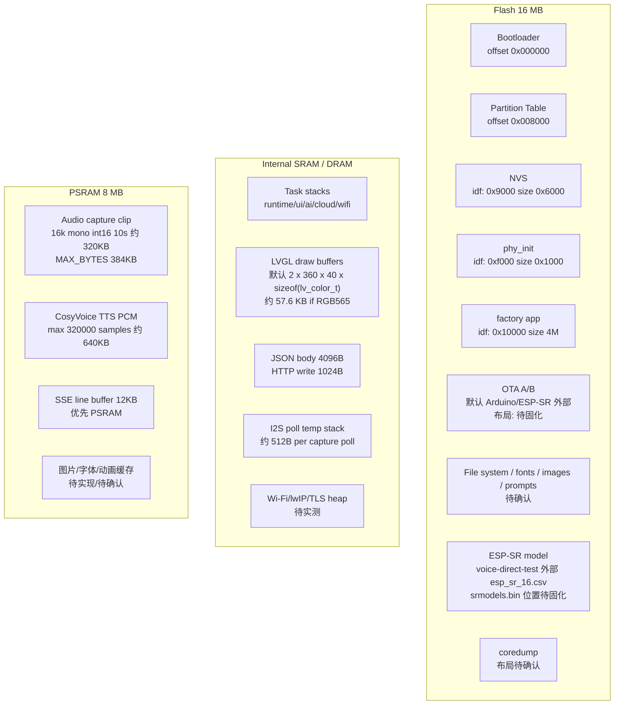
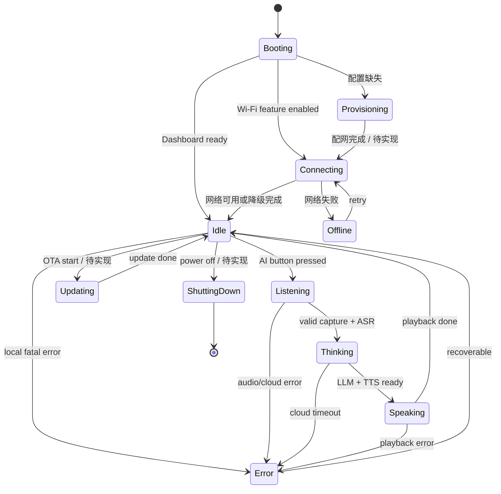

# BikeMB 系统架构文档

版本: v1
适用硬件: Waveshare `ESP32-S3-Touch-LCD-1.85C V2 / Rev2.0`
适用固件路径: `src/firmware/bikemb`
更新时间: 2026-07-27
编写依据: `docs/architecture/architecture-documentation-requirements.md`

## 0. 阅读说明

本文是 BikeMB 当前固件的规范化系统架构文档，用于指导开发、代码审查、性能分析、故障定位和 AI 辅助开发。

本文只把已经能从仓库、代码或项目文档确认的信息写成现状。缺少原理图确认、链接 map、运行时诊断或板级实测的数据，统一标为“待确认”或“建议值”。

当前已确认的基础输入：

| 项 | 当前值 | 来源 |
| --- | --- | --- |
| 开发板 | Waveshare `ESP32-S3-Touch-LCD-1.85C V2` | `docs/hardware-notes.md` |
| MCU | `ESP32-S3R8`, dual-core Xtensa LX7, 最高 240 MHz | `docs/hardware-notes.md`, `platformio.ini` |
| Flash | 16 MB | `docs/project-context.md`, `platformio.ini` |
| PSRAM | 8 MB | `docs/project-context.md` |
| 内部 SRAM | 待确认，需要 linker map 或 ESP-IDF memory report | 未在仓库文档中明确 |
| LCD | 360 x 360 round LCD, `ST77916`, QSPI | `docs/hardware-notes.md` |
| Touch | `CST816`, I2C `0x15`, INT `GPIO4` | `docs/hardware-notes.md` |
| Audio | ES7210 Mic Codec, ES8311 Speaker Codec | `src/audio/audio_session.cpp` |
| 网络 | ESP32-S3 内置 Wi-Fi STA | `src/network/wifi_service.cpp` |
| OS/SDK | Arduino 3.3.9 回归路径；ESP-IDF 迁移路径 | `platformio.ini` |
| LVGL | `lvgl/lvgl@^8.4.0` | `platformio.ini` |
| 云供应商 | Qwen ASR, Qwen Chat, CosyVoice TTS | `src/ai/ai_config.h`, `src/ai/cloud_worker.cpp` |
| 音频格式 | capture: 16 kHz mono int16; I2S stereo 16 bit | `audio_capture_core.h`, `audio_session.cpp` |
| 实测 Heap/Stack/CPU | 待确认；当前只有诊断日志代码，没有固化基线 | `bike_runtime.cpp`, `ui_service.cpp` |

## 1. 图 1：系统上下文图

图版本: v1
适用硬件: ESP32-S3-Touch-LCD-1.85C V2
更新时间: 2026-07-27

边界说明：

- 当前 P0 码表功能必须离线可用，不依赖云端、手机或 OTA。
- 当前 AI 云语音是 P2 实验能力；ESP-IDF 云端语音基础录音和回复已经通过用户板测确认，但 ADR-0004 尚未关闭。
- OTA、设备管理、MCP/IoT、手机配置工具当前不是已实现能力。

## 2. 图 2：硬件组成与电源树

图版本: v1
适用硬件: ESP32-S3-Touch-LCD-1.85C V2
更新时间: 2026-07-27

硬件登记表：

| 器件 | 驱动接口 | 总线速率 | DMA 使用 | 主要内存需求 | 初始化负责人 |
| --- | --- | --- | --- | --- | --- |
| ESP32-S3R8 | CPU/SoC | 240 MHz | SoC 内部 | task stack, heap, Wi-Fi/TLS | ESP-IDF/Arduino startup, `BikeRuntime_Start()` |
| Flash 16 MB | SPI flash | 待确认 | Bootloader/flash driver 内部 | app/FS/NVS/model/coredump | Bootloader, partition table |
| PSRAM 8 MB | Octal/外部 PSRAM，具体模式待确认 | 待确认 | Heap caps allocator | audio clip, TTS PCM, 可选大缓冲 | ESP-IDF heap, AudioSession, CloudWorker |
| ST77916 LCD | QSPI / SPI2_HOST | 待确认 | 当前 `LCD_addWindow()` 细节待确认 | LVGL draw buffer: 默认约 57.6 KB internal SRAM | `BoardSupport_Init()`, `LvglPort_Init()` |
| CST816 Touch | I2C `0x15`, INT `GPIO4` | 建议 400 kHz | 无 | 小结构体 | `LvglPort_Init()` |
| TCA9554PWR | I2C `0x20` | 建议 400 kHz | 无 | 无显著需求 | `BoardSupport_Init()` |
| ES7210 | I2C control + I2S0 input | I2S 16 kHz/16 bit/stereo 当前路径 | I2S DMA 细节待确认 | capture clip 最长约 320 KB PSRAM | `AudioSession` |
| ES8311 | I2C control + I2S0 output | I2S 16 kHz/16 bit/stereo 当前路径 | I2S DMA 细节待确认 | TTS playback buffers | `AudioSession` |
| Wi-Fi | ESP32-S3 内置 Wi-Fi STA | AP 决定 | ESP-IDF Wi-Fi 内部 | Wi-Fi/lwIP/TLS heap 待实测 | `bikemb_wifi` |
| SD 卡 | 待确认 | 待确认 | 待确认 | 待确认 | 未实现 |

## 3. 图 3：硬件上电和复位时序图

图版本: v1
适用硬件: ESP32-S3-Touch-LCD-1.85C V2
更新时间: 2026-07-27

当前仓库没有完整电源树时序、PMIC 型号、Power Good 延时、LCD/Codec 最小复位脉宽和最大等待时间。因此本图把电气时序标为待确认，只把软件已经执行的初始化顺序写成现状。

时序缺口：

| 区段 | 当前状态 | 需要补充 |
| --- | --- | --- |
| 电气上电时序 | 待确认 | PMIC/DCDC/LDO 型号、Power Good、各电源轨最小/最大延时 |
| LCD Reset | 代码通过 TCA9554/LCD driver 初始化，具体复位时序待确认 | ST77916 reset pulse、ready wait、失败重试策略 |
| Touch Reset | 代码通过 TCA9554/LVGL touch init，具体复位时序待确认 | CST816 reset pulse、INT ready、失败重试策略 |
| Audio Codec Reset | AudioSession 写 codec 寄存器，硬件 reset/enable 线待确认 | ES7210/ES8311 reset、MCLK/I2S 前置条件 |
| 功放 Enable/Mute | 待确认 | GPIO/Codec 寄存器/外部功放使能和静音策略 |
| 网络模块 Enable | ESP32-S3 内置 Wi-Fi，无独立 enable 线证据 | RF/PHY 初始化失败恢复策略 |

## 4. 图 4：系统启动和初始化流程图

图版本: v1
适用硬件: ESP32-S3-Touch-LCD-1.85C V2
更新时间: 2026-07-27

启动里程碑：

| 里程碑 | 当前定义 | 当前状态 |
| --- | --- | --- |
| T0 | 设备复位 | 已知 |
| T1 | 串口日志可用 | Arduino/ESP-IDF 均有日志；准确时间待实测 |
| T2 | 屏幕亮起 | `BoardSupport_Init()` 中背光和 LCD 初始化；准确时间待实测 |
| T3 | 启动界面可见 | 当前直接 Dashboard，专门 splash 待实现 |
| T4 | 触摸可用 | `LvglPort_Init()` 中 CST816 成功时可用 |
| T5 | 本地唤醒可用 | 常驻唤醒词未实现；BOOT/AI 键上电 3000 ms 后可作为 AI 键 |
| T6 | 网络连接成功 | `bikemb_wifi` 后台连接；准确时间待实测 |
| T7 | 云语音可用 | Wi-Fi + token + ASR/LLM/TTS 可访问；ESP-IDF 基础录音/回复已确认 |
| T8 | 完整产品功能 Ready | P0 Dashboard 可用；音乐/点歌/OTA 未 Ready |

初始化策略：

| 模块 | 串行/并行 | 超时 | 降级策略 |
| --- | --- | --- | --- |
| Bootloader 到 app | 串行 | ESP-IDF 默认，具体待确认 | Bootloader 失败恢复待确认 |
| BSP/LCD | 串行 | 待确认 | 当前失败处理不足，错误界面待实现 |
| LVGL draw buffer | 串行 | 立即分配 | 当前分配失败后循环等待；需改成错误界面或降级 |
| AudioSession | 可在 UI ready 后条件启动 | codec/I2S 超时待确认 | 音频不可用，Dashboard 继续运行 |
| Wi-Fi | 可并行后台启动 | 10 s 重试连接 | Offline，AI 云能力不可用 |
| Cloud ASR/LLM/TTS | AI 请求时触发 | 总 deadline 60 s，HTTPS read 15 s | AI Error，Dashboard 继续运行 |

## 5. 图 5：软件分层架构图

图版本: v1
适用硬件: ESP32-S3-Touch-LCD-1.85C V2
更新时间: 2026-07-27

依赖规则：

- 业务层不得直接依赖 LCD、Touch、Codec、I2S 等具体硬件驱动。
- `bike_ui` 是唯一允许调用 LVGL 的产品 task。
- Cloud provider adapter 不依赖 Dashboard 或 LVGL。
- AudioSession 是 I2S0/codec 的共享 owner，其他生产模块不得创建第二个 I2S0 owner。

## 6. 图 6：RTOS 任务与通信图

图版本: v1
适用硬件: ESP32-S3-Touch-LCD-1.85C V2
更新时间: 2026-07-27

任务清单：

| Task / 执行体 | 职责 | Priority | Core | Stack | 创建者 | 启动时间 | 调度/触发 | 最大阻塞 | Watchdog | IPC/同步 | 资源所有权 |
| --- | --- | --- | --- | --- | --- | --- | --- | --- | --- | --- | --- |
| `main_task` | 调用 `app_main()` | ESP-IDF 默认 | 通常 CPU0 | sdkconfig 决定，待确认 | ESP-IDF | RTOS 启动后 | 一次性 | 待确认 | ESP-IDF 默认，待确认 | 无 BikeMB IPC | 不拥有 LVGL/I2S |
| `bike_runtime` | 系统 tick、DashboardTick、AI button poll、诊断日志 | 4 | Core 0 | 4096 words | `BikeRuntime_Start()` | Runtime start | 5 ms loop | 当前不应阻塞；日志 10 s 一次 | 待确认 | `g_eventQueue` len 16 | event producer |
| `bike_ui` | LVGL/Dashboard 唯一 owner | 5 | Core 1 | 8192 words | `UiService_Start()` | Runtime start | queue wait 5 ms + `lv_timer_handler()` | 不应被网络/音频阻塞 | 待确认 | 消费 `g_eventQueue` | LVGL, Dashboard |
| `bikemb_ai` | AI 状态机、录音轮询、云阶段编排 | 2 | Core 0 | 12 KB | `BikeMbAiAssistant_Init()` | AI feature enabled | queue + 20 ms tick | 不执行 HTTPS 阻塞 | 待确认 | `s_commandQueue` len 8, `s_snapshotMux` | AI state/snapshot |
| `bikemb_cloud` | STT/LLM/TTS 阻塞调用和 TTS 播放 | 1 | Core 0 | 12 KB | `BikeMbCloudWorker_Init()` | AI init | job queue | HTTPS read timeout 15 s，总 deadline 60 s | 待确认 | `s_queue` len 4, request/clip mux | cloud buffers, TTS PCM |
| `bikemb_wifi` | Wi-Fi STA 初始化、后台连接和重连 | 1 | Core 0 | 6144 B | `BikeMbWifiService_Init()` | AI feature enabled | 1 s poll, 10 s retry | Wi-Fi API 阻塞待实测 | 待确认 | 状态机 + callback | Wi-Fi STA/netif |
| `AudioSession` | I2S0/codec owner、录音和播放仲裁 | 非 task | Core 0 计划归属 | 无 task stack | `BikeRuntime_Start()` 条件调用 | Audio feature enabled | 被 AI/Cloud 调用 | I2S read/write 超时待确认 | 待确认 | owner/request_id | ES7210/ES8311/I2S0 |
| `loopTask` | Arduino 回归路径主循环 | Arduino 默认 | 通常 Core 1 | Arduino 默认，待确认 | Arduino core | Arduino 启动 | `loop()` | 不适用产品路径 | 待确认 | 无 runtime queue | 回归路径 |
| `bikemb_prompt` | 档位提示音后台播放 | 1 | 未 pin | 4096 | `BikeMbAudioPrompts_Init()` | feature enabled | task notify overwrite | 播放期间阻塞自身 | 待确认 | `xTaskNotify` | prompt PCM playback |
| `bikemb-audio-mic` | 音频自检麦克风读取 | 1 | Core 0 | 4096 B | `BikeMbAudioSelfTest_Init()` | self-test env | loop/read | 待确认 | 待确认 | task handle | self-test mic |
| `bikemb-audio-capture` | capture self-test | 1 | 未 pin | 4096 B | `BikeMbAudioCaptureSelfTest_Init()` | self-test env | test task | 待确认 | 待确认 | task handle | test capture |

通信约束：

- 只有 `bike_ui` 可调用 LVGL。
- Core 0 task 只通过 runtime event、snapshot 或 App 命令边界影响 GUI。
- 网络阻塞集中在 `bikemb_cloud`，不应阻塞 `bike_ui`。
- ISR 到任务通信当前未形成产品级统一规范；LCD/Touch driver 内部 ISR/DMA 细节待确认。
- 当前没有优先级反转实测；`bikemb_ai` 与 `bikemb_cloud` 使用 portMUX 和 queue，后续需在长稳测试中检查。

## 7. 图 7：AI 云语音交互时序图

图版本: v1
适用硬件: ESP32-S3-Touch-LCD-1.85C V2
更新时间: 2026-07-27

消息类型：

| 类型 | 路径 | 当前格式 |
| --- | --- | --- |
| PCM 音频流 | Mic -> AudioSession -> PSRAM clip | 16 kHz mono int16 |
| 压缩音频流 | 当前未实现 | HTTPS MP3 / Opus 均待实现 |
| 控制消息 | Button/Runtime/AI/Cloud | FreeRTOS queue event + request_id |
| 文本消息 | ASR/LLM | UTF-8, STT 512B, answer 192B |
| UI 状态事件 | AI snapshot -> UI | copy snapshot, UI 只读 |

异常恢复：

| 异常 | 当前处理 | 待补 |
| --- | --- | --- |
| 无有效语音 | 短录音取消，不提交 STT | VAD/静音检测待实现 |
| 网络断开 | AI Error / Wi-Fi 后台重连，Dashboard 继续 | 断网 UI 和重试策略需板测 |
| 鉴权失败 | cloud error，脱敏显示 | CA/证书和 token 配置流程待完善 |
| ASR/LLM/TTS 超时 | 总 deadline 60 s，HTTPS read 15 s | 主动中断 HTTPS 待实现 |
| 用户打断播放 | 新 request_id 失效旧结果，释放本地音频 | 当前阻塞 HTTPS 仍需等 timeout |
| AEC 失效 | AEC 未实现 | AFE/AEC/VAD 方案待定 |
| 云服务主动结束 | 解析错误/阶段失败 | 需要更细错误码映射 |

## 8. 图 8：资源与内存预算图

图版本: v1
适用硬件: ESP32-S3-Touch-LCD-1.85C V2
更新时间: 2026-07-27

资源预算表：

| 资源 | 区域 | 当前值 | 预算上限 | 生命周期 | 所有者 | 内存不足处理 |
| --- | --- | --- | --- | --- | --- | --- |
| `bike_runtime` stack | SRAM | 4096 words | 待实测 | task 常驻 | Runtime | 记录 high-water，阈值待定 |
| `bike_ui` stack | SRAM | 8192 words | 待实测 | task 常驻 | UiService | 记录 high-water，阈值待定 |
| `bikemb_ai` stack | SRAM | 12 KB | 待实测 | AI enabled 常驻 | AI Assistant | 创建失败返回 false |
| `bikemb_cloud` stack | SRAM | 12 KB | 待实测 | AI enabled 常驻 | CloudWorker | 创建失败返回 false |
| `bikemb_wifi` stack | SRAM | 6144 B | 待实测 | AI enabled 常驻 | Wi-Fi Service | 创建失败返回 false |
| Runtime event queue | SRAM heap | 16 x `BikeEvent` | 固定 16 | 常驻 | Runtime | 低优先级 tick 可丢弃 |
| AI command queue | SRAM heap | 8 x `BikeMbAiEvent` | 固定 8 | AI 常驻 | AI Assistant | enqueue 失败当前未上报，待补 |
| Cloud job queue | SRAM heap | 4 x `BikeMbCloudJob` | 固定 4 | Cloud 常驻 | CloudWorker | submit 失败返回 false |
| LVGL draw buffers | internal SRAM | 默认约 57.6 KB if RGB565 | `BIKE_MB_LVGL_BUFFER_LINES` 控制 | UI 常驻 | LvglPort | 当前失败后无限等待，需改进 |
| Audio capture clip | PSRAM | 最长约 320 KB，宏上限 384 KB | 10 s / 16 kHz mono int16 | 单次录音 | AudioSession -> CloudWorker | 分配失败进入 capture failure |
| TTS PCM | PSRAM 优先 | 最多 320000 samples 约 640 KB | 固定上限 | 单次 TTS | CloudWorker | 分配失败返回 TTS error |
| TTS playback window | PSRAM/SRAM | 最多 96000 samples | 固定上限 | 单次播放 | CloudWorker/AudioSession | 超出截断播放 |
| SSE line | PSRAM 优先 | 12 KB | 固定上限 | 单次 TTS | CloudWorker | 分配失败 fallback 或错误 |
| JSON body | stack/SRAM | 4096 B | 固定上限 | 单次 HTTP | CloudWorker | 超出解析失败 |
| Wi-Fi/lwIP/TLS | SRAM/PSRAM | 待实测 | 待定义 | Wi-Fi/HTTPS 期间 | ESP-IDF | 需 heap trace |
| Flash factory app | Flash | ESP-IDF: 4 MB | 当前 CSV 固定 | 常驻 | Partition table | 超出 build 失败 |
| NVS | Flash | ESP-IDF: 0x6000 | 当前 CSV 固定 | 常驻 | NVS/Wi-Fi | 初始化失败需降级策略 |

## 9. 模块清单

| 模块 | 目录 | 职责 | 对外接口 | 依赖模块 | 运行上下文 | 维护负责人 | 单元测试位置 |
| --- | --- | --- | --- | --- | --- | --- | --- |
| Runtime | `src/runtime`, `src/services` | ESP-IDF task/core/event 边界 | `BikeRuntime_*`, `UiService_Start` | BoardSupport, UiService | `bike_runtime`, `bike_ui` | 软件架构师/开发工程师 | `tools/tests/test_runtime*.py`, `runtime_plan_test.cpp` |
| Board Support | `src/platform`, `src/drivers` | I2C, TCA9554, Backlight, LCD bring-up | `BoardSupport_Init` | Display/Touch drivers | startup | 嵌入式开发 | `test_display_driver_contract.py` |
| LVGL Port | `src/platform/lvgl_port.*` | LVGL display/touch/tick/run | `LvglPort_*` | ST77916, CST816 | `bike_ui` | GUI 工程师 | `test_lvgl_port_contract.py` |
| Dashboard App | `src/app` | UI 命令边界和页面状态 | `DashboardApp_*` | View, AI UI state | `bike_ui` / Arduino loop | GUI 工程师 | `test_dashboard*.py` |
| AI Button | `src/input` | BOOT/AI 键 guard/debounce | `BikeMbAiButton_*` | ai_config, runtime event | `bike_runtime` poll | 嵌入式开发 | `test_ai_framework.py` |
| AI Assistant | `src/ai/ai_assistant.*` | AI 状态机唯一写入者 | `BikeMbAiAssistant_*` | AudioSession, CloudWorker | `bikemb_ai` | AI/嵌入式 | `test_ai_framework.py` |
| Cloud Worker | `src/ai/cloud_worker.*` | STT/LLM/TTS 串行 worker | `BikeMbCloudWorker_*` | Qwen/CosyVoice adapters, AudioSession | `bikemb_cloud` | 云端/协议 | `test_cloud_worker_real_contract.py`, `test_idf_cloud_transport_contract.py` |
| Wi-Fi Service | `src/network` | Wi-Fi STA 后台连接 | `BikeMbWifiService_*` | esp_wifi/Arduino WiFi | `bikemb_wifi` | 网络工程师 | `test_wifi_service_contract.py`, `test_idf_wifi_service_contract.py` |
| AudioSession | `src/audio/audio_session.*` | I2S0/codec/clip owner | `BikeMbAudioSession_*` | ES7210/ES8311/I2S | 非 task 共享服务 | 音频工程师 | `test_audio_session_contract.py`, `test_idf_audio_session_contract.py` |
| Voice Commands | `src/voice` | ESP-SR direct command 测试 | `BikeMbVoiceCommands_*` | ESP-SR, Audio input | 专项环境 | 音频/语音 | `test_voice_commands_contract.py` |
| Audio Prompts | `src/audio/audio_prompts.*` | 档位播报测试 | `BikeMbAudioPrompts_*` | AudioSession/assets | `bikemb_prompt` | 音频工程师 | `test_audio_prompts_contract.py` |
| Music Service | `src/music` 计划 | 点歌/音乐 URL 管理 | 待定义 | Stream Player | 未实现 | 待定 | 待建立 |

## 10. 状态机说明

系统级目标状态：

状态登记：

| 状态 | 当前实现程度 | Owner | 进入条件 | 退出条件 | UI 行为 |
| --- | --- | --- | --- | --- | --- |
| Booting | 部分实现 | startup/runtime | reset/app start | Dashboard init | 当前无专门启动页 |
| Provisioning | 未实现 | 待定 | Wi-Fi/用户配置缺失 | 配置完成 | 待定义 |
| Connecting | 部分实现 | Wi-Fi Service | AI/Wi-Fi enabled | connected/offline | AI 页面显示连接状态 |
| Idle | 已实现 | Dashboard/AI | 初始化完成或 AI 结束 | 用户输入 | Dashboard 正常 |
| Listening | 已实现 | AI Assistant | AI key pressed | key released/cancel/error | AI 页面/状态提示 |
| Thinking | 已实现 | AI Assistant/Cloud | ASR text ready | LLM/TTS result/error | 正在思考/合成 |
| Speaking | 已实现但时序待修正 | AI/Cloud/Audio | TTS playback done callback 当前短暂出现 | Idle/Error | 正在回答 |
| Updating | 未实现 | OTA | OTA start | reboot/success/fail | 待定义 |
| Offline | 部分实现 | Wi-Fi/AI | Wi-Fi disconnected | reconnect | Dashboard 不受影响 |
| Error | 已实现于 AI，系统错误待补 | AI/System | capture/cloud/playback fail | timeout/retry | 脱敏错误 |
| ShuttingDown | 未实现 | Power | power off | off | 待定义 |

## 11. 故障定位入口

| 故障 | 首看模块 | 关键日志/指标 | 当前恢复 |
| --- | --- | --- | --- |
| 屏幕不亮 | BoardSupport, Display_ST77916 | 串口、背光、LCD init | 待补错误界面 |
| 触摸无效 | LvglPort, Touch_CST816 | `CST816 touch ready/init failed` | Dashboard 仍可运行 |
| GUI 卡顿 | bike_ui, LvglPort | render_ms, handler_max_us, flush_count | 待定义阈值 |
| 录音失败 | AudioSession, AI Assistant | capture start/finish logs | AI Error |
| ASR/LLM/TTS 超时 | CloudWorker | request_id, stage, 15s read timeout | AI Error, Dashboard 继续 |
| Wi-Fi 断开 | Wi-Fi Service | connected/offline, 10s retry | Offline, 后台重连 |
| 内存不足 | Runtime/UI diagnostics | heap free/largest, PSRAM free/largest, stack HWM | 局部失败；全局策略待补 |
| 音频 underrun | AudioSession/CloudWorker | 当前未记录 underrun | ADR-0004 待验收 |

## 12. 文档缺口和下一步

| 缺口 | 为什么缺 | 下一步 |
| --- | --- | --- |
| 电源树和硬件复位时序 | 当前文档未记录 PMIC、电源轨和 Power Good | 从原理图提取并补 Draw.io 或 Mermaid 时序 |
| LCD/QSPI 速率和 DMA | driver 内部细节未在本文确认 | 读取 `Display_ST77916` 和 ESP-IDF LCD config，补实测 |
| I2S DMA buffer | 当前只记录 AudioSession 层缓冲 | 补 I2S driver config 和 runtime heap trace |
| 内部 SRAM 基线 | 缺 linker map 和 `idf.py size` / PlatformIO size 输出 | 固化 build size 报告 |
| Heap/Stack/CPU 峰值 | 只有诊断代码，无验收样本 | 跑 30 分钟长稳，保存串口摘要 |
| Watchdog 策略 | 代码未显式登记每 task WDT 策略 | 明确 TWDT 是否启用和每 task 策略 |
| OTA/Storage/Settings | 当前未实现 | MusicService 后再规划，不能阻塞 P0 |
| AFE/AEC/VAD/Opus | 当前未实现 | 选型和资源预算单独评估 |

## 13. 验收映射

| 验收标准 | 当前文档覆盖 |
| --- | --- |
| 新工程师理解启动过程 | 图 3、图 4、启动里程碑表 |
| 找到每个主要任务创建位置和通信对象 | 图 6、任务清单、模块清单 |
| 判断哪些模块可调用 LVGL | 软件分层、RTOS 通信约束 |
| 追踪一帧音频完整路径 | 图 7、消息类型、资源表 |
| 定位 Flash/RAM/PSRAM 消耗 | 图 8、资源预算表 |
| 识别启动/网络/语音/GUI 故障点 | 故障定位入口 |
| 图中模块名映射真实代码目录 | 模块清单 |
| 代码变化后可由 AI 或脚本更新 | 本文 Mermaid/Markdown 源码入 Git |
