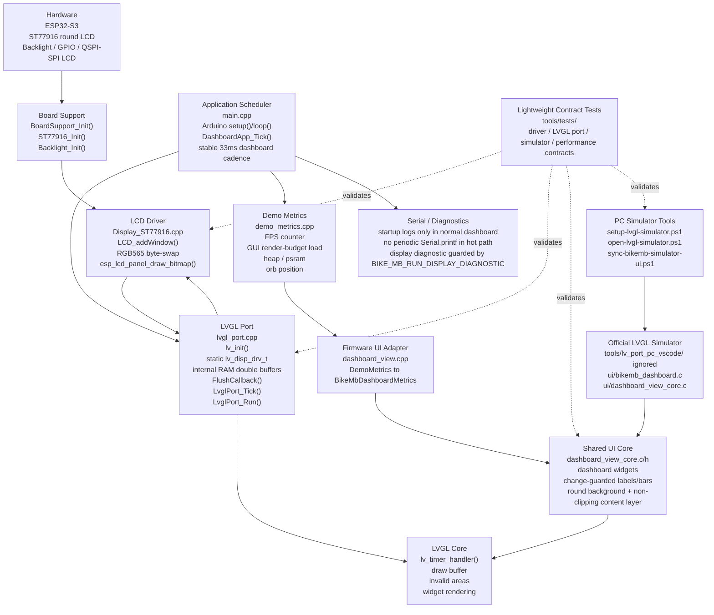

# BikeMB Software Architecture

This document captures the current BikeMB firmware architecture for quick agent and developer reference.

## Layer Diagram



## Runtime Flow

```mermaid
sequenceDiagram
  participant Loop as Arduino loop()
  participant App as DashboardApp
  participant Metrics as DemoMetrics
  participant View as DashboardView/Core
  participant LVGL as LVGL
  participant LCD as LCD_addWindow/ST77916

  Loop->>LVGL: LvglPort_Tick(deltaMs)
  Loop->>App: DashboardApp_Tick(now)
  App->>Metrics: DemoMetrics_Update(renderWorkMs)
  Metrics-->>App: fps/cpu/heap/orb
  App->>View: DashboardView_Update(metrics)
  View->>LVGL: update changed labels/bars + orb position
  Loop->>LVGL: LvglPort_Run()
  LVGL->>LCD: FlushCallback(area, color)
  LCD-->>LVGL: lv_disp_flush_ready()
  LVGL-->>Loop: renderWorkMs
  Loop->>App: DashboardApp_SetRenderWorkMs(renderWorkMs)
```

## Notes

- The LCD driver currently uses a synchronous flush contract. Do not push refresh cadence aggressively until the LCD transfer path is measured or made asynchronous.
- The dashboard CPU number is a GUI render-budget estimate, not a FreeRTOS system-wide CPU utilization metric.
- The dashboard hot path must not emit periodic serial logs. USB serial backpressure can stall the main loop and make FPS collapse after the first logging interval.
- The proven board cadence is currently the stable 33ms dashboard update interval. 16ms/60Hz needs async flush or measured LCD transfer evidence first.
- `dashboard_view_core.c/h` is shared by firmware and the official PC LVGL simulator.
- `tools/lv_port_pc_vscode/` is an ignored official checkout and should not be committed.

## How To View

This file is Markdown with Mermaid diagrams.

Recommended viewers:

- VS Code or Cursor: open this file, then use Markdown Preview.
- GitHub: Mermaid diagrams render automatically when the file is pushed.
- Typora or Obsidian: both can render Markdown; enable Mermaid support if it is disabled.

If a viewer shows the Mermaid code block as plain text, install or enable Mermaid preview support for that editor.
