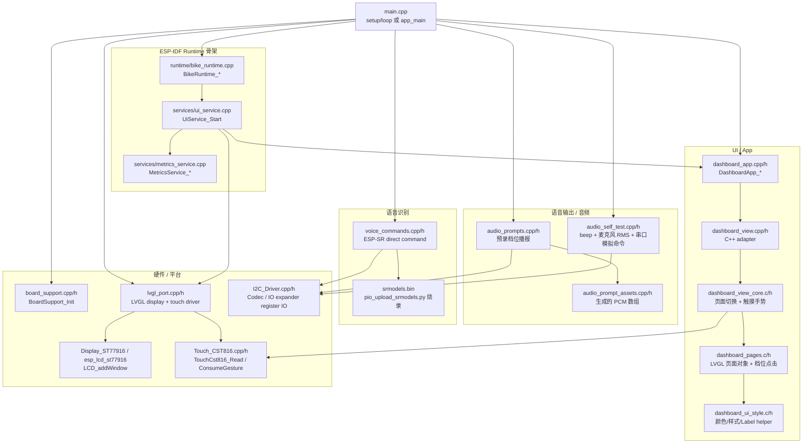
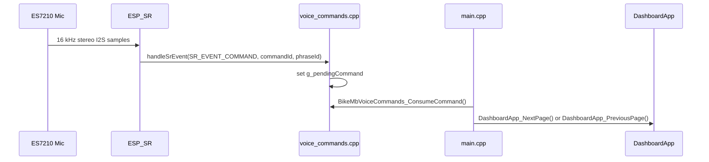

# BikeMB 固件架构说明

本文是 `firmware/bikemb` 的当前代码地图。目标不是解释概念，而是让你能快速找到“某个功能在哪个文件、哪个函数里实现”。

## 当前运行路径

当前工程保留两条运行路径：

- 默认路径：`PlatformIO + Arduino`，入口在 [main.cpp](/D:/MyProject/BikeMB/firmware/bikemb/src/main.cpp)，使用 `setup()` / `loop()`。
- 迁移路径：`PlatformIO + ESP-IDF`，入口也在 [main.cpp](/D:/MyProject/BikeMB/firmware/bikemb/src/main.cpp)，使用 `app_main()`。

目前已经上板验证的 UI、触摸、音频自检、档位播报、直接语音识别，都在 Arduino 路径上。ESP-IDF 路径已经有 Runtime/Event/Service 骨架，但音频和语音还没有迁过去。

## 总体模块图



## Arduino 主循环框架

文件：[main.cpp](/D:/MyProject/BikeMB/firmware/bikemb/src/main.cpp)

### 编译开关

| 开关 | 默认值 | 哪个环境打开 | 作用 |
| --- | --- | --- | --- |
| `BIKE_MB_RUN_DISPLAY_DIAGNOSTIC` | `0` | 手动 build flag | 只跑显示诊断，不跑 dashboard。 |
| `BIKE_MB_ENABLE_AUDIO_SELF_TEST` | `0` | `esp32-s3-touch-lcd-1-85c-audio-self-test` | 开启 beep、麦克风 RMS、串口 `n/p` 模拟翻页。 |
| `BIKE_MB_ENABLE_AUDIO_PROMPTS` | `0` | `esp32-s3-touch-lcd-1-85c-mode-prompts-test` | 开启档位点击预录语音播报。 |
| `BIKE_MB_ENABLE_VOICE_COMMANDS` | `0` | `esp32-s3-touch-lcd-1-85c-voice-direct-test` | 开启 ESP-SR 直接语音命令识别。 |

### `setup()` 顺序

1. `Serial.begin(115200)`：打开串口。
2. `BoardSupport_Init()`：板级初始化，包含 LCD/I2C/背光等基础链路。
3. `BikeMbAudioPrompts_Init()`：档位播报初始化；默认是空函数。
4. `BikeMbAudioSelfTest_Init()`：音频自检初始化；默认是空函数。
5. `BikeMbVoiceCommands_Init()`：语音识别初始化；默认是空函数。
6. `LvglPort_Init()`：初始化 LVGL 显示和 CST816 触摸输入。
7. `DashboardApp_Init()`：初始化指标服务并创建 dashboard UI。
8. `DashboardApp_SetModeChangedCallback(HandleModeChanged)`：把 UI 档位点击接到音频播报入口。

### `loop()` 顺序

1. 计算 `now` 和 `deltaMs`。
2. `LvglPort_Tick(deltaMs)`：推进 LVGL tick。
3. `DashboardApp_Tick(now)`：更新 demo 数据和 UI。
4. `DashboardApp_SetRenderWorkMs(LvglPort_Run())`：运行 `lv_timer_handler()`，并记录渲染耗时。
5. `BikeMbAudioSelfTest_Tick(now)`：音频自检环境下处理串口命令和麦克风 RMS 打印。
6. `HandleAudioSelfTestCommand()`：把音频自检的 `n/p` 命令路由到 dashboard 翻页。
7. `HandleVoiceCommand()`：把语音识别结果路由到 dashboard 翻页。
8. `delay(5)`。

### `main.cpp` 里的命令路由函数

| 函数 | 来源 | 作用 |
| --- | --- | --- |
| `HandleModeChanged(uint8_t modeIndex)` | UI 档位点击 callback | 如果 `BIKE_MB_ENABLE_AUDIO_PROMPTS=1`，调用 `BikeMbAudioPrompts_PlayMode(...)`。 |
| `HandleAudioSelfTestCommand()` | 串口自检命令 | 消费 `BikeMbAudioSelfTest_ConsumeCommand()`，调用 `DashboardApp_NextPage()` / `DashboardApp_PreviousPage()`，再播放提示音。 |
| `HandleVoiceCommand()` | ESP-SR 识别结果 | 消费 `BikeMbVoiceCommands_ConsumeCommand()`，调用 dashboard 翻页命令。 |

## UI 框架

UI 分层的原则：触摸、语音、串口测试都不能直接操作 LVGL 页面，而是走 `DashboardApp_*` 命令入口。

### App 层

文件：[dashboard_app.h](/D:/MyProject/BikeMB/firmware/bikemb/src/app/dashboard_app.h)

| 函数 | 调用方 | 作用 |
| --- | --- | --- |
| `DashboardApp_Init()` | `main.cpp` / `UiService` | 初始化 `MetricsService`，创建 dashboard view。 |
| `DashboardApp_Tick(uint32_t nowMs)` | `main.cpp` / `UiService` | 更新 demo 数据、刷新 UI label 和波形。 |
| `DashboardApp_SetRenderWorkMs(uint32_t renderWorkMs)` | `main.cpp` / `UiService` | 把 LVGL 渲染耗时反馈给指标服务。 |
| `DashboardApp_NextPage()` | 触摸/音频/语音命令 | 下一页。 |
| `DashboardApp_PreviousPage()` | 触摸/音频/语音命令 | 上一页。 |
| `DashboardApp_SetModeChangedCallback(...)` | `main.cpp` | 注册档位变化 callback，用于档位播报。 |

### View Core 层

文件：[dashboard_view_core.h](/D:/MyProject/BikeMB/firmware/bikemb/src/app/dashboard_view_core.h)

| 函数/类型 | 作用 |
| --- | --- |
| `BikeMbDashboardMetrics` | C struct，承载所有要显示到 UI 的数据。 |
| `BikeMbDashboardModeChangedCallback` | 档位变化 callback 类型：`void (*)(uint8_t mode_index)`。 |
| `BikeMbDashboardView_Create()` | 创建 screen、三个页面容器、page dots 和子控件。 |
| `BikeMbDashboardView_Update(...)` | 更新 label、波形，并轮询触摸手势。 |
| `BikeMbDashboardView_NextPage()` | 显示下一页。 |
| `BikeMbDashboardView_PreviousPage()` | 显示上一页。 |
| `BikeMbDashboardView_SetModeChangedCallback(...)` | 把 callback 传给 `dashboard_pages`。 |

### Page 层

文件：

- [dashboard_pages.c](/D:/MyProject/BikeMB/firmware/bikemb/src/app/dashboard_pages.c)
- [dashboard_pages.h](/D:/MyProject/BikeMB/firmware/bikemb/src/app/dashboard_pages.h)
- [dashboard_ui_style.c](/D:/MyProject/BikeMB/firmware/bikemb/src/app/dashboard_ui_style.c)
- [dashboard_ui_style.h](/D:/MyProject/BikeMB/firmware/bikemb/src/app/dashboard_ui_style.h)

| 函数 | 作用 |
| --- | --- |
| `BikeMbDashboardPages_Create(...)` | 创建首页、速率波形页、详细信息页。 |
| `BikeMbDashboardPages_Update(...)` | 更新所有页面上的文字和波形点。 |
| `BikeMbDashboardPages_SetModeChangedCallback(...)` | 保存档位变化 callback。 |
| `mode_click_event_cb(...)` | 私有 LVGL 点击事件：`ECO -> TRAIL -> BOOST -> ECO`，更新 label，并发出 mode index。 |
| `BikeMbUi_MakeFixedLabel(...)` | 创建固定宽度 label，减少圆屏 UI 文字溢出。 |
| `BikeMbUi_SetLabelTextIfChanged(...)` | 只有文字变化时才更新 LVGL label。 |

页面不会再按时间自动跳转。旧的 `activePage = (now / 5000) % 3` 已经删除。当前页面只会因为这些入口变化：

- CST816 左右滑动手势。
- 音频自检环境下串口 `n/p`。
- 直接语音识别环境下识别到上一页/下一页。

## 音频硬件引脚

当前音频层使用已经上板验证过的 Waveshare 引脚：

| 信号 | GPIO | 用途 |
| --- | --- | --- |
| I2S MCLK | GPIO2 | ES8311/ES7210 主时钟 |
| I2S BCLK | GPIO48 | I2S bit clock |
| I2S LRCK | GPIO38 | I2S word select |
| I2S DOUT | GPIO47 | 输出到 ES8311 喇叭链路 |
| I2S DIN | GPIO39 | ES7210 麦克风输入 |
| I2C SDA/SCL | GPIO10/GPIO11 | Codec 寄存器配置 |
| PA enable | GPIO15 | 功放使能 |

## 语音输出框架

现在有两条输出路径：音频自检提示音、档位预录语音播报。

### 音频自检输出

文件：

- [audio_self_test.h](/D:/MyProject/BikeMB/firmware/bikemb/src/audio/audio_self_test.h)
- [audio_self_test.cpp](/D:/MyProject/BikeMB/firmware/bikemb/src/audio/audio_self_test.cpp)

开启方式：`BIKE_MB_ENABLE_AUDIO_SELF_TEST=1`

公共 API：

| 函数 | 作用 |
| --- | --- |
| `BikeMbAudioSelfTest_Init()` | 初始化 GPIO15、ES8311、ES7210、I2S，并播放一次开机 beep。 |
| `BikeMbAudioSelfTest_Tick(uint32_t nowMs)` | 读取串口 `n/p` 命令，每秒打印一次麦克风 mean-square。 |
| `BikeMbAudioSelfTest_PlayPageTone(bool nextPage)` | 翻页命令后播放短提示音。 |
| `BikeMbAudioSelfTest_ConsumeCommand()` | 取出待处理的模拟翻页命令，并清空队列。 |

私有实现：

| 函数 | 作用 |
| --- | --- |
| `initSpeakerCodec()` | 配置 ES8311，I2C 地址 `0x18`。 |
| `initMicrophoneCodec()` | 配置 ES7210，I2C 地址 `0x40`。 |
| `writeTone(...)` | 生成方波 stereo sample，通过 `I2SClass::write` 输出。 |
| `reportMicLevel()` | 从 I2S 读样本并打印 mean-square。 |
| `readSerialCommand()` | 把串口 `n/N` 和 `p/P` 转成待处理命令。 |

### 档位预录语音播报

文件：

- [audio_prompts.h](/D:/MyProject/BikeMB/firmware/bikemb/src/audio/audio_prompts.h)
- [audio_prompts.cpp](/D:/MyProject/BikeMB/firmware/bikemb/src/audio/audio_prompts.cpp)
- [audio_prompt_assets.h](/D:/MyProject/BikeMB/firmware/bikemb/src/audio/audio_prompt_assets.h)
- [audio_prompt_assets.cpp](/D:/MyProject/BikeMB/firmware/bikemb/src/audio/audio_prompt_assets.cpp)
- [generate-mode-prompts.ps1](/D:/MyProject/BikeMB/tools/generate-mode-prompts.ps1)

开启方式：`BIKE_MB_ENABLE_AUDIO_PROMPTS=1`

公共 API：

| 函数/类型 | 作用 |
| --- | --- |
| `BikeMbAudioPromptMode` | 枚举：`ECO`、`TRAIL`、`BOOST`。值和 UI mode index 对齐。 |
| `BikeMbAudioPrompts_Init()` | 初始化 GPIO15、ES8311、I2S 喇叭输出，并创建后台播放 task。 |
| `BikeMbAudioPrompts_PlayMode(BikeMbAudioPromptMode mode)` | 提交档位语音播放请求后立即返回，不阻塞 UI 档位切换。 |

私有实现：

| 函数/数据 | 作用 |
| --- | --- |
| `initSpeakerCodec()` | 配置 ES8311，逻辑和音频自检输出一致。 |
| `promptTask(...)` | 后台等待 `xTaskNotify`，收到最新档位请求后播放对应 PCM。 |
| `g_requestSerial` | 播放请求版本号。连续切换档位时，新版本会让旧语音在下一个 chunk 前中断。 |
| `writePrompt(...)` | 把 16 kHz mono PCM 复制成 stereo I2S frame 输出，并检查是否被新请求打断。 |
| `kBikeMbPromptEcoPcm` | `经济模式` 的 PCM 数据。 |
| `kBikeMbPromptTrailPcm` | `越野模式` 的 PCM 数据。 |
| `kBikeMbPromptBoostPcm` | `增强模式` 的 PCM 数据。 |

播放时序：

1. UI 点击档位后先更新页面状态。
2. `main.cpp` 的 `HandleModeChanged(...)` 调用 `BikeMbAudioPrompts_PlayMode(...)`。
3. `BikeMbAudioPrompts_PlayMode(...)` 只更新 `g_requestedMode` / `g_requestSerial`，再用 `xTaskNotify(..., eSetValueWithOverwrite)` 唤醒后台 task。
4. `promptTask(...)` 在后台写 I2S。每写一个小块前比较 `expectedSerial != getRequestSerial()`。
5. 如果用户连续切换档位，旧语音停止，后台 task 转去播放最新档位语音。

语音资产生成流程：

1. 运行 `powershell -ExecutionPolicy Bypass -File tools\generate-mode-prompts.ps1`。
2. 脚本默认读取 `generated_audio/eco.mp3`、`generated_audio/trail.mp3`、`generated_audio/boost.mp3`。
3. Windows Media Transcoder 先把源音频转为临时 WAV，输出到 `build/generated-prompts`。
4. 脚本再下混/重采样为 `16-bit mono PCM, 16000 Hz`。
5. 脚本把 PCM 转成 `audio_prompt_assets.cpp` 里的 C 数组。
6. `audio_prompt_assets.cpp` 本身也受 `BIKE_MB_ENABLE_AUDIO_PROMPTS` 保护，所以默认固件不会带入大语音数组。

当前限制：档位播报和 ESP-SR 识别都会使用 I2S 音频链路。现在先放在不同测试环境里，后续如果要同时“边听边播”，需要增加共享音频管理或暂停/恢复识别策略。

## 语音识别框架

文件：

- [voice_commands.h](/D:/MyProject/BikeMB/firmware/bikemb/src/voice/voice_commands.h)
- [voice_commands.cpp](/D:/MyProject/BikeMB/firmware/bikemb/src/voice/voice_commands.cpp)
- [pio_upload_srmodels.py](/D:/MyProject/BikeMB/tools/pio_upload_srmodels.py)

开启方式：`BIKE_MB_ENABLE_VOICE_COMMANDS=1`

公共 API：

| 函数/类型 | 作用 |
| --- | --- |
| `BikeMbVoiceCommand` | 枚举：`NONE`、`NEXT_PAGE`、`PREVIOUS_PAGE`。 |
| `BikeMbVoiceCommands_Init()` | 初始化 ES7210、I2S 输入、ESP-SR callback，并进入 direct command mode。 |
| `BikeMbVoiceCommands_ConsumeCommand()` | 取出待处理的语音命令，并清空队列。 |

私有实现：

| 函数/数据 | 作用 |
| --- | --- |
| `initMicrophoneCodec()` | 配置 ES7210，I2C 地址 `0x40`。 |
| `kSrCommands[]` | ESP-SR 命令表。当前是英文：`Next page`、`Next screen`、`Next song`、`Previous page`、`Previous screen`、`Go back`。 |
| `handleSrEvent(sr_event_t event, int commandId, int phraseId)` | ESP-SR callback。识别成功时写入 `g_pendingCommand`；timeout 时回到 command mode。 |
| `g_pendingCommand` | 单槽命令队列，由 `main.cpp` 消费。 |

`BikeMbVoiceCommands_Init()` 初始化顺序：

1. 打印 `direct command mode enabled`。
2. 调用 `initMicrophoneCodec()`。
3. 调用 `g_i2s.setPins(GPIO_NUM_48, GPIO_NUM_38, GPIO_NUM_47, GPIO_NUM_39, GPIO_NUM_2)`。
4. 以 `16000 Hz`、16-bit、stereo slot mode 启动 I2S。
5. 注册 `ESP_SR.onEvent(handleSrEvent)`。
6. 调用 `ESP_SR.begin(...)`，参数包含：
   - `SR_CHANNELS_STEREO`
   - `SR_MODE_COMMAND`
   - 输入格式字符串 `"MN"`

语音命令流：



当前限制：当前 Arduino ESP-SR wrapper 在本工程里走英文命令。中文 `下一页/上一页` 还没有在这个路径中启用。

## 固件分区和构建环境框架

文件：[platformio.ini](/D:/MyProject/BikeMB/firmware/bikemb/platformio.ini)

### PlatformIO 环境

| Environment | Framework | 用途 | 关键配置 |
| --- | --- | --- | --- |
| `esp32-s3-touch-lcd-1-85c` | Arduino | 默认 LVGL dashboard 固件。 | 不打开音频/语音开关。 |
| `esp32-s3-touch-lcd-1-85c-audio-self-test` | Arduino | 音频输入/输出硬件验证。 | `BIKE_MB_ENABLE_AUDIO_SELF_TEST=1` |
| `esp32-s3-touch-lcd-1-85c-mode-prompts-test` | Arduino | 点击档位后播放预录语音。 | `BIKE_MB_ENABLE_AUDIO_PROMPTS=1` |
| `esp32-s3-touch-lcd-1-85c-voice-direct-test` | Arduino | ESP-SR 直接识别上一页/下一页。 | `board_build.partitions = esp_sr_16.csv`，`BIKE_MB_ENABLE_VOICE_COMMANDS=1`，`extra_scripts = pre:../../tools/pio_upload_srmodels.py` |
| `esp32-s3-touch-lcd-1-85c-idf` | ESP-IDF | Runtime/Event/Service 迁移构建。 | `BIKE_MB_USE_ESPIDF_RUNTIME=1` |

### 默认分区

默认 Arduino 环境没有在仓库里指定自定义分区 CSV。它使用 board/framework 默认分区布局。这是当前稳定 LVGL 固件路径。

### ESP-SR 分区

直接语音识别环境使用 `esp_sr_16.csv`，因为 ESP-SR 需要模型分区。这个 CSV 由 Arduino/ESP32 framework 包提供，不是本仓库自维护文件。

模型文件由 [pio_upload_srmodels.py](/D:/MyProject/BikeMB/tools/pio_upload_srmodels.py) 追加烧录：

```python
srmodels = framework_libs / "esp32s3" / "esp_sr" / "srmodels.bin"
env.Append(FLASH_EXTRA_IMAGES=[("0xC10000", str(srmodels))])
```

含义：

- `srmodels.bin` 来自 `framework-arduinoespressif32-libs`。
- 它作为 extra image 烧录到 `0xC10000`。
- 固件镜像和模型镜像必须匹配 `esp_sr_16.csv` 的分区布局。
- 如果找不到模型文件，脚本会在烧录前抛出 `FileNotFoundError`。

### 常用构建命令

建议使用项目内 `.pio-home`，避免全局 `.platformio` 权限问题：

```powershell
$env:PLATFORMIO_CORE_DIR = (Resolve-Path '.pio-home').Path
$env:PLATFORMIO_SETTING_ENABLE_TELEMETRY = 'No'
py -X utf8 -m platformio run -s -d firmware\bikemb
```

构建档位播报固件：

```powershell
$env:PLATFORMIO_CORE_DIR = (Resolve-Path '.pio-home').Path
$env:PLATFORMIO_SETTING_ENABLE_TELEMETRY = 'No'
py -X utf8 -m platformio run -s -d firmware\bikemb -e esp32-s3-touch-lcd-1-85c-mode-prompts-test
```

烧录档位播报固件：

```powershell
$env:PLATFORMIO_CORE_DIR = (Resolve-Path '.pio-home').Path
$env:PLATFORMIO_SETTING_ENABLE_TELEMETRY = 'No'
py -X utf8 -m platformio run -s -d firmware\bikemb -e esp32-s3-touch-lcd-1-85c-mode-prompts-test -t upload
```

烧录直接语音识别固件：

```powershell
$env:PLATFORMIO_CORE_DIR = (Resolve-Path '.pio-home').Path
$env:PLATFORMIO_SETTING_ENABLE_TELEMETRY = 'No'
py -X utf8 -m platformio run -s -d firmware\bikemb -e esp32-s3-touch-lcd-1-85c-voice-direct-test -t upload
```

## ESP-IDF Runtime 骨架

文件：

- [bike_runtime.cpp](/D:/MyProject/BikeMB/firmware/bikemb/src/runtime/bike_runtime.cpp)
- [bike_event.h](/D:/MyProject/BikeMB/firmware/bikemb/src/runtime/bike_event.h)
- [ui_service.cpp](/D:/MyProject/BikeMB/firmware/bikemb/src/services/ui_service.cpp)
- [metrics_service.cpp](/D:/MyProject/BikeMB/firmware/bikemb/src/services/metrics_service.cpp)

| 函数 | 作用 |
| --- | --- |
| `BikeRuntime_Init()` | 创建 event queue，并调用 `BoardSupport_Init()`。 |
| `BikeRuntime_Start()` | 启动 `UiService` 和 `RuntimeTickTask`。 |
| `BikeRuntime_PostEvent(...)` | 向固定 FreeRTOS queue 投递事件；队列满时丢弃低优先级 tick。 |
| `BikeRuntime_GetEventQueue()` | 返回 queue handle。 |
| `BikeRuntime_GetDroppedLowPriorityEvents()` | 返回低优先级事件丢弃计数。 |
| `UiService_Start(...)` | 启动拥有 LVGL 的 UI task。 |
| `UiTask(...)` | 初始化 LVGL/dashboard，消费事件，并调用 `LvglPort_Run()`。 |

当前边界：ESP-IDF runtime 还不是音频/语音的验证路径。音频和语音实验先留在 Arduino 环境，等后续设计“音频驱动所有权”和“任务调度模型”后再迁移。

## 验证入口

轻量合同测试在 `tools/tests`。

| 测试文件 | 保护内容 |
| --- | --- |
| `test_audio_self_test_contract.py` | 音频自检开关、引脚、API、dashboard 命令边界。 |
| `test_audio_prompts_contract.py` | 档位播报 API、生成资产、默认关闭、mode callback。 |
| `test_voice_commands_contract.py` | ESP-SR API、命令词、模型烧录脚本、语音环境分区配置。 |
| `test_dashboard_no_auto_page_contract.py` | 防止 demo metrics 再引入自动翻页。 |
| `test_lvgl_port_contract.py` | LVGL display/touch port 边界。 |
| `test_lvgl_simulator_contract.py` | PC simulator 与固件共享 dashboard UI 源码。 |
| `test_runtime_contract.py` | ESP-IDF runtime/event/service 骨架。 |

运行：

```powershell
powershell -ExecutionPolicy Bypass -File tools\run-tests.ps1
```

## 当前已知架构限制

- 语音输出和语音识别目前是两个测试环境，不建议同时打开。
- `voice-direct-test` 没有唤醒词，环境噪声可能导致误识别，所以不适合作为日常骑行 UI 固件。
- 当前 Arduino ESP-SR 路径还没有启用中文命令识别。
- ESP-IDF runtime 已经有结构，但音频/语音还没有迁移到这个运行模型。
