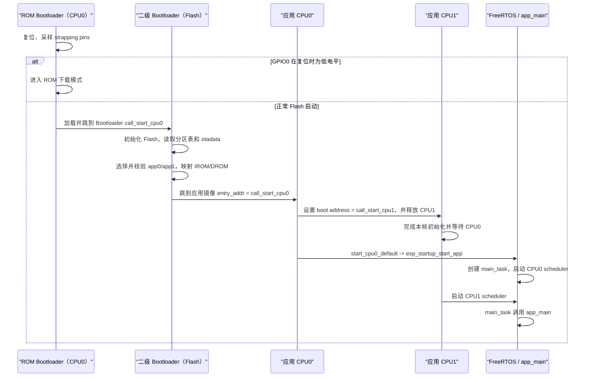
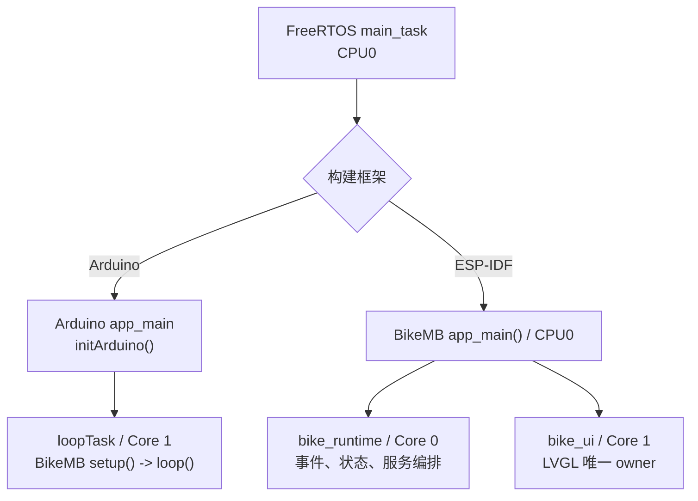
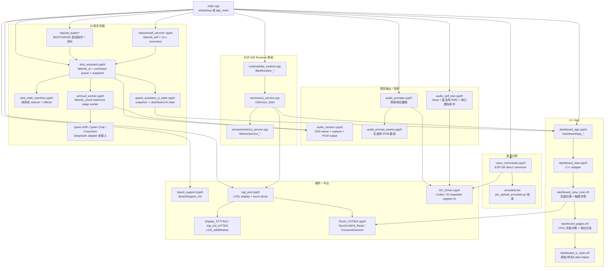
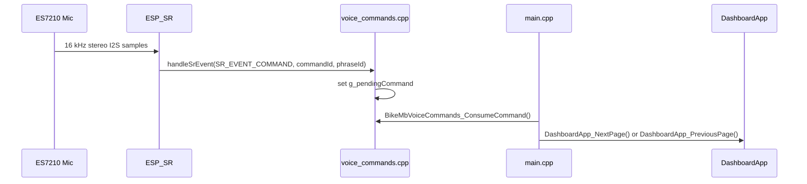
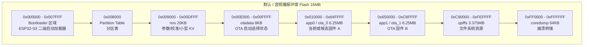
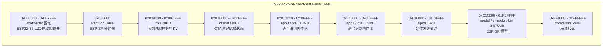

# BikeMB 固件架构说明

本文是 `src/firmware/bikemb` 的当前代码地图。目标不是解释概念，而是让你能快速找到“某个功能在哪个文件、哪个函数里实现”。系统级约束和目标架构分别维护在 `docs/architecture/`；AI 助手的逐函数说明见 [ai-assistant-implementation.md](/D:/MyProject/BikeMB/docs/architecture/ai-assistant-implementation.md)。本文只把已经进入源码的能力标为“当前实现”，尚未落地的能力明确标为“计划中”。

## 当前运行路径

当前工程保留两条运行路径：

- 默认路径：`PlatformIO + Arduino`，入口在 [main.cpp](/D:/MyProject/BikeMB/src/firmware/bikemb/src/main.cpp)，使用 `setup()` / `loop()`。
- 迁移路径：`PlatformIO + ESP-IDF`，入口也在 [main.cpp](/D:/MyProject/BikeMB/src/firmware/bikemb/src/main.cpp)，使用 `app_main()`。

当前 Arduino 路径仍是已上板验证最多的路径，承载 LVGL dashboard、触摸、音频自检、档位播报、直接语音识别测试和 AI 语音闭环。AI 初版已经包含 BOOT 键、纯状态机、控制 task、异步 Wi-Fi、AudioSession 录音、Qwen ASR、Qwen Chat、CosyVoice TTS、喇叭播放和独立 AI 页面。默认固件仍关闭 AI；真实云链路只在专用测试环境启用。DeepSeek adapter 已实现但未接入 CloudWorker，音乐流和点歌仍是计划能力。

ESP-IDF 路径已经完成框架迁移第一阶段：产品入口使用 BikeMB `app_main()`，`bike_runtime` 固定 Core 0，`bike_ui` 固定 Core 1，AI Assistant、Cloud Worker、Wi-Fi Worker 固定 Core 0，BOOT/AI 键页面切换通过 runtime event 交给 Core 1 UI task。AudioSession 的 ESP-IDF codec/I2S 初始化已完成第一轮上板验证，Qwen ASR/Qwen Chat 的 ESP-IDF HTTPS JSON transport 已能构建，但 ESP-IDF TTS 播放、取消和完整语音闭环还没有完成回归，所以不能关闭 ADR-0004。

## Bootloader 与双核启动链路

ESP32-S3 上电后不是直接执行 BikeMB 的 `setup()` 或 `app_main()`。启动链路包含 ROM 一级 Bootloader、Flash 二级 Bootloader、应用 CPU0 入口、CPU1 入口和 FreeRTOS task 五层。



### 启动阶段和源码入口

| 阶段 | 运行核心 | 关键入口 | 责任和下一跳 |
| --- | --- | --- | --- |
| ROM 一级 Bootloader | CPU0 | 芯片 Mask ROM，源码不在本仓库 | 复位后最先运行，采样 GPIO0 等 strapping pin；正常启动时从 Flash 加载二级 Bootloader。ROM 本身不占外部 Flash 分区。 |
| Flash 二级 Bootloader | CPU0 | `bootloader_start.c::call_start_cpu0()` | 执行最小硬件/Flash 初始化，读取 Partition Table 和 `otadata`，选择 OTA app，校验镜像并加载 RAM 段、映射 IROM/DROM。 |
| Bootloader 跳转应用 | CPU0 | `bootloader_utility_load_boot_image()` -> `unpack_load_app()` -> `set_cache_and_start_app()` | 从应用镜像头读取 `entry_addr`，最终以函数指针调用该地址；正常情况下不返回。当前应用链接脚本声明 `ENTRY(call_start_cpu0)`。 |
| 应用早期启动 | CPU0 | `cpu_start.c::call_start_cpu0()` | 初始化应用 BSS、cache、PSRAM 和系统组件，并在 `system_early_init()` 中拉起 CPU1。 |
| 第二核心启动 | CPU1 | `cpu_start.c::call_start_cpu1()` | CPU0 把 CPU1 boot address 设置为该函数，再复位、启用并解除 stall；CPU1 完成本核 TLS、异常向量、中断和 cache 初始化后等待 CPU0。 |
| FreeRTOS 启动 | CPU0 + CPU1 | `start_cpu0_default()` / `start_cpu_other_cores()` | CPU0 创建 `main_task` 并调用 `vTaskStartScheduler()`；CPU1 等 CPU0 scheduler 就绪后调用本核 `xPortStartScheduler()`。 |
| 框架应用入口 | `main_task` 默认在 CPU0 | `app_main()` | Arduino 构建进入 framework 的 `app_main()`，再创建 Core 1 的 `loopTask`；ESP-IDF 构建进入 BikeMB 的 `app_main()`。 |

二级 Bootloader 镜像和应用镜像中都存在名为 `call_start_cpu0` 的符号，但它们分别链接进两个独立镜像。前者是 Bootloader 自己的入口，后者是被选中应用的入口，不能按同一个 C 函数调用链理解。

当前依赖版本的源码定位：

- 二级 Bootloader 入口：[bootloader_start.c](/D:/MyProject/BikeMB/.pio-home/packages/framework-espidf/components/bootloader/subproject/main/bootloader_start.c:26)
- 应用选择、校验和最终跳转：[bootloader_utility.c](/D:/MyProject/BikeMB/.pio-home/packages/framework-espidf/components/bootloader_support/src/bootloader_utility.c:579)
- 应用 CPU0/CPU1 早期入口：[cpu_start.c](/D:/MyProject/BikeMB/.pio-home/packages/framework-espidf/components/esp_system/port/cpu_start.c:218)
- 两核 startup function 分派：[startup.c](/D:/MyProject/BikeMB/.pio-home/packages/framework-espidf/components/esp_system/startup.c:37)
- `main_task` 创建和两核 scheduler 启动：[app_startup.c](/D:/MyProject/BikeMB/.pio-home/packages/framework-espidf/components/freertos/app_startup.c:64)
- Arduino `app_main()` 和 `loopTask`：[main.cpp](/D:/MyProject/BikeMB/.pio-home/packages/framework-arduinoespressif32/cores/esp32/main.cpp:89)

当前项目配置未启用 Secure Boot 和 Flash Encryption。二级 Bootloader 仍会检查镜像头、segment、checksum/hash 等结构完整性，但这不等同于验证“镜像一定由 BikeMB 官方签名”。未来启用签名信任链或加密启动时，必须单独更新 bootloader 配置、密钥管理、烧录流程和恢复策略。

### 从 `app_main()` 到 BikeMB task



这里的 CPU0 和 CPU1 是 ESP32-S3 的两个处理核心，但它们共享同一个被选中的 BikeMB 应用镜像和地址空间，并不是分别烧录两个应用。`bike_runtime` 和 `bike_ui` 是计划固定到不同核心的 FreeRTOS task；二级 Bootloader 不创建这些 task，也不会直接调用 `setup()`。

### 正式 MusicService 的架构门禁

根据 [ADR-0004](/D:/MyProject/BikeMB/docs/architecture/adr/0004-idf-dual-core-before-music-service.md)，完成 ESP-IDF 双核迁移是正式 `MusicService`、产品音乐流和点歌开发的强制前置条件。门禁关闭期间可以做隔离的 MP3 decoder、HTTPS stream 和资源占用 spike，也可以维护接口、mock 与测试，但不得把 `MusicService` 或点歌行为接入产品运行路径。

门禁只有在以下条件全部满足后才能关闭：

1. 产品固件从 BikeMB `app_main()` 启动，`bike_runtime` 固定 Core 0，`bike_ui` 固定 Core 1，Arduino 路径降为 bring-up/回归用途。
2. LVGL 只由 `bike_ui` 访问；跨核输入、状态和 UI 更新只通过 queue/event/snapshot 传递。
3. AI control、Cloud/Wi-Fi、AudioSession、语音输入输出都由 ESP-IDF runtime/service 管理，不再从 Arduino `setup()` / `loop()` 启动或轮询。
4. I2S0、ES7210 和 ES8311 仍只有一个运行时 owner；DMA buffer 不跨队列复制整段音频，取消和超时路径可回收所有权。
5. 双核构建、合同测试和板级启动/触摸/显示/录音/TTS 回归通过，并记录 heap、PSRAM、task stack、UI 延迟和 audio underrun 基线。

当前状态：**门禁未满足**。代码层第一阶段已经完成：ESP-IDF `app_main()` 会启动 `bike_runtime` Core 0 和 `bike_ui` Core 1，AI Assistant、Cloud Worker、Wi-Fi Worker 已固定到 Core 0，BOOT/AI 键页面切换通过 runtime event 交给 Core 1 UI task 执行。AudioSession 已在 ESP-IDF `driver/i2s_std.h` 路径上完成 codec/I2S 初始化上板验证。门禁仍需 ESP-IDF 录音、TTS、取消、真实云 transport 和完整资源基线确认；所以 `MusicService` 和点歌保持“计划中”，不应作为开发工程师的当前实现任务。

## ESP-IDF 双核框架迁移

这一节描述当前“框架迁移”本身，不等同于完整功能迁移。它的目标是先把产品运行模型写清楚，让后续音频、云、音乐能力都接入同一套 task、事件和所有权模型。

### 已完成的框架层

| 项 | 当前实现 |
| --- | --- |
| 产品入口 | `BIKE_MB_USE_ESPIDF_RUNTIME` 构建进入 BikeMB `app_main()`，不经过 Arduino `setup()` / `loop()`。 |
| Core 0 runtime | `BikeRuntime_Start()` 创建 `bike_runtime`，负责系统 tick、dashboard tick、AI button 轮询和服务启动边界。 |
| Core 1 UI | `UiService_Start()` 创建 `bike_ui`，它是 LVGL 和 Dashboard 的唯一运行时 owner。 |
| Task/core 规划 | `bike_runtime_plan.*` 记录 `bike_runtime`、`bike_ui`、`bikemb_ai`、`bikemb_cloud`、`bikemb_wifi`、`ai_button_poll`、`audio_session` 的归属。 |
| AI/Cloud/Wi-Fi task | `bikemb_ai`、`bikemb_cloud`、`bikemb_wifi` 均使用 `xTaskCreatePinnedToCore(..., BIKE_RUNTIME_CORE_RUNTIME)` 固定 Core 0。 |
| 跨核 UI 命令 | AI button 不直接调用 Dashboard/LVGL；按下时先投递 `ShowAiPage` event，再通知 Assistant 开始处理。 |
| 构建 workaround | ESP-IDF `esp_lcd` 组件局部使用 `-O0`，绕开当前 xtensa GCC 编译 `esp_lcd_panel_rgb.c` 的 internal compiler error。 |

### 仍未完成的迁移层

| 项 | 为什么还不能算完成 |
| --- | --- |
| AudioSession ESP-IDF 回归 | codec/I2S 初始化已迁到 ESP-IDF `driver/i2s_std.h` 并上板到 `session ready`；录音、TTS 播放、取消和 underrun 基线仍需回归。 |
| Wi-Fi/HTTPS transport | 真实云闭环仍依赖 Arduino `WiFiClientSecure`；ESP-IDF 下需要 `esp_wifi`、`esp_http_client` 或等价 adapter。 |
| 语音闭环板级验证 | 还没在 ESP-IDF 双核 env 上完成录音、STT、LLM、TTS、播放和取消回归。 |
| 资源基线 | 还没记录 heap、largest block、PSRAM、task stack high-water mark、UI 延迟和 audio underrun。 |
| 架构门禁验收 | ADR-0004 要求软件架构根据代码、构建、板级验证和资源数据一起确认，不能只看能编译。 |

当前对开发工程师的实现约束：新功能只允许接入 `bike_runtime` / `bike_ui` / queue-event-snapshot 模型；除 bring-up/回归用途外，不应再把产品能力写回 Arduino `loop()`。

## 总体模块图



## Arduino 主循环框架

文件：[main.cpp](/D:/MyProject/BikeMB/src/firmware/bikemb/src/main.cpp)

### 编译开关

| 开关 | 默认值 | 哪个环境打开 | 作用 |
| --- | --- | --- | --- |
| `BIKE_MB_RUN_DISPLAY_DIAGNOSTIC` | `0` | 手动 build flag | 只跑显示诊断，不跑 dashboard。 |
| `BIKE_MB_ENABLE_AUDIO_SELF_TEST` | `0` | `esp32-s3-touch-lcd-1-85c-audio-self-test` | 开启 beep、麦克风 RMS、串口 `n/p` 模拟翻页。 |
| `BIKE_MB_ENABLE_AUDIO_PROMPTS` | `0` | `esp32-s3-touch-lcd-1-85c-mode-prompts-test` | 开启档位点击预录语音播报。 |
| `BIKE_MB_ENABLE_VOICE_COMMANDS` | `0` | `esp32-s3-touch-lcd-1-85c-voice-direct-test` | 开启 ESP-SR 直接语音命令识别。 |
| `BIKE_MB_ENABLE_AI_ASSISTANT` | `0` | 三个 AI 测试环境 | 开启 AI task、BOOT 键、CloudWorker、UI snapshot 和 Wi-Fi service。 |
| `BIKE_MB_ENABLE_AUDIO_SESSION` | `0` | 音频与 AI voice 环境 | 初始化共享 codec/I2S0、录音 clip 和 PCM 输出。 |
| `BIKE_MB_AI_USE_MOCK_PROVIDERS` | `0` | `ai-framework-test`、`ai-voice-mock-test` | 使用本地阶段延时，不访问真实 STT/LLM/TTS。 |
| `BIKE_MB_AI_TLS_INSECURE_TEST_ONLY` | `0` | `ai-voice-cloud-test` | 测试环境跳过 TLS 证书校验；禁止用于发布。 |

### `setup()` 顺序

1. `Serial.begin(115200)`：打开串口。
2. `BoardSupport_Init()`：板级初始化，包含 LCD/I2C/背光等基础链路。
3. AI 开关打开时依次调用 `BikeMbAiAssistant_Init()`、`BikeMbWifiService_Init()`、`BikeMbAiButton_Init()`；默认环境不创建这些 task。
4. AudioSession 开关打开时调用 `BikeMbAudioSession_Init()`，统一初始化 codec 和 I2S0。
5. 初始化 Audio Capture Self Test、Audio Prompts、Audio Self Test 和 Voice Commands；未开启的模块为空实现。
6. `LvglPort_Init()`：初始化 LVGL 显示和 CST816 触摸输入。
7. `DashboardApp_Init()`：初始化指标服务并创建 dashboard UI。
8. `DashboardApp_SetModeChangedCallback(HandleModeChanged)`：把 UI 档位点击接到音频播报入口。

### `loop()` 顺序

1. 计算 `now` 和 `deltaMs`。
2. AI 开关打开时调用 `BikeMbAiButton_Tick(now)`；这里只读取 GPIO 和推进消抖，不等待网络。
3. `LvglPort_Tick(deltaMs)`：推进 LVGL tick。
4. `DashboardApp_Tick(now)`：更新 demo 数据，复制 AI snapshot，并刷新 UI。
5. `DashboardApp_SetRenderWorkMs(LvglPort_Run())`：运行 `lv_timer_handler()`，并记录渲染耗时。
6. `BikeMbAudioSelfTest_Tick(now)`：音频自检环境下处理串口命令和麦克风 RMS 打印。
7. `HandleAudioSelfTestCommand()`：把音频自检的 `n/p` 命令路由到 dashboard 翻页。
8. `HandleVoiceCommand()`：把语音识别结果路由到 dashboard 翻页。
9. `delay(5)`。

### `main.cpp` 里的命令路由函数

| 函数 | 来源 | 作用 |
| --- | --- | --- |
| `HandleModeChanged(uint8_t modeIndex)` | UI 档位点击 callback | 如果 `BIKE_MB_ENABLE_AUDIO_PROMPTS=1`，调用 `BikeMbAudioPrompts_PlayMode(...)`。 |
| `HandleAudioSelfTestCommand()` | 串口自检命令 | 消费 `BikeMbAudioSelfTest_ConsumeCommand()`，调用 `DashboardApp_NextPage()` / `DashboardApp_PreviousPage()`，再播放提示音。 |
| `HandleVoiceCommand()` | ESP-SR 识别结果 | 消费 `BikeMbVoiceCommands_ConsumeCommand()`，调用 dashboard 翻页命令。 |

## UI 框架

UI 分层的原则：触摸、语音、串口测试都不能直接操作 LVGL 页面，而是走 `DashboardApp_*` 命令入口。

### App 层

文件：[dashboard_app.h](/D:/MyProject/BikeMB/src/firmware/bikemb/src/app/dashboard_app.h)

| 函数 | 调用方 | 作用 |
| --- | --- | --- |
| `DashboardApp_Init()` | `main.cpp` / `UiService` | 初始化 `MetricsService`，创建 dashboard view。 |
| `DashboardApp_Tick(uint32_t nowMs)` | `main.cpp` / `UiService` | 更新 demo 数据、刷新 UI label 和波形。 |
| `DashboardApp_SetRenderWorkMs(uint32_t renderWorkMs)` | `main.cpp` / `UiService` | 把 LVGL 渲染耗时反馈给指标服务。 |
| `DashboardApp_ShowAiPage()` | AI Button | 稳定按下 AI 键时直接显示独立 AI 页面。 |
| `DashboardApp_NextPage()` | 触摸/音频/语音命令 | 下一页。 |
| `DashboardApp_PreviousPage()` | 触摸/音频/语音命令 | 上一页。 |
| `DashboardApp_SetModeChangedCallback(...)` | `main.cpp` | 注册档位变化 callback，用于档位播报。 |

### View Core 层

文件：[dashboard_view_core.h](/D:/MyProject/BikeMB/src/firmware/bikemb/src/app/dashboard_view_core.h)

| 函数/类型 | 作用 |
| --- | --- |
| `BikeMbDashboardMetrics` | C struct，承载所有要显示到 UI 的数据。 |
| `BikeMbDashboardModeChangedCallback` | 档位变化 callback 类型：`void (*)(uint8_t mode_index)`。 |
| `BikeMbDashboardView_Create()` | 创建 screen、首页/AI/详情三个页面容器、page dots 和子控件。 |
| `BikeMbDashboardView_Update(...)` | 更新 label、波形，并轮询触摸手势。 |
| `BikeMbDashboardView_NextPage()` | 显示下一页。 |
| `BikeMbDashboardView_PreviousPage()` | 显示上一页。 |
| `BikeMbDashboardView_SetModeChangedCallback(...)` | 把 callback 传给 `dashboard_pages`。 |

### Page 层

文件：

- [dashboard_pages.c](/D:/MyProject/BikeMB/src/firmware/bikemb/src/app/dashboard_pages.c)
- [dashboard_pages.h](/D:/MyProject/BikeMB/src/firmware/bikemb/src/app/dashboard_pages.h)
- [dashboard_ui_style.c](/D:/MyProject/BikeMB/src/firmware/bikemb/src/app/dashboard_ui_style.c)
- [dashboard_ui_style.h](/D:/MyProject/BikeMB/src/firmware/bikemb/src/app/dashboard_ui_style.h)

| 函数 | 作用 |
| --- | --- |
| `BikeMbDashboardPages_Create(...)` | 创建首页、独立 AI 页面、详细信息页。 |
| `BikeMbDashboardPages_Update(...)` | 更新所有页面上的文字和波形点。 |
| `BikeMbDashboardPages_SetModeChangedCallback(...)` | 保存档位变化 callback。 |
| `mode_click_event_cb(...)` | 私有 LVGL 点击事件：`ECO -> TRAIL -> BOOST -> ECO`，更新 label，并发出 mode index。 |
| `BikeMbUi_MakeFixedLabel(...)` | 创建固定宽度 label，减少圆屏 UI 文字溢出。 |
| `BikeMbUi_SetLabelTextIfChanged(...)` | 只有文字变化时才更新 LVGL label。 |

AI 状态沿用同一 UI 边界：`DashboardApp_Tick()` 复制 `BikeMbAiSnapshot`，通过 `BikeMbAiUiState_FromSnapshot(...)` 转为不含 provider 细节的 `BikeMbDashboardAiUiState`，再随 metrics 传给 View/Page。后台 AI、Wi-Fi 和 cloud task 不直接调用 LVGL。

页面不会再按时间自动跳转。旧的 `activePage = (now / 5000) % 3` 已经删除。当前页面只会因为这些入口变化：

- CST816 左右滑动手势。
- 音频自检环境下串口 `n/p`。
- 直接语音识别环境下识别到上一页/下一页。
- AI 按键稳定按下时调用 `DashboardApp_ShowAiPage()`，立即切到 AI 页面。

## AI 助手控制框架

### 当前实现状态

| 能力 | 当前状态 | 说明 |
| --- | --- | --- |
| 配置与密钥边界 | 已实现 | AI 默认关闭；真实密钥只允许放入 Git 忽略的 `ai_secrets.local.h`。 |
| BOOT/AI 键 | 已实现，待完整上板矩阵 | `GPIO0` 低电平有效；启动 3000 ms 内忽略，连续释放 50 ms 后解锁，运行边沿消抖 30 ms。 |
| AI 状态机 | 已实现并有 host test | 管理 request ID、60 s 云阶段 deadline、取消、短录音、10 s 上限、旧结果丢弃和 snapshot。 |
| AI control task | 已实现 | `bikemb_ai` 使用 8 项命令队列，每 20 ms 产生一次内部 tick。 |
| Cloud worker | 已实现真实与 mock 两条路径 | `bikemb_cloud` 串行执行 Qwen ASR、Qwen Chat、CosyVoice TTS；mock 环境只模拟阶段延时。 |
| Wi-Fi service | 已实现基础连接 | `bikemb_wifi` 后台轮询，每 10 s 重试；只向 AI Assistant 发布连接状态。 |
| AI UI 状态与独立页面 | 已实现展示 | snapshot 映射为 chip、mini overlay 或 full-page 语义；dashboard 第二页显示网络、AI 状态、操作提示、动态波形和状态环。 |
| Audio Session / 真实录音 | 已实现 | 统一拥有 I2S0/codec；16 kHz mono clip 在 PSRAM 中最多保存 10 秒。 |
| 真实 STT / LLM / TTS | 已实现初版 | 当前运行时为 Qwen ASR + Qwen Chat + CosyVoice；DeepSeek adapter 尚未接入。 |
| MP3 stream / Music Service | 计划中 | 解码器选择、流播放器和点歌 resolver 尚未实现。 |

### 模块与接口

| 模块 | 关键接口 | 当前职责 |
| --- | --- | --- |
| `input/ai_button_logic.*` | `BikeMbAiButtonLogic_Init/Update` | 纯启动保护和消抖 reducer，可由 host test 编译。 |
| `input/ai_button.*` | `BikeMbAiButton_Init/Tick` | 读取 `GPIO0`，把稳定边沿转成 Assistant press/release 命令。 |
| `ai/ai_state_machine.*` | `BikeMbAiStateMachine_Init/Dispatch` | 唯一业务状态 reducer，返回 audio/cloud effect bitmask。 |
| `ai/ai_assistant.*` | `Init`、`OnButtonPressed/Released`、`Cancel`、`SetWifiConnected`、`GetSnapshot` | 拥有 command queue、state machine 和并发安全 snapshot。 |
| `ai/cloud_worker.*` | `Init`、`Submit`、`CancelBefore` | 独立 worker；只接受带 `requestId/deadlineMs` 的 stage job。 |
| `audio/audio_session.*` | `Start/Poll/FinishCapture`、`WriteStereoPcm`、`Acquire/Release` | 统一音频 owner、录音 clip 所有权和 TTS PCM 输出。 |
| `ai/qwen_asr_adapter.*` | `BikeMbQwenAsr_WriteRequestJson` | 分块生成 Base64 WAV JSON。 |
| `ai/qwen_chat_adapter.*` | `WriteRequestJson`、`CopyBoundedAnswer` | 当前 LLM 短回答适配器。 |
| `ai/cosyvoice_tts_adapter.*` | `WriteRequestJson`、`HandleSseLineWithStream` | 生成 TTS 请求并解码 SSE/Base64 PCM。 |
| `network/wifi_service_core.*` | `Init/Update` | 与 Arduino Wi-Fi API 解耦的连接/重试 reducer。 |
| `network/wifi_service.*` | `BikeMbWifiService_Init` | 后台连接 Wi-Fi，把 connected/disconnected 事件投给 Assistant。 |
| `app/ai_assistant_ui_state.*` | `BikeMbAiUiState_FromSnapshot` | 把 AI 内部状态压缩为 UI 可显示状态、文案和操作提示。 |

### 当前数据流

```mermaid
sequenceDiagram
  participant Loop as Arduino loop
  participant Button as AiButton
  participant Ai as bikemb_ai
  participant State as AiStateMachine
  participant Audio as AudioSession
  participant Cloud as bikemb_cloud
  participant API as DashScope
  participant Wifi as bikemb_wifi
  participant App as DashboardApp/LVGL

  Loop->>Button: Tick(now), read GPIO0
  Button->>Ai: PRESS / RELEASE command
  Wifi->>Ai: SET_WIFI event
  Ai->>State: Dispatch(event)
  State-->>Ai: new snapshot + effect mask
  Ai->>Audio: capture start / poll / finish
  Ai->>Cloud: STT / LLM / TTS job(requestId, deadline)
  Cloud->>API: Qwen ASR / Chat / CosyVoice HTTPS
  Cloud->>Audio: TTS PCM playback
  Cloud-->>Ai: tagged stage result
  App->>Ai: GetSnapshot(copy)
  App->>App: map snapshot to dashboard AI UI state
```

`bikemb_ai` 是状态唯一写入者。Cloud/Wi-Fi/Button 只投递事件；UI 只复制 snapshot。取消会递增有效 `requestId` 并调用 `BikeMbCloudWorker_CancelBefore(...)`，因此已经排队或晚到的旧结果不能覆盖新状态。当前取消不能主动关闭阻塞中的 HTTPS，请求仍依赖 15 秒读取超时返回。

### BOOT 键安全边界

- `Key1/BOOT` 连接 `GPIO0`，板载 `10 kΩ` 上拉，按下为低电平。
- 前 `3000 ms` 不产生 AI 事件；保护期后必须先连续释放 `50 ms` 才进入 Armed。
- Armed 后按下/松开分别稳定 `30 ms` 才产生一次事件。
- GPIO0 仍是 ESP32-S3 启动 strap。按住 BOOT 上电或复位仍可能进入 ROM 下载模式；应用层延时不能消除该行为。
- 当前 OpenSpec 只确认了原理图，完整上板安全矩阵仍应在对应任务完成后勾选。

## 音频硬件引脚

当前音频层使用已经上板验证过的 Waveshare 引脚：

| 信号 | GPIO | 用途 |
| --- | --- | --- |
| I2S MCLK | GPIO2 | ES8311/ES7210 主时钟 |
| I2S BCLK | GPIO48 | I2S bit clock |
| I2S LRCK | GPIO38 | I2S word select |
| I2S DOUT | GPIO47 | 输出到 ES8311 喇叭链路 |
| I2S DIN | GPIO39 | ES7210 麦克风输入 |
| I2C SDA/SCL | GPIO10/GPIO11 | Codec 寄存器配置 |
| PA enable | GPIO15 | 功放使能 |

## 语音输出框架

现在有三条输出路径：音频自检提示音、档位预录语音播报和 AI TTS。三者通过 `AudioSession` 仲裁 I2S0 owner。

### 音频自检输出

文件：

- [audio_self_test.h](/D:/MyProject/BikeMB/src/firmware/bikemb/src/audio/audio_self_test.h)
- [audio_self_test.cpp](/D:/MyProject/BikeMB/src/firmware/bikemb/src/audio/audio_self_test.cpp)

开启方式：`BIKE_MB_ENABLE_AUDIO_SELF_TEST=1`

公共 API：

| 函数 | 作用 |
| --- | --- |
| `BikeMbAudioSelfTest_Init()` | 获取 AudioSession Self Test owner，播放一次开机 beep，并创建麦克风检测 task。 |
| `BikeMbAudioSelfTest_Tick(uint32_t nowMs)` | 读取串口 `n/p` 命令，每秒打印一次麦克风 mean-square。 |
| `BikeMbAudioSelfTest_PlayPageTone(bool nextPage)` | 翻页命令后播放短提示音。 |
| `BikeMbAudioSelfTest_ConsumeCommand()` | 取出待处理的模拟翻页命令，并清空队列。 |

私有实现：

| 函数 | 作用 |
| --- | --- |
| `writeTone(...)` | 生成方波 stereo sample，通过 `BikeMbAudioSession_WriteStereoPcm(...)` 输出。 |
| `reportMicLevel()` | 通过 `BikeMbAudioSession_ReadMicBytes(...)` 读样本并打印 mean-square。 |
| `readSerialCommand()` | 把串口 `n/N` 和 `p/P` 转成待处理命令。 |

### 档位预录语音播报

文件：

- [audio_prompts.h](/D:/MyProject/BikeMB/src/firmware/bikemb/src/audio/audio_prompts.h)
- [audio_prompts.cpp](/D:/MyProject/BikeMB/src/firmware/bikemb/src/audio/audio_prompts.cpp)
- [audio_prompt_assets.h](/D:/MyProject/BikeMB/src/firmware/bikemb/src/audio/audio_prompt_assets.h)
- [audio_prompt_assets.cpp](/D:/MyProject/BikeMB/src/firmware/bikemb/src/audio/audio_prompt_assets.cpp)
- [generate-mode-prompts.ps1](/D:/MyProject/BikeMB/tools/generate-mode-prompts.ps1)

开启方式：`BIKE_MB_ENABLE_AUDIO_PROMPTS=1`

公共 API：

| 函数/类型 | 作用 |
| --- | --- |
| `BikeMbAudioPromptMode` | 枚举：`ECO`、`TRAIL`、`BOOST`。值和 UI mode index 对齐。 |
| `BikeMbAudioPrompts_Init()` | 检查 AudioSession 可用性并创建后台播放 task。 |
| `BikeMbAudioPrompts_PlayMode(BikeMbAudioPromptMode mode)` | 提交档位语音播放请求后立即返回，不阻塞 UI 档位切换。 |

私有实现：

| 函数/数据 | 作用 |
| --- | --- |
| `promptTask(...)` | 后台等待 `xTaskNotify`，收到最新档位请求后播放对应 PCM。 |
| `g_requestSerial` | 播放请求版本号。连续切换档位时，新版本会让旧语音在下一个 chunk 前中断。 |
| `writePrompt(...)` | 获取 Prompt owner，把 16 kHz mono PCM 复制成 stereo frame 后交给 AudioSession，并检查是否被新请求打断。 |
| `kBikeMbPromptEcoPcm` | `经济模式` 的 PCM 数据。 |
| `kBikeMbPromptTrailPcm` | `越野模式` 的 PCM 数据。 |
| `kBikeMbPromptBoostPcm` | `增强模式` 的 PCM 数据。 |

播放时序：

1. UI 点击档位后先更新页面状态。
2. `main.cpp` 的 `HandleModeChanged(...)` 调用 `BikeMbAudioPrompts_PlayMode(...)`。
3. `BikeMbAudioPrompts_PlayMode(...)` 只更新 `g_requestedMode` / `g_requestSerial`，再用 `xTaskNotify(..., eSetValueWithOverwrite)` 唤醒后台 task。
4. `promptTask(...)` 在后台写 I2S。每写一个小块前比较 `expectedSerial != getRequestSerial()`。
5. 如果用户连续切换档位，旧语音停止，后台 task 转去播放最新档位语音。

语音资产生成流程：

1. 运行 `powershell -ExecutionPolicy Bypass -File tools\generate-mode-prompts.ps1`。
2. 脚本默认读取 `src/assets/audio/mode-prompts/eco.mp3`、`src/assets/audio/mode-prompts/trail.mp3`、`src/assets/audio/mode-prompts/boost.mp3`。
3. Windows Media Transcoder 先把源音频转为临时 WAV，输出到 `src/build/generated-prompts`。
4. 脚本再下混/重采样为 `16-bit mono PCM, 16000 Hz`。
5. 脚本把 PCM 转成 `audio_prompt_assets.cpp` 里的 C 数组。
6. `audio_prompt_assets.cpp` 本身也受 `BIKE_MB_ENABLE_AUDIO_PROMPTS` 保护，所以默认固件不会带入大语音数组。

当前限制：档位播报和 ESP-SR 识别都会使用 I2S 音频链路。现在先放在不同测试环境里，后续如果要同时“边听边播”，需要增加共享音频管理或暂停/恢复识别策略。

## 语音识别框架

文件：

- [voice_commands.h](/D:/MyProject/BikeMB/src/firmware/bikemb/src/voice/voice_commands.h)
- [voice_commands.cpp](/D:/MyProject/BikeMB/src/firmware/bikemb/src/voice/voice_commands.cpp)
- [pio_upload_srmodels.py](/D:/MyProject/BikeMB/tools/pio_upload_srmodels.py)

开启方式：`BIKE_MB_ENABLE_VOICE_COMMANDS=1`

公共 API：

| 函数/类型 | 作用 |
| --- | --- |
| `BikeMbVoiceCommand` | 枚举：`NONE`、`NEXT_PAGE`、`PREVIOUS_PAGE`。 |
| `BikeMbVoiceCommands_Init()` | 初始化 ES7210、I2S 输入、ESP-SR callback，并进入 direct command mode。 |
| `BikeMbVoiceCommands_ConsumeCommand()` | 取出待处理的语音命令，并清空队列。 |

私有实现：

| 函数/数据 | 作用 |
| --- | --- |
| `initMicrophoneCodec()` | 配置 ES7210，I2C 地址 `0x40`。 |
| `kSrCommands[]` | ESP-SR 命令表。当前是英文：`Next page`、`Next screen`、`Next song`、`Previous page`、`Previous screen`、`Go back`。 |
| `handleSrEvent(sr_event_t event, int commandId, int phraseId)` | ESP-SR callback。识别成功时写入 `g_pendingCommand`；timeout 时回到 command mode。 |
| `g_pendingCommand` | 单槽命令队列，由 `main.cpp` 消费。 |

`BikeMbVoiceCommands_Init()` 初始化顺序：

1. 打印 `direct command mode enabled`。
2. 调用 `initMicrophoneCodec()`。
3. 调用 `g_i2s.setPins(GPIO_NUM_48, GPIO_NUM_38, GPIO_NUM_47, GPIO_NUM_39, GPIO_NUM_2)`。
4. 以 `16000 Hz`、16-bit、stereo slot mode 启动 I2S。
5. 注册 `ESP_SR.onEvent(handleSrEvent)`。
6. 调用 `ESP_SR.begin(...)`，参数包含：
   - `SR_CHANNELS_STEREO`
   - `SR_MODE_COMMAND`
   - 输入格式字符串 `"MN"`

语音命令流：



当前限制：当前 Arduino ESP-SR wrapper 在本工程里走英文命令。中文 `下一页/上一页` 还没有在这个路径中启用。

## 固件分区和构建环境框架

文件：[platformio.ini](/D:/MyProject/BikeMB/src/firmware/bikemb/platformio.ini)

### PlatformIO 环境

| Environment | Framework | 用途 | 关键配置 |
| --- | --- | --- | --- |
| `esp32-s3-touch-lcd-1-85c` | Arduino | 默认 LVGL dashboard 固件。 | 不打开音频/语音开关。 |
| `esp32-s3-touch-lcd-1-85c-audio-self-test` | Arduino | 音频输入/输出硬件验证。 | `BIKE_MB_ENABLE_AUDIO_SELF_TEST=1` |
| `esp32-s3-touch-lcd-1-85c-mode-prompts-test` | Arduino | 点击档位后播放预录语音。 | `BIKE_MB_ENABLE_AUDIO_PROMPTS=1` |
| `esp32-s3-touch-lcd-1-85c-audio-session-test` | Arduino | 共享 AudioSession 基础验证。 | `BIKE_MB_ENABLE_AUDIO_SESSION=1` |
| `esp32-s3-touch-lcd-1-85c-audio-capture-test` | Arduino | 10 秒有界麦克风采集。 | `BIKE_MB_ENABLE_AUDIO_SESSION=1`，`BIKE_MB_ENABLE_AUDIO_CAPTURE_SELF_TEST=1` |
| `esp32-s3-touch-lcd-1-85c-voice-direct-test` | Arduino | ESP-SR 直接识别上一页/下一页。 | `board_build.partitions = esp_sr_16.csv`，`BIKE_MB_ENABLE_VOICE_COMMANDS=1`，`extra_scripts = pre:../../../tools/pio_upload_srmodels.py` |
| `esp32-s3-touch-lcd-1-85c-ai-framework-test` | Arduino | BOOT 键、AI 状态机、UI 映射、Wi-Fi 和 mock cloud worker 集成验证。 | `BIKE_MB_ENABLE_AI_ASSISTANT=1`，`BIKE_MB_AI_USE_MOCK_PROVIDERS=1` |
| `esp32-s3-touch-lcd-1-85c-ai-voice-mock-test` | Arduino | 真实录音 + mock provider + 本地提示音。 | `BIKE_MB_ENABLE_AI_ASSISTANT=1`，`BIKE_MB_ENABLE_AUDIO_SESSION=1`，mock provider |
| `esp32-s3-touch-lcd-1-85c-ai-voice-cloud-test` | Arduino | Qwen ASR + Qwen Chat + CosyVoice 真实云闭环。 | AI + AudioSession，测试专用 insecure TLS |
| `esp32-s3-touch-lcd-1-85c-idf` | ESP-IDF | Runtime/Event/Service 迁移构建。 | `BIKE_MB_USE_ESPIDF_RUNTIME=1` |
| `esp32-s3-touch-lcd-1-85c-idf-audio-session-test` | ESP-IDF | AudioSession codec/I2S 初始化迁移验证。 | `BIKE_MB_USE_ESPIDF_RUNTIME=1`，`BIKE_MB_IDF_ENABLE_AUDIO_SESSION=ON` |
| `esp32-s3-touch-lcd-1-85c-idf-ai-voice-cloud-test` | ESP-IDF | 无声真实云迁移验证，当前只到 Qwen ASR/Qwen Chat。 | AI + AudioSession，TTS 播放显式未迁移 |

### 默认分区

默认 Arduino 环境没有在仓库里指定自定义分区 CSV。它使用 board/framework 默认分区布局。这是当前稳定 LVGL 固件路径。

竖向内存图：



默认分区说明：

| 区域 | 内容 | BikeMB 当前用途 |
| --- | --- | --- |
| Bootloader | ESP32-S3 二级启动加载器；当前 PlatformIO 构建从 Flash `0x000000` 烧录，分区表前空间保留给该镜像。 | 负责读取分区表并启动选中的 app。芯片 ROM 一级 Bootloader 位于 Mask ROM，不属于 Flash 布局。 |
| Partition Table | 分区表。 | 描述 `nvs`、`app0/app1`、`spiffs` 等区域位置。 |
| `nvs` | 非易失键值存储。 | 后续可放设置、校准值、累计里程等小数据。 |
| `otadata` | OTA 状态区。 | 记录当前应从 `app0` 还是 `app1` 启动。 |
| `app0` / `app1` | 两个 OTA 应用槽。 | 默认/音频播报固件空间较大，适合 LVGL + 语音资源测试。 |
| `spiffs` | SPI Flash 文件系统。 | 预留给图片、字体、配置等文件资源；当前主要资源仍编译进固件。 |
| `coredump` | 崩溃转储区。 | 发生异常时可保存崩溃信息，便于定位问题。 |

### ESP-SR 分区

直接语音识别环境使用 `esp_sr_16.csv`，因为 ESP-SR 需要模型分区。这个 CSV 由 Arduino/ESP32 framework 包提供，不是本仓库自维护文件。

竖向内存图：



ESP-SR 分区说明：

| 区域 | 内容 | BikeMB 当前用途 |
| --- | --- | --- |
| Bootloader | ESP32-S3 二级启动加载器；从 Flash `0x000000` 开始，分区表前空间保留给该镜像。 | 读取 ESP-SR 分区表并启动选中的语音测试固件。芯片 ROM 一级 Bootloader 不在 Flash 中。 |
| Partition Table | `esp_sr_16.csv` 对应的分区表。 | 为 `model` 分区留出固定地址。 |
| `nvs` | 非易失键值存储。 | 后续可复用为设置、校准值、用户偏好。 |
| `otadata` | OTA 状态区。 | 管理 `app0/app1` 启动选择。 |
| `app0` / `app1` | 两个 3MB 应用槽。 | 语音识别环境为了给模型让空间，单个 app 空间比默认分区小。 |
| `spiffs` | SPI Flash 文件系统。 | ESP-SR 布局里保留 6MB 文件系统空间。 |
| `model` | ESP-SR 模型镜像分区。 | `pio_upload_srmodels.py` 把 `srmodels.bin` 烧录到 `0xC10000`。 |
| `coredump` | 崩溃转储区。 | 保存异常转储，便于定位语音/音频任务崩溃。 |

模型文件由 [pio_upload_srmodels.py](/D:/MyProject/BikeMB/tools/pio_upload_srmodels.py) 追加烧录：

```python
srmodels = framework_libs / "esp32s3" / "esp_sr" / "srmodels.bin"
env.Append(FLASH_EXTRA_IMAGES=[("0xC10000", str(srmodels))])
```

含义：

- `srmodels.bin` 来自 `framework-arduinoespressif32-libs`。
- 它作为 extra image 烧录到 `0xC10000`。
- 固件镜像和模型镜像必须匹配 `esp_sr_16.csv` 的分区布局。
- 如果找不到模型文件，脚本会在烧录前抛出 `FileNotFoundError`。

### 常用构建命令

建议使用项目内 `.pio-home`，避免全局 `.platformio` 权限问题：

```powershell
$env:PLATFORMIO_CORE_DIR = (Resolve-Path '.pio-home').Path
$env:PLATFORMIO_SETTING_ENABLE_TELEMETRY = 'No'
py -X utf8 -m platformio run -s -d src\firmware\bikemb
```

构建档位播报固件：

```powershell
$env:PLATFORMIO_CORE_DIR = (Resolve-Path '.pio-home').Path
$env:PLATFORMIO_SETTING_ENABLE_TELEMETRY = 'No'
py -X utf8 -m platformio run -s -d src\firmware\bikemb -e esp32-s3-touch-lcd-1-85c-mode-prompts-test
```

烧录档位播报固件：

```powershell
$env:PLATFORMIO_CORE_DIR = (Resolve-Path '.pio-home').Path
$env:PLATFORMIO_SETTING_ENABLE_TELEMETRY = 'No'
py -X utf8 -m platformio run -s -d src\firmware\bikemb -e esp32-s3-touch-lcd-1-85c-mode-prompts-test -t upload
```

烧录直接语音识别固件：

```powershell
$env:PLATFORMIO_CORE_DIR = (Resolve-Path '.pio-home').Path
$env:PLATFORMIO_SETTING_ENABLE_TELEMETRY = 'No'
py -X utf8 -m platformio run -s -d src\firmware\bikemb -e esp32-s3-touch-lcd-1-85c-voice-direct-test -t upload
```

构建 AI mock framework 固件：

```powershell
$env:PLATFORMIO_CORE_DIR = (Resolve-Path '.pio-home').Path
$env:PLATFORMIO_SETTING_ENABLE_TELEMETRY = 'No'
py -X utf8 -m platformio run -s -d src\firmware\bikemb -e esp32-s3-touch-lcd-1-85c-ai-framework-test
```

构建真实 AI 语音固件：

```powershell
$env:PLATFORMIO_CORE_DIR = (Resolve-Path '.pio-home').Path
$env:PLATFORMIO_SETTING_ENABLE_TELEMETRY = 'No'
py -X utf8 -m platformio run -s -d src\firmware\bikemb -e esp32-s3-touch-lcd-1-85c-ai-voice-cloud-test
```

真实环境需要本地 `src/firmware/bikemb/include/ai_secrets.local.h`。该环境当前关闭证书校验，只用于开发上板验证。

## ESP-IDF Runtime 骨架

文件：

- [bike_runtime.cpp](/D:/MyProject/BikeMB/src/firmware/bikemb/src/runtime/bike_runtime.cpp)
- [bike_event.h](/D:/MyProject/BikeMB/src/firmware/bikemb/src/runtime/bike_event.h)
- [bike_runtime_plan.h](/D:/MyProject/BikeMB/src/firmware/bikemb/src/runtime/bike_runtime_plan.h)
- [ui_service.cpp](/D:/MyProject/BikeMB/src/firmware/bikemb/src/services/ui_service.cpp)
- [metrics_service.cpp](/D:/MyProject/BikeMB/src/firmware/bikemb/src/services/metrics_service.cpp)

| 函数 | 作用 |
| --- | --- |
| `BikeRuntime_Init()` | 创建 event queue，并调用 `BoardSupport_Init()`。 |
| `BikeRuntime_Start()` | 启动 `UiService`、AI/Wi-Fi/AudioSession 初始化边界和 `RuntimeTickTask`。 |
| `BikeRuntime_PostEvent(...)` | 向固定 FreeRTOS queue 投递事件；队列满时丢弃低优先级 tick。 |
| `BikeRuntime_GetEventQueue()` | 返回 queue handle。 |
| `BikeRuntime_GetDroppedLowPriorityEvents()` | 返回低优先级事件丢弃计数。 |
| `BikeRuntime_FindServicePlan(...)` | 返回 host-testable 的 task/core 所有权规划。 |
| `UiService_Start(...)` | 启动拥有 LVGL 的 UI task。 |
| `UiTask(...)` | 初始化 LVGL/dashboard，消费事件，并调用 `LvglPort_Run()`。 |

当前边界：ESP-IDF runtime 已经承接产品入口、Core 0/Core 1 task 归属和 AI 页面跨核事件。AudioSession 的 codec/I2S 初始化已迁入 ESP-IDF 并完成 `session ready` 上板验证；但录音、TTS 播放、取消和云端真实 transport 仍没有完成 ESP-IDF 回归。关闭 ADR-0004 前需要继续补齐 ESP-IDF transport/audio adapter 的板级语音闭环。

## 验证入口

当前测试入口是 `tools/run-tests.ps1`，它会扫描并执行 `tools/tests/test_*.py`。这些 Python 脚本主要是 contract tests：读取源码、配置和文档中的关键符号，确认模块边界、feature gate、构建环境和架构约束没有被破坏。

目前没有引入 Unity、GoogleTest、Catch2、doctest 这类正式 C/C++ UT 框架。仓库里的 C++ “单元级”测试是 host-side assert tests：由 Python 脚本调用本机 `g++ -std=c++17 -Wall -Wextra -Werror` 编译纯逻辑 `.cpp` 和 `tools/tests/*_test.cpp`，运行后依靠 `assert()` 判断结果。这种方式适合测试 reducer、纯状态机、配置规划、JSON/PCM 小解析器；不适合测试 FreeRTOS 调度、I2S DMA、Wi-Fi、LCD 或真实板级时序。

测试分三层：

| 层级 | 命令 / 入口 | 覆盖范围 | 局限 |
| --- | --- | --- | --- |
| Contract tests | `powershell -ExecutionPolicy Bypass -File tools\run-tests.ps1` | Python contract + host-side C++ assert tests。 | 不跑固件，不验证硬件。 |
| Smoke build | `powershell -ExecutionPolicy Bypass -File tools\run-tests.ps1 -SmokeBuild` | 默认 PlatformIO env 构建。 | 默认 env 不是所有测试环境。 |
| 指定固件构建 | `py -X utf8 -m platformio run -e esp32-s3-touch-lcd-1-85c-idf` | ESP-IDF 双核迁移环境构建。 | 只能证明可编译，不能证明板级稳定。 |

| 测试文件 | 保护内容 |
| --- | --- |
| `test_audio_self_test_contract.py` | 音频自检开关、引脚、API、dashboard 命令边界。 |
| `test_audio_prompts_contract.py` | 档位播报 API、生成资产、默认关闭、mode callback。 |
| `test_voice_commands_contract.py` | ESP-SR API、命令词、模型烧录脚本、语音环境分区配置。 |
| `test_dashboard_no_auto_page_contract.py` | 防止 demo metrics 再引入自动翻页。 |
| `test_lvgl_port_contract.py` | LVGL display/touch port 边界。 |
| `test_lvgl_simulator_contract.py` | PC simulator 与固件共享 dashboard UI 源码。 |
| `test_runtime_contract.py` | ESP-IDF runtime/event/service 骨架。 |
| `test_runtime_plan_contract.py` | Runtime task/core 规划、AI/Cloud/Wi-Fi Core 0 pinning、AI 页面跨核事件边界。 |
| `test_idf_audio_session_contract.py` | ESP-IDF AudioSession 独立构建环境、CMake feature gate 和 `i2s_std` 初始化边界。 |
| `test_idf_cloud_transport_contract.py` | ESP-IDF real cloud 环境、`esp_http_client` ASR/Chat transport 和 TTS 静默未迁移边界。 |
| `test_ai_framework.py` | AI 配置、BOOT 键 reducer、AI 状态机、UI 映射、task/queue 所有权和 main feature gate。 |
| `test_dashboard_ai_ui_contract.py` | Dashboard 只从 snapshot 派生 AI 页面，不直接依赖 cloud/audio/Assistant 命令接口。 |
| `test_wifi_service_contract.py` | Wi-Fi service 不阻塞启动、配置隔离、重连 reducer 和 Assistant 状态发布。 |
| `test_audio_session_contract.py` | AudioSession 唯一 I2S0 owner、capture 和 PCM 接口。 |
| `test_audio_capture_contract.py` | 16 kHz mono、有界 PSRAM clip 和 stereo-to-mono downmix。 |
| `test_cloud_worker_real_contract.py` | 真实 CloudWorker、Qwen/CosyVoice 串联、请求失效和资源边界。 |
| `test_qwen_asr_contract.py` / `test_qwen_chat_contract.py` | ASR Base64 WAV 与当前 Qwen Chat 请求边界。 |
| `test_cosyvoice_tts_contract.py` | CosyVoice SSE/Base64 PCM 解码与播放边界。 |
| `test_deepseek_adapter_contract.py` | 未接入运行时的 DeepSeek adapter 请求与长度限制。 |
| `ai_button_logic_test.cpp` | 3000 ms 启动保护、50 ms 释放解锁和 30 ms 消抖。 |
| `ai_state_machine_test.cpp` | 短录音、10 s 上限、60 s deadline、取消、忙态替换和旧 request 丢弃。 |
| `ai_assistant_ui_state_test.cpp` | AI snapshot 到 dashboard visual/surface/text 的纯映射。 |
| `wifi_service_core_test.cpp` | 未配置、连接、断开和 10 s 重试动作。 |

常用运行：

```powershell
powershell -ExecutionPolicy Bypass -File tools\run-tests.ps1
```

ESP-IDF 双核迁移环境构建：

```powershell
py -X utf8 -m platformio run -e esp32-s3-touch-lcd-1-85c-idf
```

## 当前已知架构限制

- Voice Commands 仍未迁入 AudioSession，和共享音频/AI 环境保持编译期互斥。
- `voice-direct-test` 没有唤醒词，环境噪声可能导致误识别，所以不适合作为日常骑行 UI 固件。
- 当前 Arduino ESP-SR 路径还没有启用中文命令识别。
- AI 默认关闭；真实云闭环只在 `ai-voice-cloud-test` 环境启用，尚不是发布配置。
- 真实 LLM 路径当前使用 Qwen Chat；DeepSeek adapter 已实现但未接入 CloudWorker。
- 独立 AI 页面已经进入 dashboard 第二页，但目前是只读展示；取消、重试和停止控件尚未连接到 Assistant 命令接口，并且仍需上板验证布局和交互。
- 真实云环境使用测试专用 insecure TLS，尚无 CA 证书校验；CloudWorker 还会打印截断的转写和回答文本。
- 取消能使旧 request 失效并停止本地音频，但不能主动中断阻塞 HTTPS；单一 CloudWorker 会延迟后续云 job。
- CosyVoice PCM 当前完整缓冲后播放，PSRAM 上限约 625 KiB，不是低延迟流式播放。
- HTTPS MP3 解码器、Stream Player、Music Service 和未来点歌 resolver 尚未实现。
- ESP-IDF runtime 已完成代码层第一阶段迁移，AudioSession codec/I2S 初始化已完成第一轮上板验证；云 transport、录音/TTS/取消板级语音闭环和完整资源基线尚未完成。
