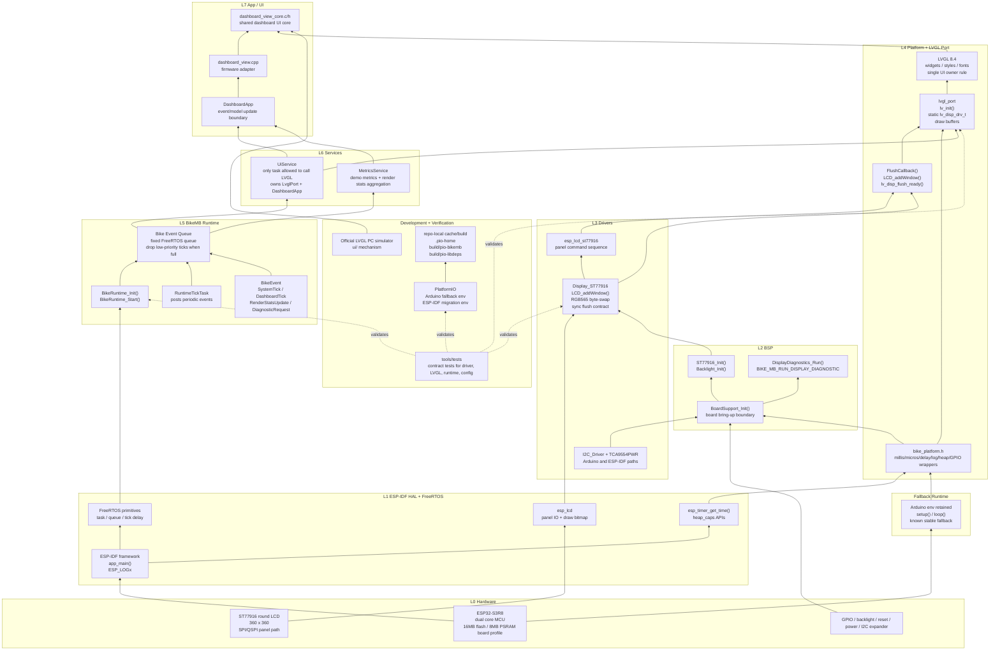
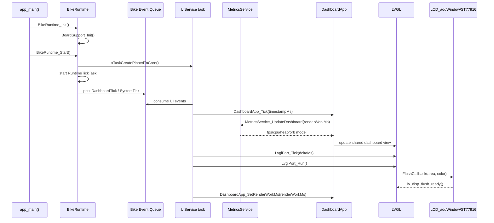

# BikeMB Software Architecture

This document captures the current BikeMB firmware architecture for quick agent and developer reference.

## Layered Firmware Architecture

## Runtime Flow

## Current Migration State

- The Arduino PlatformIO env remains the default and the stable hardware fallback.
- The ESP-IDF PlatformIO env builds and provides the new `app_main()` Runtime/Event Bus/Service skeleton.
- LVGL remains single-owner: only `UiService` should call LVGL APIs in the ESP-IDF runtime.
- The LCD path still uses the stable synchronous flush contract: `FlushCallback()` -> `LCD_addWindow()` -> `lv_disp_flush_ready()`.
- The PC simulator continues to share `dashboard_view_core.c/h` through the official LVGL simulator `ui/` mechanism.
- Before flashing the ESP-IDF env, finish the IDF board sdkconfig pass for flash size, PSRAM, CPU frequency, and LVGL examples/demos pruning.

## How To View

This file is Markdown with Mermaid diagrams.

- VS Code or Cursor: open this file, then use Markdown Preview.
- GitHub: Mermaid diagrams render automatically when the file is pushed.
- Typora or Obsidian: enable Mermaid support if it is disabled.
