# BikeMB 软件框架

本文档描述 BikeMB 当前建议的软件框架。目标是保留 bring-up 已验证的底层驱动，同时把正式工程拆成适合继续扩展的应用结构。

## 分层目标

- `bringup` 负责硬件验证，不继续承载正式应用逻辑
- `bikemb` 负责正式 demo 与后续应用扩展
- `platform` 层负责板级和显示/触摸适配
- `app` 层负责页面、demo 数据和后续业务模块

## 软件框架图

```mermaid
flowchart TD
    A["main.cpp<br/>system bootstrap"] --> B["platform::board<br/>serial, i2c, exio, backlight"]
    A --> C["platform::lvgl_port<br/>lv_init, draw buffer, flush, tick"]
    A --> D["app::dashboard_app<br/>screen lifecycle + update loop"]

    B --> E["drivers::display_st77916<br/>QSPI LCD driver"]
    B --> F["drivers::i2c_driver"]
    B --> G["drivers::tca9554"]
    B -. optional .-> H["drivers::touch_cst816"]

    D --> I["app::dashboard_view<br/>labels, bars, animated objects"]
    D --> J["app::demo_metrics<br/>fps, cpu load estimate, heap, psram"]

    C --> E
    J --> I
```



## `bikemb` 目录建议

```text
firmware/bikemb/
  include/
    lv_conf.h
  src/
    main.cpp
    app/
      dashboard_app.cpp
      dashboard_app.h
      dashboard_view.cpp
      dashboard_view.h
      demo_metrics.cpp
      demo_metrics.h
    platform/
      board_support.cpp
      board_support.h
      lvgl_port.cpp
      lvgl_port.h
    drivers/
      Display_ST77916.cpp
      Display_ST77916.h
      I2C_Driver.cpp
      I2C_Driver.h
      TCA9554PWR.cpp
      TCA9554PWR.h
      esp_lcd_st77916.c
      esp_lcd_st77916.h
```

## 运行流程

1. `main.cpp` 启动串口和板级支持
2. 初始化 I2C、EXIO、背光、LCD
3. 初始化 `LVGL`
4. 注册显示 flush 回调
5. 创建 dashboard 页面
6. 主循环中持续：
   - 维护 `lv_tick`
   - 更新 demo metrics
   - 刷新 dashboard
   - 调用 `lv_timer_handler`

## 当前第一版页面目标

第一版 `bikemb` 页面尽量复刻当前 bring-up dashboard 的信息结构：

- 标题
- `CPU`
- `FPS`
- `MEM`
- `PSRAM`
- 一个简单动效区域

这样可以先形成稳定 demo 工程，再在后续把 demo 数据替换为真实骑行数据。
