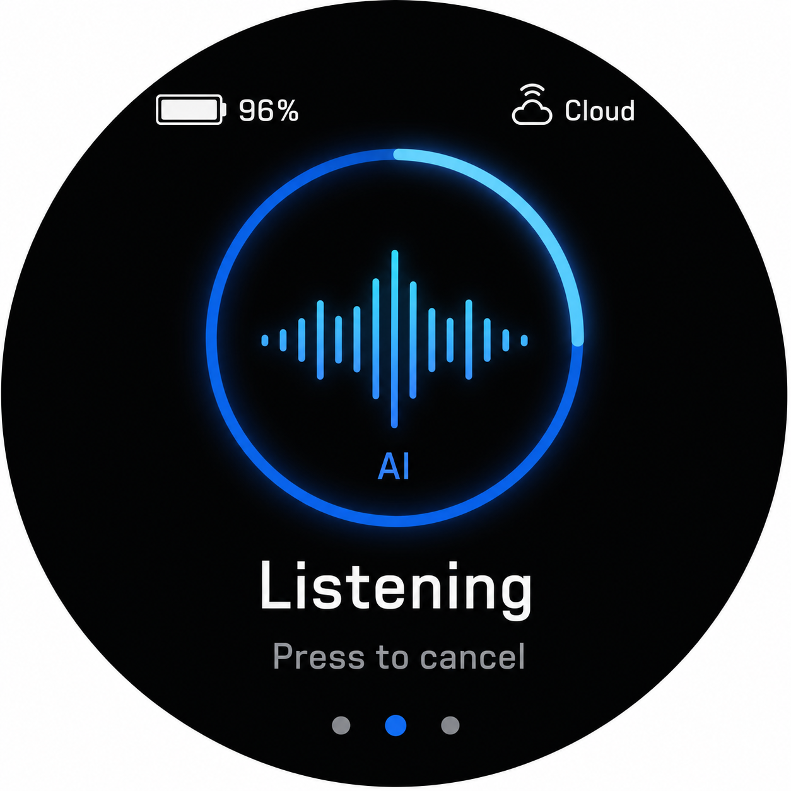

# BikeMB AI assistant UI

This document defines the AI assistant page as a UI state surface. It does not define cloud, audio, account, or network implementation.

## Selected baseline

The selected baseline combines the instrument-style status ring from visual option 1 with the voice waveform language from visual option 2.



This is the current project UI/UX direction for the dedicated AI assistant dashboard page.

Design intent:

- Treat AI as a riding-state instrument, not a chat window.
- Keep one clear state at a time.
- Make the listening/thinking/speaking state readable at a glance.
- Preserve LVGL feasibility through arcs, labels, bars, lines, simple icons, and page dots.
- Keep the page useful even when cloud or network features are unavailable.

Baseline composition:

| Area | Final direction |
| --- | --- |
| Top left | Battery icon plus percentage, e.g. `96%` |
| Top right | Cloud/network status, e.g. `Cloud` |
| Center | Large accent ring with voice waveform inside |
| Inside ring | Small `AI` identity label below the waveform |
| Below ring | Large state text, e.g. `Listening` |
| Lower text | Muted action hint, e.g. `Press to cancel` |
| Bottom | Three dashboard page dots with page 2 active |

## Role

The AI assistant page is the second dashboard page. It shows whether AI interaction is idle, listening, processing, speaking, playing music, offline, or failed.

It must not replace the basic bike computer home page.

## Boundaries

Allowed:

- Show AI state.
- Show battery and network summary.
- Let the rider start, cancel, or stop one interaction.
- Show waiting, offline, and error feedback.

Not allowed:

- Store or display Wi-Fi passwords.
- Store or display API tokens.
- Show cloud account details.
- Require AI to use P0 riding pages.
- Use always-on wake word behavior in P0.

## Layout

Recommended structure:

| Area | Content | Notes |
| --- | --- | --- |
| Top left | Battery | Short text or icon |
| Top right | Network summary | `Online`, `Cloud`, or `Offline` |
| Center | AI visual state | Ring, waveform, dots, or simple face-like mark |
| Center label | State word | One short line preferred |
| Bottom | Action hint or page dot | `Tap to talk`, `Cancel`, `Stop`, or muted reason |

The center action target should be large and easy to tap. Avoid small controls inside the center visual.

The selected baseline uses the center visual as the main tap/press target. The ring and waveform should be treated as one interactive zone rather than separate controls.

## Complete assistant page

The complete AI assistant page is the dedicated second dashboard page. It is used when the rider intentionally opens the AI page or when an AI interaction needs enough space to show status clearly.

### Page anatomy

```text
360 x 360 round screen

  top status ring
  +----------------------------+
  | Battery              Cloud |
  |                            |
  |          AI mark           |
  |       state animation      |
  |                            |
  |        State label         |
  |        Action hint         |
  |                            |
  |   page dot / small status  |
  +----------------------------+
```

Required elements:

| Element | Position | Purpose | LVGL primitive |
| --- | --- | --- | --- |
| Battery | Top left safe area | Confirms device state | `lv_label` or recolored `lv_img` |
| Network | Top right safe area | Shows AI availability | `lv_label` or recolored `lv_img` |
| AI state visual | Center, about 120-150 px | Main state expression | `lv_arc`, `lv_line`, `lv_bar`, or small `lv_img` |
| State label | Below center visual | Clear current state | `lv_label` |
| Action hint | Lower center | Tells what press/tap does | `lv_label` |
| Page dot | Bottom safe area | Dashboard position | small `lv_obj` dots |

### Layout measurements

Use these as starting coordinates, then tune in simulator:

| Item | Suggested size / position |
| --- | --- |
| Top status y | `24-56 px` |
| Center visual box | `105-255 x 82-232 px` |
| State label baseline | around `238 px` |
| Action hint baseline | around `270 px` |
| Page dots | around `318 px` |
| Center hit area | at least `160 x 160 px` |

The center visual must not overlap top battery/network text or bottom page dots.

For the selected baseline, keep the ring diameter around `170-190 px`. Keep waveform height around `70-90 px`, centered inside the ring, with the `AI` label small enough that it does not compete with the waveform.

### State-specific page designs

| State | Full-page design |
| --- | --- |
| `Idle` | Dark page, low-brightness ring, no active waveform, title/action text `Tap to talk`. Battery and network remain visible. |
| `Listening` | Selected baseline state: bright accent ring plus live waveform inside. State label `Listening`. Action hint `Press to cancel`. |
| `Sending` | Keep the ring visible and replace waveform with small moving dots. State label `Sending`. Keep action hint cancellable if backend supports it. |
| `Thinking` | Convert the ring into a slow segmented arc sweep. State label `Thinking`. No full-screen spinner. |
| `Speaking` | Keep waveform inside ring and let bar height react subtly to audio level. State label `Speaking`. Action hint `Press to stop`. |
| `MusicPlaying` | Low equalizer bars in center. State label `Music`. Action hint `Press to stop`. |
| `Offline` | Muted gray ring, state label `Offline`, action hint `AI unavailable`. Page switching still works. |
| `Error` | Short red accent pulse, state label `Failed`, action hint `Press to clear` or `Retry` only if supported. |

### Page hierarchy

Priority order on the complete page:

1. AI state visual and state label.
2. Action hint.
3. Battery and network.
4. Page dots and minor status.

Do not add chat transcripts, long prompts, or multi-line assistant replies to the round-screen page. The page is for state and control, not conversation history.

## State table

| State | Text | Visual | Center action |
| --- | --- | --- | --- |
| `Idle` | `Tap to talk` | Low-brightness breathing ring | Start listening |
| `Listening` | `Listening` | Expanding waveform or pulsing ring | Cancel |
| `Sending` | `Sending` | Small progress dots | Cancel |
| `Thinking` | `Thinking` | Slow rotating arc or three dots | Cancel |
| `Speaking` | `Speaking` | Ring reacts subtly to audio level | Stop |
| `MusicPlaying` | `Music` | Low-amplitude equalizer bars | Stop |
| `Offline` | `Offline` | Muted gray ring | No AI action, navigation remains available |
| `Error` | `Failed` | Short red or muted warning state | Clear error or retry when supported |

## Text rules

- Prefer English single words for compact states until final language direction is chosen.
- State text should fit within two lines at maximum.
- Avoid long technical causes on the round screen.
- Put detailed causes in serial logs or later companion settings pages.
- Do not show SSID, URL, model name, token, account, or device owner information.

## Color and priority

- Default AI accent follows the current ride mode color when available.
- For the selected baseline preview, use AUTO blue `#238CFF` as the default accent.
- Offline uses muted gray.
- Error uses restrained red, not a full-screen alarm, unless the UI itself is unusable.
- Active listening should be clearly brighter than idle, but must not overpower battery or navigation status.

## Waiting states

Waiting states should communicate progress without implying precision:

- `Sending`: dots or short progress sweep.
- `Thinking`: slow pulse or rotating arc.
- Timeout: switch to `Failed` with a retry-capable message if backend supports retry.

Do not use large blocking spinners over the entire page. The rider must still be able to leave the page.

## Interaction rules

| Current state | Button / center tap | Result |
| --- | --- | --- |
| `Idle` | Press or tap | Request one AI interaction |
| `Listening` | Press or tap | Cancel recording |
| `Sending` | Press or tap | Cancel request if possible |
| `Thinking` | Press or tap | Cancel request if possible |
| `Speaking` | Press or tap | Stop playback |
| `MusicPlaying` | Press or tap | Stop music |
| `Offline` | Press or tap | Brief disabled feedback only |
| `Error` | Press or tap | Clear error or retry when supported |

Horizontal page switching must remain available in every state.

## Responses from other pages

AI may be triggered while the rider is on `Home`, `RideDetails`, or a settings page. Passive AI status updates must not destroy the current page context, but the physical recording/AI button is an explicit request to open the complete AI page.

### Response surfaces

Use three UI surfaces, chosen by severity and duration:

| Surface | Use | Duration | Blocks page? |
| --- | --- | --- | --- |
| `AiStatusChip` | Short acknowledgement, offline, cancelled | `1-2 s` | No |
| `AiMiniOverlay` | Listening, sending, thinking from another page | Until state changes or user cancels | No, but captures center tap |
| `AiFullPage` | Dedicated AI page, physical recording/AI button, or long speaking/music state | Until rider leaves | Yes, by navigation only |

### AiStatusChip

Small temporary status placed in the lower safe area above page dots.

Use for:

- `Listening started`.
- `Cancelled`.
- `Offline`.
- `Failed`.
- `Stopped`.

Rules:

- Height should stay around `32-40 px`.
- Text should be one short phrase.
- It must not cover the speed value on `Home`.
- It fades out without changing dashboard page.

LVGL primitives:

- `lv_obj` rounded capsule.
- `lv_label` for text.
- Optional recolored small icon.

### AiMiniOverlay

Compact in-page AI state surface for active interaction while the rider remains on another page.

Recommended layout:

```text
Home or RideDetails remains visible

            main page content

        [ small AI ring + state ]
        [ Press to cancel/stop ]

            page dots remain visible
```

Rules:

- Use a dark translucent panel or simple ring, not a large card.
- Keep it inside the safe center/bottom area.
- On `Home`, never cover the speed number. Prefer lower center.
- On `RideDetails`, it may replace the least important lower metric row.
- Center tap or physical button action may cancel/stop depending on AI state.
- Horizontal page switching remains allowed unless the touch starts inside the overlay hit area.

### AiFullPage handoff

Navigate to the complete AI page when:

- The rider switches to page 2 manually.
- The rider presses the physical recording/AI button from any dashboard page.
- The current state needs more clarity than the mini overlay can provide.
- Speaking or music playback is expected to continue and the rider opens AI controls.

Do not auto-jump from `Home` to `AiFullPage` for passive background status changes. The physical recording/AI button is explicit navigation and should open `AiFullPage` before recording starts.

## Cross-page trigger behavior

| Current page | Trigger | Immediate UI | Next state |
| --- | --- | --- | --- |
| `Home` | Physical recording/AI button | `AiFullPage` / `Listening` | Stay on `AiAssistant` until rider leaves |
| `RideDetails` | Physical recording/AI button | `AiFullPage` / `Listening` | Stay on `AiAssistant` until rider leaves |
| `SettingsList` | Physical recording/AI button | `AiFullPage` / `Listening` | Stay on `AiAssistant` until rider leaves |
| `AboutDevice` | Physical recording/AI button | `AiFullPage` / `Listening` | Stay on `AiAssistant` until rider leaves |
| `AiAssistant` | AI trigger | Full-page state transition | Stay on AI page |

When the same physical button is used for dashboard page switching, AI trigger must require a different input pattern than normal paging. Do not overload the P0 page-switch button without a confirmed hardware interaction model.

## Voice reply expression

For short assistant replies, the round screen should show state only:

- `Speaking`
- `Done`
- `Failed`

Do not display a paragraph transcript while riding.

For future non-riding settings flows, a short two-line reply may be added, but it must remain out of P0 riding pages.

## LVGL component guidance

Prefer native LVGL primitives:

- `lv_label` for state text and action hint.
- `lv_arc` for rings and progress sweeps.
- `lv_line` or custom draw callbacks for simple waveforms.
- `lv_bar` for equalizer-style music state.
- `lv_img` only for small monochrome icons that can be recolored.

Avoid bitmap-heavy animated characters. They cost memory, complicate recoloring, and are harder to keep readable on a 360 px round LCD.

## Data contract

The page should render from a small UI-facing state object:

```text
AiAssistantUiState
  visual_state
  battery_percent
  network_state
  can_cancel
  can_retry
  invoked_from_page
  preferred_surface
```

The UI should not call network, audio, or cloud APIs directly.

Recommended `preferred_surface` values:

- `Chip`
- `MiniOverlay`
- `FullPage`

The state owner decides the preferred surface; the current screen may downgrade passive status updates for riding safety. A physical recording/AI button press remains explicit navigation to `FullPage`.
