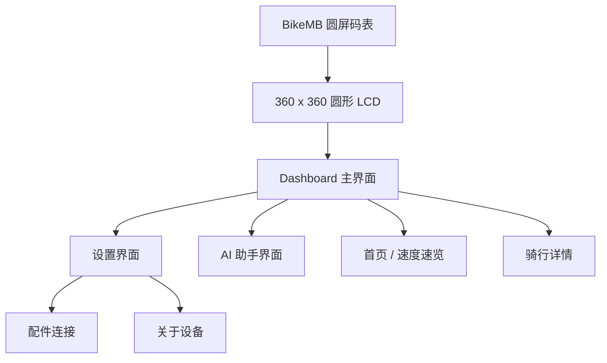
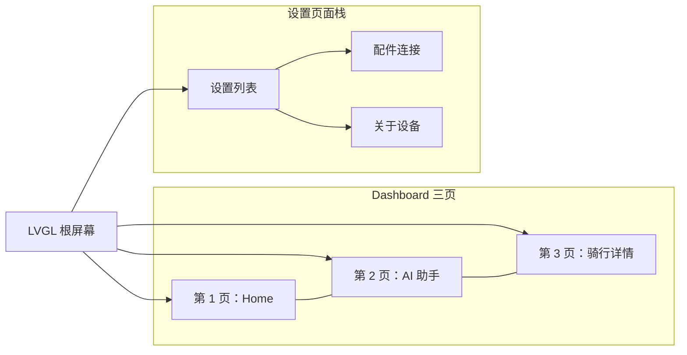
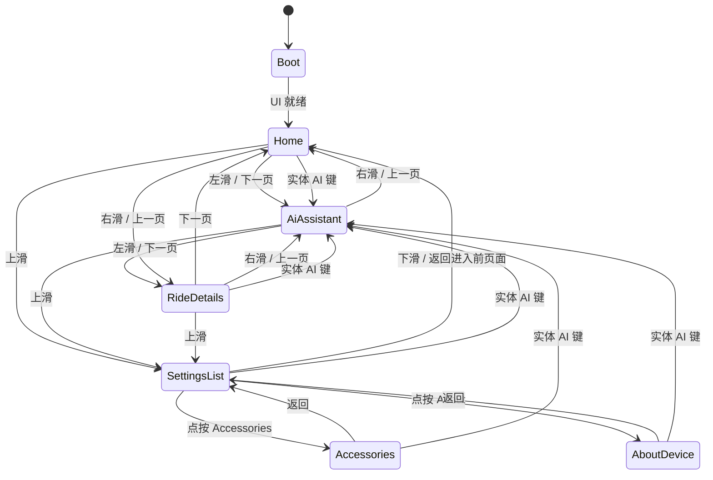
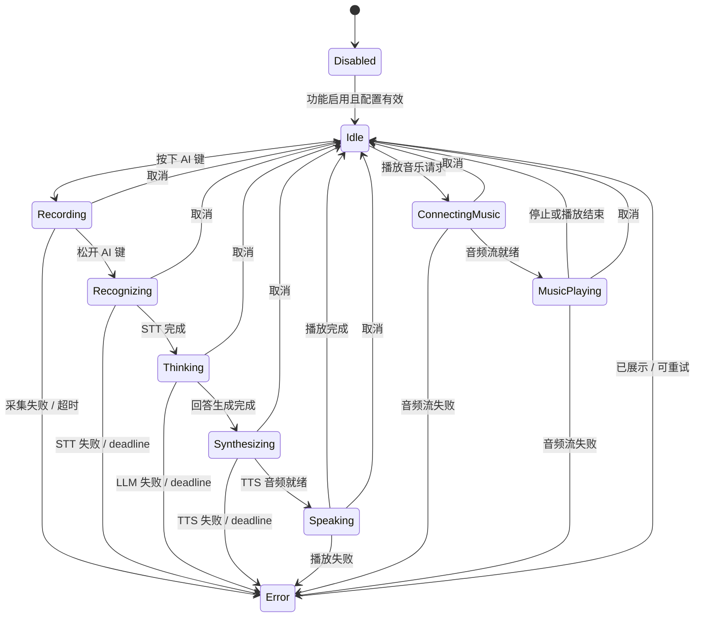
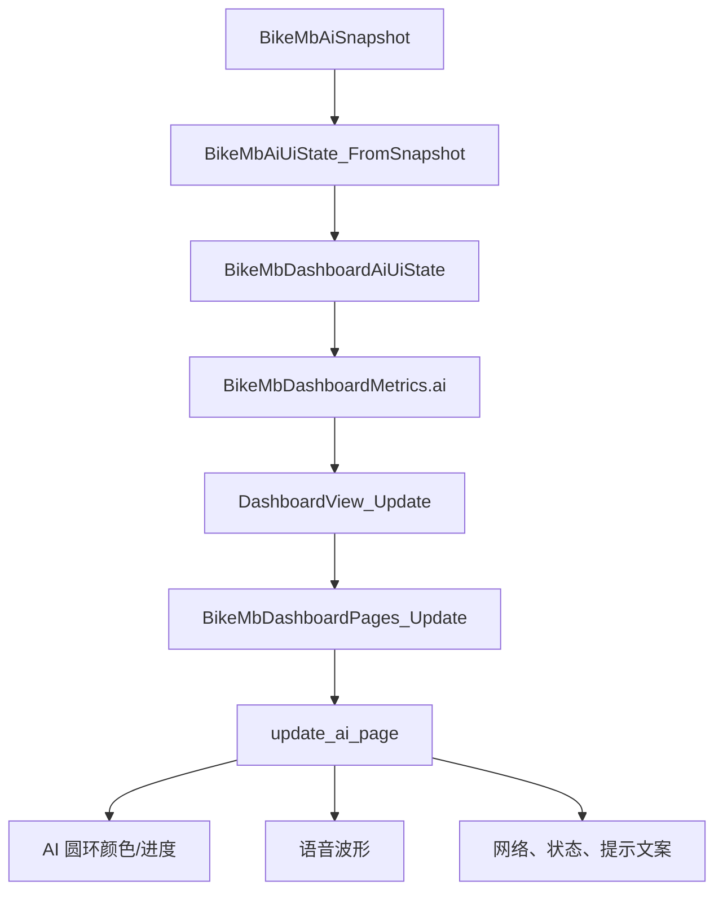
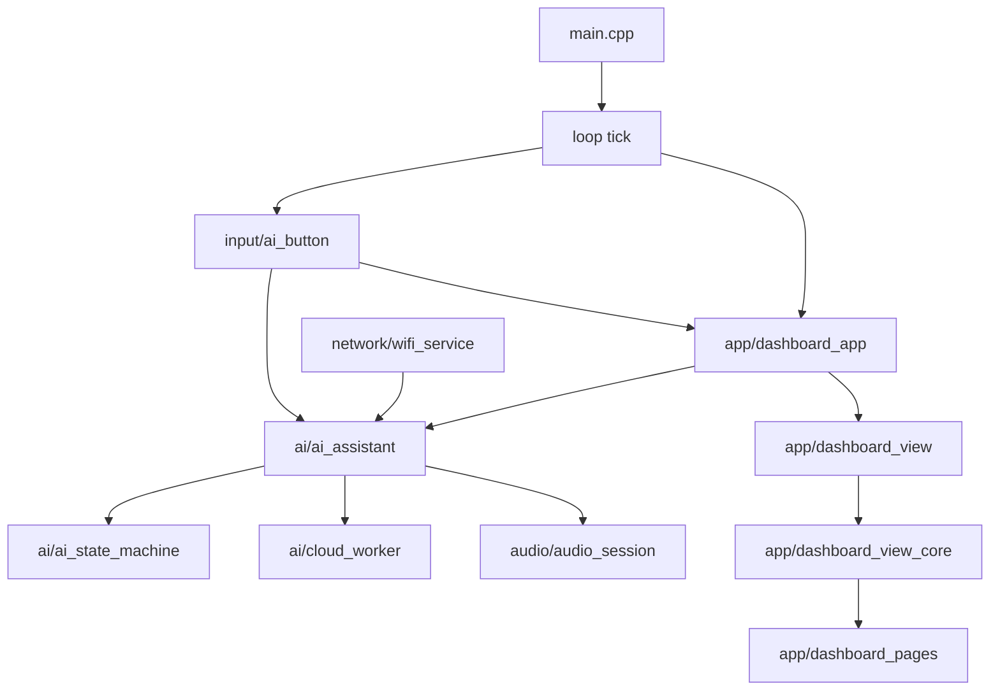

# BikeMB 当前 UI/UX 图谱

这是理解 BikeMB 当前界面和交互的入口文件。
以后看项目 UI/UX，先读这个文件，再跳到末尾列出的细节文档。

最后更新：2026-07-21。

## 产品界面范围

BikeMB 是一个 `360 x 360` 圆屏自行车码表。当前 UI 是一个 LVGL dashboard：三页骑行主界面，加一个设置页面栈。

AI 助手当前作为 dashboard 的第 2 页实现。实体录音/AI 键表示用户明确要打开 AI 助手页，并进入 AI 交互状态。

## 当前 UI 结构

### Home 首页

用途：骑行中最快速查看核心信息。

当前可见 UI：

- 档位 chip。
- 电池。
- 速度数字。
- 速度单位。
- 助力/续航区域。
- 时间。
- 页面指示点。

设计优先级：

1. 速度。
2. 电池和档位。
3. 续航、里程、时间。
4. 装饰边框和助力发光层。

### AI 助手页

用途：展示 AI 是否可用、当前处于什么状态，但不做聊天窗口。

当前选定基线稿：

当前可见 UI：

- 电池。
- 网络/云端状态。
- AI 圆环。
- 语音波形。
- `AI` 标识。
- 状态文案。
- 操作提示。
- 页面指示点。

设计优先级：

1. AI 状态视觉。
2. 状态文案。
3. 操作提示。
4. 电池和网络。
5. 页面指示点。

### 骑行详情页

用途：在速度速览之后查看次级骑行数据。

当前可见 UI：

- 档位/状态。
- 电池。
- 距离。
- 时长。
- 踏频占位。
- 爬升占位。
- 页面指示点。

### 设置页面

用途：放非骑行中的控制项和设备信息。

当前页面：

- `SettingsList`
- `Accessories`
- `AboutDevice`

设置页面不属于 dashboard 左右翻页循环。退出设置时回到进入设置前的 dashboard 页面。

## 当前 UX 流程

UX 规则：

- 左右手势只切换 dashboard 页面。
- 任意 dashboard 页上滑进入设置。
- 设置页下滑返回。
- 实体录音/AI 键打开完整 AI 助手页。
- 被动 AI 状态不应打断骑行数据。
- AI、云端、音频和音乐能力不能阻塞基础 dashboard 可读性。

## AI 助手 UX 状态流

## AI 状态到 UI 的映射

当前视觉映射：

| AI 状态 | UI 视觉状态 | 推荐展示面 | 屏幕文案 |
| --- | --- | --- | --- |
| `Disabled` | `Offline` | 完整页 | `Offline` / `AI unavailable` |
| `Idle` | `Idle` | 完整页 | `Tap to talk` / `Center to start` |
| `Recording` | `Listening` | Mini overlay | `Listening` / `Press to cancel` |
| `Recognizing` | `Sending` | Mini overlay | `Sending` / `Press to cancel` |
| `Thinking` | `Thinking` | Mini overlay | `Thinking` / `Press to cancel` |
| `Synthesizing` | `Thinking` | Mini overlay | `Thinking` / `Press to cancel` |
| `Speaking` | `Speaking` | 完整页 | `Speaking` / `Press to stop` |
| `ConnectingMusic` | `Music` | 完整页 | `Music` / `Press to stop` |
| `MusicPlaying` | `Music` | 完整页 | `Music` / `Press to stop` |
| `Error` | `Error` | Chip | `Failed` / `Press to clear` |

说明：实体 AI 键会在开始录音前打开完整 AI 页。`preferred_surface` 仍用于记录被动状态或嵌入状态更适合展示在哪种 UI 面上。

## UI 实现触点

本节不是代码架构的唯一事实来源，而是 UI/UX 视角下的阅读地图，用于理解当前行为从哪里进入界面。

函数组说明：

| 函数组 | 主要职责 | UI/UX 关联 |
| --- | --- | --- |
| `input/ai_button.*` | 读取实体 AI 键并发出按下/松开事件 | 打开 AI 页，并开始/停止交互 |
| `ai/ai_assistant.*` | 管理 AI 命令队列、snapshot、effects、云端/音频交接 | 产出用户看到的 AI 状态 |
| `ai/ai_state_machine.*` | 定义 AI 状态迁移和 effects | 决定状态文案、取消和重试行为 |
| `ai/cloud_worker.*` | 处理 ASR、对话、TTS 和云端工作 | 驱动识别、思考、合成、回答状态 |
| `audio/audio_session.*` | 管理录音/播放音频会话归属 | 避免音频交互冲突 |
| `network/wifi_service.*` | 跟踪 Wi-Fi 可用性 | 驱动 `Cloud` / `Offline` 状态 |
| `app/ai_assistant_ui_state.*` | 把 AI snapshot 映射成 dashboard UI 状态 | 把实现状态转成屏幕语言 |
| `app/dashboard_app.*` | 每帧拉取 metrics 和 AI snapshot | 给 UI 提供当前状态 |
| `app/dashboard_view.*` | 把 C++ metrics 转成 C dashboard metrics | App 层和 LVGL 页面代码的边界 |
| `app/dashboard_view_core.*` | 管理页面切换和触摸手势 | 定义 dashboard/settings 导航 UX |
| `app/dashboard_pages.*` | 创建并更新 LVGL 页面控件 | 定义实际屏幕构成 |

## 当前 UI 阅读顺序

以后查看或修改 UI/UX，按这个顺序读：

1. `docs/ui-ux/current-ui-ux-map.md`
2. `docs/ui-ux/ai-assistant-ui.md`
3. `docs/ui-ux/screen-flows.md`
4. `docs/ui-ux/interaction-model.md`
5. `src/firmware/bikemb/src/app/dashboard_pages.c`
6. `src/firmware/bikemb/src/app/ai_assistant_ui_state.cpp`
7. `src/firmware/bikemb/src/ai/ai_state_machine.cpp`

## 相关文档

- [AI 助手 UI](ai-assistant-ui.md)
- [屏幕流程](screen-flows.md)
- [交互模型](interaction-model.md)
- [视觉规范](visual-guidelines.md)
- [架构状态机](../architecture/state-machine.md)
