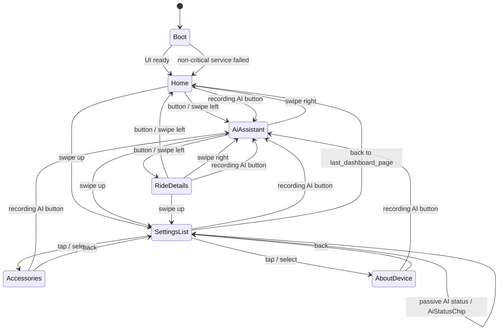

# BikeMB screen flows

This document defines current screen order and transitions for the round-screen UI.

## Success criteria

- Power-on reaches a usable main dashboard within 3 seconds.
- Riding information remains readable and reachable even when AI or network is offline.
- Page switching is predictable by physical button and touch.
- Waiting and error states never hide the basic speed page.

## Boot flow

```text
Power on
  -> Hardware/UI init
  -> Optional short loading state
  -> Dashboard / Home
```

Rules:

- Loading should be skipped if the main screen can render immediately.
- Any loading state must be simple: product name, small spinner or progress dot, optional status text.
- If non-critical services fail during boot, continue to `Dashboard / Home` and show the failure only in the relevant status area.

## Dashboard flow

```text
Home
  <-> AiAssistant
  <-> RideDetails
```

Navigation:

- Short physical button press cycles `Home -> AiAssistant -> RideDetails -> Home`.
- Horizontal swipe follows the same order.
- Page dots show the current dashboard page.
- The speed-focused `Home` page is always the first recovery target.

## Home page

Purpose:

- Fast riding glance.
- Current speed is the primary visual object.

Required visible information:

- Current speed.
- Speed unit.
- Battery.
- Current mode or status.
- Time or ride duration.
- One secondary range, distance, or assist metric.

Failure rule:

- Missing secondary data must not block the speed display.
- If speed data is unavailable, show a clear placeholder such as `--` with a muted `No speed` or `Waiting` label.

## AI assistant page

Purpose:

- Show AI availability and interaction state.
- Provide a single coarse action target for start, cancel, or stop.

Allowed transitions:

```text
Idle -> Listening -> Sending -> Thinking -> Speaking -> Idle
Idle -> Offline
Listening/Sending/Thinking/Speaking -> Idle
Any active state -> Error -> Idle
```

Rules:

- AI page must not become the default power-on page.
- Offline AI state must still allow page switching.
- Do not show secrets, long SSIDs, URLs, model names, tokens, or account identifiers.

## AI trigger from other pages

The physical recording/AI button is an explicit request to open the complete AI assistant page. When pressed from any dashboard page, the UI should switch to `AiAssistant` immediately and then show the active listening state.

```text
Any current page
  -> Recording/AI button
  -> AiAssistant
  -> Listening
  -> Done / cancelled / failed
```

Rules:

- Passive AI status updates should not steal focus from the current page.
- Pressing the physical recording/AI button should navigate to `AiAssistant` before recording begins.
- After the AI state returns to idle, the rider can leave `AiAssistant` with normal page navigation.
- `SettingsList` and settings detail pages should use a short status chip for passive AI status, but the physical recording/AI button should still open `AiAssistant`.

AI response surfaces:

| Surface | Used from | Purpose |
| --- | --- | --- |
| `AiStatusChip` | Any page | Short status such as `Offline`, `Cancelled`, or `Failed` |
| `AiMiniOverlay` | `Home`, `RideDetails` | Active listening/thinking/speaking without leaving the page |
| `AiFullPage` | `AiAssistant` or physical recording/AI button | Complete AI state and controls |

## Ride details page

Purpose:

- Show secondary ride metrics after the main glance page.

Recommended metrics:

- Trip distance.
- Ride duration.
- Battery.
- Total distance when available.
- Optional cadence, elevation, or assist data only after the data source exists.

Rules:

- Use compact rows or cards.
- Keep numeric values aligned.
- Avoid long labels that wrap near the circular edge.

## Settings flow

```text
Any dashboard page
  -> swipe up
SettingsList
  -> Accessories
  -> AboutDevice
```

Return rules:

| Current screen | Input | Result |
| --- | --- | --- |
| `SettingsList` | Swipe down or back | Return to `last_dashboard_page` |
| `Accessories` | Swipe down or back | Return to `SettingsList` |
| `AboutDevice` | Swipe down or back | Return to `SettingsList` |

Settings pages are not part of the riding dashboard page cycle.

## Error and waiting flows

Non-blocking error:

```text
Service failure
  -> Keep current page
  -> Show local muted error state
  -> Allow navigation
```

Blocking UI error:

```text
Critical UI init failure
  -> Minimal error screen
  -> Serial log detail
```

Use the full-screen error only when the dashboard cannot render at all.

## Flow diagram


