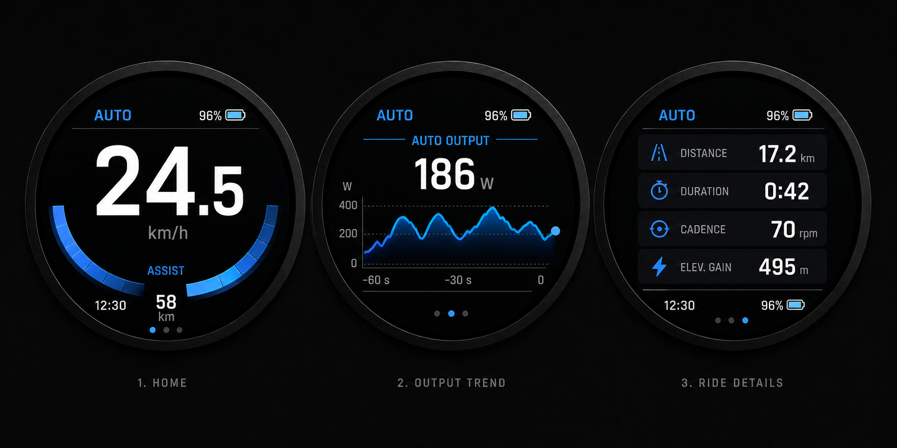
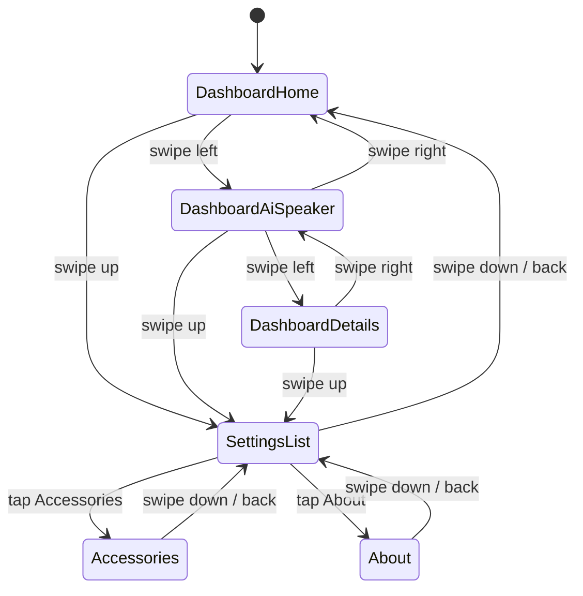

# BikeMB Avinox 风格 UI 与 UX 设计稿

本文档记录当前确认的 UI 方向和交互规则，作为后续 LVGL 实现依据。

## 设计假设

- 目标硬件仍是 `360 x 360` 圆屏。
- 当前 dashboard 主流程调整为三页：`首页`、`AI 助手`、`骑行详情`。
- `AI 助手`页固定为第 2 页，先做 UI/UX 设计，不在本文档中定义固件实现细节。
- 参考方向是 Avinox Display 的黑底 OLED、高对比数字、紧凑运动仪表风格，但不使用任何品牌 Logo 或完全复制版式。
- 设计阶段先服务当前 demo 和后续真实数据接入，不一次性做完整设置系统。

## 已确认概念图



这版作为当前视觉基线。后续实现可按 LVGL 能力拆成：`label`、`arc`、`bar`、`chart`、`line`、`container/card`、`image/icon`。

## 视觉原则

### 页面颜色规则

同一页面只使用当前档位的主色，再通过透明度和明暗渐变做层次；不要在同一页面混用多种强调色。

| 档位 | 主色 | 用途 |
| --- | --- | --- |
| `ECO` | 绿色 | 图标、页点、assist arc、趋势线、状态强调 |
| `Trail` | 黄色 / 琥珀色 | 图标、页点、assist arc、趋势线、状态强调 |
| `AUTO` | 蓝色 | 图标、页点、assist arc、趋势线、状态强调 |
| `Boost` | 红色 | 图标、页点、assist arc、趋势线、状态强调 |

建议初始 token：

| Token | 建议值 | 说明 |
| --- | --- | --- |
| `COLOR_BG` | `#050707` | OLED 黑底 |
| `COLOR_PANEL` | `#101315` | 卡片/区域底 |
| `COLOR_TEXT` | `#F4F7F8` | 主文本 |
| `COLOR_TEXT_MUTED` | `#8D969D` | 次级文本 |
| `COLOR_LINE` | `#30363A` | 分割线 |
| `COLOR_ECO` | `#23D66B` | ECO 主色 |
| `COLOR_TRAIL` | `#F3B53F` | Trail 主色 |
| `COLOR_AUTO` | `#238CFF` | AUTO 主色 |
| `COLOR_BOOST` | `#F04E3E` | Boost 主色 |

### 字体层级

| 层级 | 用途 | 建议尺寸 |
| --- | --- | --- |
| `Display XL` | 首页速度数字 | 88-104 px |
| `Display L` | 详情页主数值、AI 助手状态主文案 | 46-64 px |
| `Body` | 单位、卡片标题 | 18-26 px |
| `Meta` | 时间、电量、小标签 | 18-24 px |

首页时间需要更明显：不要再只放角落小字。建议放在底部左侧或底部中轴附近，字号不低于 `24 px`，亮度接近主文本，且保留独立图标或细分割线。

## 页面设计

### Dashboard 页面顺序

| 页序 | 页面 | 主要任务 |
| --- | --- | --- |
| 1 | 首页 | 骑行中快速查看速度、电量、档位和时间 |
| 2 | AI 助手 | 查看网络、电量、AI 对话状态，并触发/取消语音交互 |
| 3 | 骑行详情 | 查看本次骑行数据明细 |

### 1. 首页

主要信息：

- 当前档位：左上角，例如 `AUTO`。
- 电量：右上角，例如 `96%`。
- 当前速度：屏幕中心最大数字，例如 `24.5 km/h`。
- 助力/功率弧线：下半圆单色渐变，颜色跟随当前档位。
- 剩余里程：下方，例如 `58 km`。
- 时间：更明显显示，例如 `12:30`，建议字号提升并靠近底部信息区。

实现要点：

- 移除多色 `ECO/POWER` 弧线，改成当前档位单色渐变弧。
- 图标、页点、辅助弧线全部跟随档位色。
- 速度数字优先级最高，时间优先级提升到第二梯队。

### 2. AI 助手页

页面定位：

- 这是云端 AI 助手能力的 dashboard 入口页，不替代基础码表首页。
- 页面应让用户一眼确认设备电量、网络是否可用、当前是否正在录音/思考/播报/播放音乐。
- 语音交互由按键或触摸主动触发，不做 V1 常驻唤醒词入口。

主要信息：

- 顶部状态区：
  - 左上角：电量，例如 `96%` 或电池图标。
  - 右上角：网络状态，例如 `Wi-Fi`、`Cloud`、`Offline`。
- 中心对话状态：
  - 主标题：`AI` 或 `小智`，用于提示当前页身份。
  - 状态文案：`Idle`、`Listening`、`Thinking`、`Speaking`、`Music`、`Offline`。
  - 中央图形：使用单色圆环、声波或微笑面板表达状态，不使用复杂角色插画作为必需资源。
- 底部操作区：
  - 空闲时显示 `Tap to talk` / `按下说话`。
  - 录音、等待、播报或音乐播放时显示 `Cancel` / `Stop` 状态。
  - 可保留页点，第二个页点高亮。

状态映射：

| 状态 | UI 文案 | 视觉反馈 | 操作 |
| --- | --- | --- | --- |
| `Idle` | `Tap to talk` | 低亮呼吸圆环 | 触摸或实体键开始对话 |
| `Recording` | `Listening` | 声波或圆环展开 | 再次触摸取消 |
| `Uploading` | `Sending` | 小型进度点 | 可取消 |
| `Thinking` | `Thinking` | 缓慢旋转或点状等待 | 可取消 |
| `Speaking` | `Speaking` | 圆环随音量轻微跳动 | 可停止 |
| `MusicPlaying` | `Music` | 音符/频谱条低幅动效 | 可停止 |
| `Error` | `Offline` 或 `Failed` | 红色或低亮灰提示 | 返回空闲或重试 |

布局建议：

- 仍使用黑底 OLED 风格，AI 页不引入儿童玩具化视觉。
- AI 页可以使用当前档位色作为默认强调色；网络失败和错误状态使用低亮红色或灰色，不影响其他页面色彩规则。
- 状态文字不超过两行，中心图形尺寸控制在 `120-150 px`，避免遮挡顶部电量和网络状态。
- 网络状态只显示摘要，不在圆屏上展示长 SSID、URL、模型名或 token。

交互规则：

| 当前状态 | 操作 | 结果 |
| --- | --- | --- |
| `Idle` | 点击 AI 页中心区域或按指定实体键 | 开始一次语音交互 |
| `Recording` / `Uploading` / `Thinking` | 点击中心区域或按指定实体键 | 取消当前 AI 请求 |
| `Speaking` / `MusicPlaying` | 点击中心区域或按指定实体键 | 停止播报或音乐 |
| `Error` | 点击中心区域或横向切页 | 清除错误提示或离开页面 |

实现要点：

- AI 页只呈现状态，不直接保存 Wi-Fi 密码、API token 或云端配置。
- `Offline` 时仍允许横向切页和上滑进入设置。
- AI 页后续应读取 `AiSpeakerState`、电量、网络状态三个输入，不直接操作音频或网络底层。

### 3. 骑行详情页

主要信息：

- 当前档位：左上角。
- 电量：右上角或底部状态区。
- 数据卡片：
  - `Distance 17.2 km`
  - `Duration 0:42`
  - `Cadence 70 rpm`
  - `Elev. Gain 495 m`
- 时间：底部区域，例如 `12:30`。

实现要点：

- 卡片图标颜色跟随当前档位。
- 卡片底色保持深灰，不使用彩色卡片背景。
- 所有数值右对齐，单位小一档显示。

## 新增设置 UX

### 入口

从三页主 dashboard 的任意一页向上滑动，进入设置列表。

```text
Dashboard page
  swipe up
Settings list
```

### 设置列表

暂时只有两个设置项：

1. `配件连接`
2. `关于设备`

布局建议：

- 仍使用黑底 OLED 风格。
- 顶部标题：`SETTINGS` / `设置`。
- 每个设置项是一张横向卡片，左侧图标，右侧箭头或细线。
- 图标和选中态颜色跟随当前档位色。

### 关于设备页面

点击 `关于设备` 打开详情页。

显示内容：

- 标题：`ABOUT DEVICE` / `关于设备`
- 设备名：`BikeMB`
- 固件版本：例如 `v0.1.0`
- 构建类型：例如 `Arduino / LVGL`

版本号来源先使用编译期常量，后续可接入 git hash 或构建脚本生成。

### 配件连接页面

当前只做占位页面，不接真实配件协议。

显示内容：

- 标题：`ACCESSORIES` / `配件连接`
- 状态：`No accessories connected`
- 可选占位项：`Heart Rate`、`Radar`、`Light`

### 返回规则

| 当前页面 | 操作 | 结果 |
| --- | --- | --- |
| Dashboard | 上滑 | 打开设置列表 |
| 设置列表 | 下滑 | 返回上一次 dashboard 页 |
| 设置列表 | 点击 `关于设备` | 打开关于设备页 |
| 设置列表 | 点击 `配件连接` | 打开配件连接页 |
| 关于设备页 | 下滑或点击返回 | 返回设置列表 |
| 配件连接页 | 下滑或点击返回 | 返回设置列表 |

### 与现有横向翻页的关系

- 横向滑动仍只在 dashboard 三页之间切换，顺序为：首页、AI 助手、骑行详情。
- 进入设置列表后，默认禁用 dashboard 横向翻页，避免设置列表误触切页。
- 设置详情页不响应左右翻页，只保留返回操作。

## 交互状态机



实现时需要保存 `last_dashboard_page`，这样从设置返回时回到进入前的 dashboard 页。

## LVGL 实现提示

- 新增一个顶层状态：`Dashboard` / `SettingsList` / `SettingsDetail`。
- Dashboard 页数调整为三页，`AI 助手`页插入到数组或枚举的第 2 位。
- 档位颜色建议封装为函数：`Dashboard_GetModeColor(mode)`。
- 图标颜色、页点、弧线、趋势线都从同一个 mode color 获取，避免页面混色。
- AI 页建议独立成一个页面构建函数，只接收电量、网络状态和 `AiSpeakerState` 三类状态输入。
- 后续 UI 开发只画状态和入口；音频、联网、云端请求属于后续硬件/固件开发任务。
- 关于设备版本号建议先定义常量，例如 `BIKE_MB_FIRMWARE_VERSION`。

## 待确认点

- 设置页标题使用中文还是英文，或中英混排。
- 首页时间最终位置：底部左侧、底部居中，还是速度下方。
- `配件连接` 是只做占位，还是下一步要接真实蓝牙/CAN/UART 配件。
- AI 助手页主标题使用 `AI`、`小智`，还是后续再命名。
- 网络状态是否只显示连接/离线，还是增加云端服务可用性状态。
